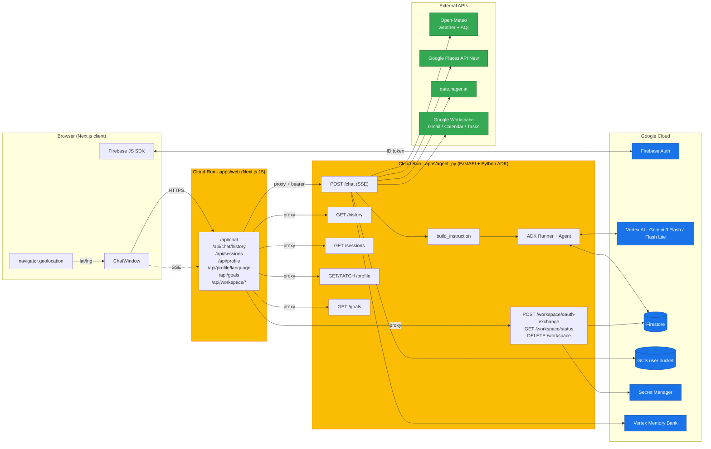
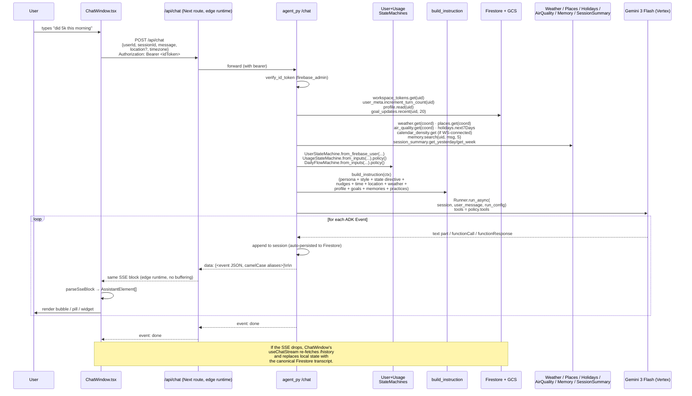
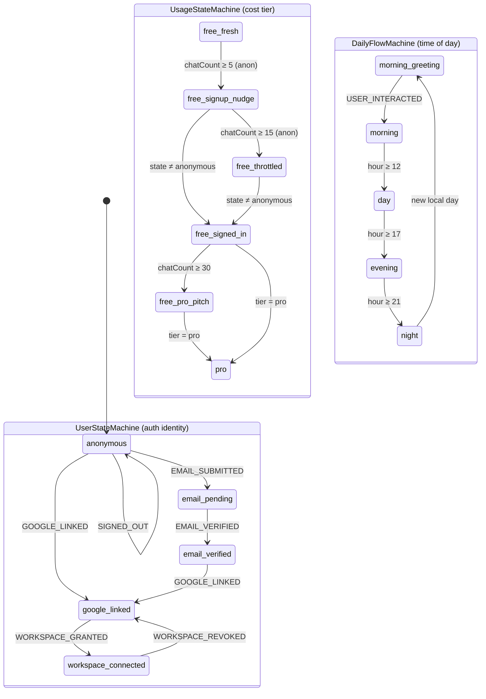

# Lifecoach — Architecture

This document is the source of truth for how Lifecoach is built. Keep it in sync as the system changes — see [§14 Documentation maintenance](#14-documentation-maintenance) for the rules.

`README.md` is a quick start; `ROADMAP.md` is build-history. **This file** is the spec.

---

## Table of contents

1. [Overview](#1-overview)
2. [Topology](#2-topology)
3. [End-to-end chat turn](#3-end-to-end-chat-turn)
4. [State machines](#4-state-machines)
5. [Auth & identity](#5-auth--identity)
6. [Geolocation](#6-geolocation)
7. [The agent service — `apps/agent_py`](#7-the-agent-service--appsagent_py)
8. [The web app — `apps/web`](#8-the-web-app--appsweb)
9. [Shared packages](#9-shared-packages)
10. [Wire contracts](#10-wire-contracts)
11. [Infrastructure & deploy](#11-infrastructure--deploy)
12. [Testing strategy](#12-testing-strategy)
13. [Non-negotiable invariants](#13-non-negotiable-invariants)
14. [Documentation maintenance](#14-documentation-maintenance)

---

## 1. Overview

Lifecoach is a warm, conversational AI life coach. The user opens the web app, talks to a coaching agent that knows their context (time, weather, profile, goals, calendar), and receives short, human-feeling replies. Optionally signs in, optionally connects Google Workspace for inbox/calendar/task help, optionally upgrades to Pro.

The repo is a polyglot pnpm monorepo with two production deployables and one developer-only host:

| Deployable | Stack | Runtime | Purpose |
|---|---|---|---|
| `apps/web` | Next.js 15 (App Router, React 19), Tailwind 4 | Cloud Run (containerised Next standalone) | UI + thin auth-attaching proxy to the agent |
| `apps/agent_py` | Python 3.12, FastAPI, [Google ADK](https://github.com/google/adk-python) ≥ 1.32 | Cloud Run (uvicorn `--factory build_app`) | The conversation: prompt assembly, model invocation, tool execution, persistence |
| `apps/ui-book` | Storybook 9 | dev-only, not deployed | Host for the design system; stories are the test surface for `packages/ui` |

Shared TypeScript code lives in `packages/*`. Python contracts mirror the Zod schemas at `apps/agent_py/src/lifecoach_agent/contracts/`. Infra is Terraform in `infra/`.

**Origin & history:** the agent originally shipped in TypeScript (`apps/agent`, `@google/adk` v0.6.1). At PR #56 it was rebuilt on Python ADK 1.32 — primarily to unlock the `AgentEvaluator` eval framework, drop the `gws` CLI subprocess in favour of `google-api-python-client`, and adopt `VertexAiMemoryBankService` over mem0. The TS service was deleted at the cutover; nothing in the repo runs it today. The wire format and Firestore schema were preserved byte-for-byte so `apps/web` was untouched.

---

## 2. Topology



**Trust boundaries.**

- The browser holds the Firebase ID token. `apps/web` API routes verify nothing themselves — they attach the bearer header and forward to `apps/agent_py`, which calls `firebase_admin.auth.verify_id_token`.
- OAuth tokens for Google Workspace are stored in Firestore (`workspaceTokens/{uid}`) and never leave the agent. The LLM emits a `connect_workspace` UI-directive tool; the application owns the OAuth flow.
- Billing tier (`tier: "free" | "pro"`) is on `userMeta/{uid}` and is read by `UsageStateMachine` server-side. The LLM never sees it directly — it sees the *consequence* (model selection, nudge directive, presence of `upgrade_to_pro` tool).

---

## 3. End-to-end chat turn



**Latency budget (warm Cloud Run):** auth ~50 ms, parallel context fetch ~150 ms, prompt build <5 ms, first token from Vertex 1–3 s, full reply 3–8 s. Cold instance adds 5–15 s at TTFB.

**Wire contract for `/chat` SSE:** see [§10.1](#101-chat-sse-wire-format).

---

## 4. State machines

`packages/user-state` (TS, consumed by `apps/web`) and `apps/agent_py/src/lifecoach_agent/state/` (Python, consumed by the agent server) are **two ports of the same logic**. Both are pure (no I/O). Tests assert each transition; illegal transitions throw.

Three orthogonal machines compose at the runner-build call site:



**Per-state policy (UserState → tools + directive + UI affordances):**

| `UserState` | Main-agent tools | UI affordances |
|---|---|---|
| `anonymous` | `ask_*_choice`, `update_user_profile`, `log_goal_update`, `memory_save`, **`auth_user`** | "Sign in / link Google" |
| `email_pending` | choice / profile / goals / memory | "Check your inbox" |
| `email_verified` | choice / profile / goals / memory | "Link Google" |
| `google_linked` | choice / profile / goals / memory, **`connect_workspace`** | "Connect Workspace" |
| `workspace_connected` | choice / profile / goals / memory, **`call_workspace`** | "Workspace connected" badge |

**Per-state policy (UsageState → model + nudge + upgrade tool):**

| `UsageState` | Model | Nudge | `upgrade_to_pro` |
|---|---|---|---|
| `free_fresh` (anon, 0–4) | `gemini-3-flash-preview` | none | off |
| `free_signup_nudge` (anon, 5–14) | `gemini-3-flash-preview` | `signup` | off |
| `free_throttled` (anon, 15+) | **`gemini-flash-lite-latest`** | `signup` | off |
| `free_signed_in` (signed-in, 0–29) | `gemini-3-flash-preview` | none | off |
| `free_pro_pitch` (signed-in, 30+) | `gemini-3-flash-preview` | `pro` | **on** |
| `pro` (any tier=pro) | `gemini-3-flash-preview` | none | off |

**DailyFlow** drives the day-phase block in the prompt (`morning`, `day`, `evening`, `night`) and gates time-windowed practices (`day_planning` only fires `morning_greeting | morning`, `evening_gratitude` fires `evening | night`).

---

## 5. Auth & identity

**Browser-side** (`apps/web/src/lib/firebase.ts`):

- On first load, `signInAnonymously` runs unconditionally. The user can talk immediately with no friction.
- Upgrade paths:
  - **Email:** `sendSignInLinkToEmail` → user clicks link → `completeEmailSignInLink` reconstructs credential → `linkWithCredential(anonUser, credential)` preserves the anon UID and history.
  - **Google:** `linkWithPopup(anonUser, GoogleAuthProvider)` — same UID-preservation guarantee.
- Per `UserStateMachine` invariant: there is **no ad-hoc** `user.isAnonymous` branching in components or agent code. All routing decisions go through `UserStateMachine.policy()`.

**Server-side** (`apps/agent_py/src/lifecoach_agent/auth.py`):

- `verify_token(request)` reads `Authorization: Bearer <idToken>` and calls `firebase_admin.auth.verify_id_token`.
- `require_auth: bool` (env `REQUIRE_AUTH=true`) gates each route; when false, anonymous calls fall back to the `userId` in the request body — sufficient for local dev and the smoke `/health`-style flows but never used in deployed envs.

**Workspace OAuth** (separate from Firebase Auth):

- Browser opens GIS popup via `apps/web/src/lib/workspace.ts`, gets an authorization code.
- Code is POSTed to `/api/workspace/oauth-exchange` (with the user's Firebase bearer) which forwards to the agent.
- Agent exchanges the code at Google's token endpoint and stores `{accessToken, refreshToken, scopes, grantedAt, expiresAt}` in Firestore at `workspaceTokens/{uid}`.
- Tokens are refreshed on demand by `oauth/workspace_client.py` with a per-uid asyncio mutex to avoid stampedes.
- **The browser never sees a token. The LLM never sees a token.**

---

## 6. Geolocation

**Hard rule:** location comes from `navigator.geolocation` only. If the user denies permission, `location` is `null` and the agent operates without weather, places, or air quality. **No IP-based geolocation, ever.**

Forbidden in any file:

- Reading `x-forwarded-for`, `cf-connecting-ip`, or any IP header for location inference.
- Dependencies: `geoip-lite`, `@maxmind/*`, `ipinfo`, `ip-api`, `ipapi`, `node-geoip`.
- Reverse-resolving an IP to a city/country server-side.

CI guard: `just guard-no-ip-geolocation` greps source + manifests for these tokens and fails the build. Lefthook runs the same check pre-commit. **Do not bypass with comments — fix the approach instead.**

---

## 7. The agent service — `apps/agent_py`

### 7.1 HTTP endpoints

All routes live in `src/lifecoach_agent/server.py`. Body is JSON ≤ 256 KiB.

| Method + Path | Auth | Body / Query | Response | Purpose |
|---|---|---|---|---|
| `GET /health` | none | — | `{"status":"ok"}` | Cloud Run liveness |
| `POST /chat` | bearer (optional in dev; required in prod) | `{userId, sessionId, message, location?, timezone}` | **SSE stream** | The conversation. See [§10.1](#101-chat-sse-wire-format). |
| `GET /history?userId=&sessionId=` | bearer | — | `{events: Event[]}` | Replay a Firestore session. Events serialised camelCase. |
| `GET /sessions` | bearer | — | `{sessions: [{sessionId, lastUpdateTime}]}` | List a user's session docs (for the sidebar drawer). |
| `GET /profile?userId=` | bearer | — | `{profile, history}` | Read `users/{uid}/user.yaml` + last 50 audit-log entries. |
| `PATCH /profile` | bearer | `{profile: object}` | `{"status":"ok"}` | Replace `user.yaml`. Audit log appended on every diff. |
| `POST /profile/language` | bearer (via web BFF) | `{language}` | `{"status":"ok"}` | Set `profile.language`. |
| `GET /goals?userId=` | bearer | — | `{updates: GoalUpdate[]}` | Last 20 entries from `goal_updates.json`. |
| `POST /workspace/oauth-exchange` | bearer | `{code}` | `{connected, scopes, grantedAt}` | Exchange GIS code → tokens. |
| `GET /workspace/status` | bearer | — | `{connected, scopes, grantedAt}` | Never echoes tokens. |
| `DELETE /workspace` | bearer | — | `{connected:false, scopes:[], grantedAt:null}` | Revoke at Google + drop the Firestore doc. |

### 7.2 ADK runner wiring (`main.py:runner_for`)

Every `/chat` turn builds a fresh `Runner` from `RunnerForParams(ctx, uid, usage_policy)`:

1. **Tool list** assembled per state:
   - Always: `update_user_profile`, `log_goal_update`, `ask_single_choice_question`, `ask_multiple_choice_question`.
   - `auth_user` — when `user_state == "anonymous"`.
   - `memory_save` — when memory service is configured.
   - `connect_workspace` — when workspace is enabled and user is `google_linked`.
   - `call_workspace` — when user is `workspace_connected`.
   - `upgrade_to_pro` — when `usage_policy.upgrade_tool_available`.
   - Per enabled practice: zero-or-more tools from `practice.tools(deps, uid)`.
2. **Agent factory:** `agent = build_root_agent_for(ctx, tools, model=usage_policy.model)` — `name="lifecoach"`, system instruction = `build_instruction(ctx)` materialised string.
3. **Runner:** `Runner(app_name="lifecoach", agent=agent, session_service=FirestoreSessionService(...))`.

> **Wire contract gotcha:** the agent's `name` is on the SSE wire as `event.author`. The web client renders text events only when `author === "lifecoach"`. **Do not rename the agent without coordinating with `apps/web/src/lib/sse.ts`.** Recovery stubs author themselves as `"lifecoach"` directly to sidestep this.

### 7.3 System prompt (`prompt/build_instruction.py`)

Reassembled every turn. Section order is stable; conditionals are noted.

```
PERSONA_HEADER          warm, supportive coach
STYLE_RULES             short replies, no bullets, every turn produces a visible reply
INFO_CAPTURE            (cond) info-capture rules — anonymous users
POST_TOOL_REFLECTION    (cond) reflection guide — when conversation has tool turns
EXAMPLES                (cond) BAD/GOOD few-shot pairs
OPEN_UI_SYSTEM_PROMPT   how to use UI-directive tools (Picker convention)
USER_STATE              from UserStateMachine
STATE_DIRECTIVE         per-state guidance
SIGNUP_NUDGE            (cond) nudgeMode === "signup"
PRO_NUDGE               (cond) nudgeMode === "pro"
WORKSPACE_CHEATSHEET    (cond) state === "workspace_connected"
CURRENT_TIME            now formatted in user TZ — single source of truth for time
SESSION_SUMMARIES       yesterday + 7-day rolling (lazily generated, cached on session.state)
DAY_PHASE               from DailyFlowMachine
LOCATION                or "user_location: unknown" — never IP fall-back
WEATHER                 current + 5-day forecast
AIR_QUALITY             AQI + pm2.5 / o3 / no2
HOLIDAYS                next 7 days for the country derived from timezone
NEARBY_PLACES           top N within ~2 km
CALENDAR_DENSITY        (cond) workspace-connected: today/tomorrow event counts
USER_PROFILE            full user.yaml; nulls preserved (the agent invents keys freely)
RECENT_GOAL_UPDATES     last 20 from goal_updates.json
RELEVANT_MEMORIES       Vertex Memory Bank top 5
ENABLED_PRACTICES       directive lines from practices currently ON
AVAILABLE_PRACTICES     hint listing practices the user could enable
```

**Read-tool prohibition.** Time, weather, profile, goals, holidays, memories, calendar density — all *injected* every turn. The agent has no `get_weather`, `get_profile`, `get_time`, `list_goals` tools. Reading via tool wastes turns and adds latency.

### 7.4 Tools surface

Every tool lives in `src/lifecoach_agent/tools/` (one file, one tool factory). Bound to per-uid stores via factory closures so tests can swap fakes. ADK `FunctionTool` wraps a clean async callable.

| Tool name | Args | Side effect | UI directive? |
|---|---|---|---|
| `update_user_profile` | `{path, value}` | Dotted-path write to `users/{uid}/user.yaml`; appends to `profile-history.jsonl` | no |
| `log_goal_update` | `{goal, status, note?}` | Append to `users/{uid}/goal_updates.json` | no |
| `ask_single_choice_question` | `{question, options}` | Renders a radio-group choice card | **yes (turn-ending)** |
| `ask_multiple_choice_question` | `{question, options}` | Renders a checkbox choice card | **yes (turn-ending)** |
| `auth_user` | `{mode: "google" \| "email", email?}` | Renders Sign-in card | **yes (turn-ending)** |
| `connect_workspace` | none | Renders Connect-Workspace card | **yes (turn-ending)** |
| `memory_save` | `{text}` | Writes to Vertex Memory Bank | no |
| `upgrade_to_pro` | none | Renders Pro upgrade card | **yes (turn-ending)** |
| `call_workspace` | `{service, resource, method, params}` (params is JSON-encoded **string** to dodge schema mismatches) | Generic Google Workspace dispatch (Gmail / Calendar / Tasks) via `google-api-python-client` | no |

A turn-ending tool that successfully fires (`status: "shown"` / `"auth_prompted"` / `"oauth_prompted"` / `"upgrade_prompted"`) is the agent's response — the UI card stands in for any text reply.

> **Generic vs narrow.** `call_workspace` is intentionally generic — one tool covers all of Gmail / Calendar / Tasks. Inside the service module the dispatcher is generic; the *main-agent* tool surface is narrow because the LLM does best with a small, purposeful surface. See `~/.claude/projects/.../memory/feedback_prefer_generic_tools.md`.

### 7.5 Context providers

Every module under `context/` is an idempotent fetch with documented cache key + TTL. Errors fall back to `None` / empty list — context fetches must never break a turn.

| Module | External | Cache | Returns |
|---|---|---|---|
| `weather.py` | Open-Meteo (`api.open-meteo.com`) | 30 min, key = lat/lng rounded to 2 dp | `Weather` (current + 5-day forecast) |
| `air_quality.py` | Open-Meteo AQI (`air-quality-api.open-meteo.com`) | 30 min, key = lat/lng rounded | `AirQuality` (AQI + PM2.5 + O3 + NO2) |
| `places.py` | Google Places API (New) — bearer = ADC token | 60 min, key = rounded coord + radius | `Place[]` (name, vicinity, distance_km) |
| `holidays.py` | date.nager.at | 24 h, key = country code + year | `Holiday[]` |
| `calendar_density.py` | Google Calendar (workspace-connected only) | per-turn (no cache) | today / tomorrow event counts |
| `memory.py` | `VertexAiMemoryBankService` | per-turn | top-5 facts for the user message |
| `session_summary.py` | Internal (Gemini Flash Lite) | written to `session.state.summary*`, regenerated when stale | yesterday + 7-day summaries |

### 7.6 Storage

Every module under `storage/` is a thin async client over an injected `FirestoreLike` Protocol or a `BucketLike` Protocol. Tests inject in-memory fakes; production wires the real clients via adapters in `main.py`.

| Module | Backend | Path | Schema |
|---|---|---|---|
| `firestore_session.py` | Firestore | `apps/{app_name}/users/{uid}/sessions/{sessionId}` | `{id, appName, userId, state, events: Event[], lastUpdateTime}`. Implementation **extends `BaseSessionService`** so the ADK runner can call `session_service.get_session(..., config=GetSessionConfig)` and receive a real `Session`. |
| `user_profile.py` | GCS | `users/{uid}/user.yaml` | Schema-free YAML — the agent invents keys; the UI renders a generic tree. |
| `profile_history.py` | GCS | `users/{uid}/profile-history.jsonl` | Append-only `{path, before, after, at}` audit lines. |
| `goal_updates.py` | GCS | `users/{uid}/goal_updates.json` | Append-only JSON array of `GoalUpdate`. |
| `user_meta.py` | Firestore | `userMeta/{uid}` | `{uid, chatTurnCount, firstSeenAt, tier, updatedAt}`. Counter increments at the start of every `/chat`. Drives `UsageStateMachine`. |
| `workspace_tokens.py` | Firestore | `workspaceTokens/{uid}` | `{uid, accessToken, refreshToken, scopes, grantedAt, expiresAt}`. Per-uid mutex on refresh. **Tokens never leave the agent.** |

> **Storage Protocol shape ≠ SDK shape.** The `FirestoreLike` Protocol is JS-style (`doc()`, `collection()`, snapshot has `.data()`). The Python `google.cloud.firestore.AsyncClient` uses `document()`, `to_dict()`, returns a list from `collection.get()`. The bridge lives in `main.py:_build_real_firestore` and is regression-tested at `tests/unit/test_firestore_adapter.py`.

### 7.7 Workspace dispatch (`workspace_agent/`)

`call_workspace` is a single ADK `FunctionTool` that dispatches Discovery-spec calls via `google-api-python-client`:

```
call_workspace({service, resource, method, params}) → result | error
```

`gws_client.py` walks the Discovery API tree (`gmail.users.messages.list(...)`), with structured error mapping: `scope_required`, `forbidden`, `network`, `rate_limited`, `not_found`, `bad_request`, `timeout`, `upstream`, `serialization`, `disabled`. The `gws` CLI subprocess that the TS service used was deleted at PR #56.

A future refactor replaces this single dispatcher with a real ADK sub-agent and 9 narrow tools per Workspace resource (`list_inbox`, `get_message`, `archive_messages`, …) — see `~/.claude/plans/no-server-ip-fallback-encapsulated-sunset.md` Phase 7.

### 7.8 Practices (`practices/`)

A "practice" is an opt-in coaching ritual that contributes a prompt directive (when its time/idempotency gate is open), optional few-shot examples, and zero or more tools. Each practice is one file under `practices/`.

| Practice | When ON | Time gate | Idempotency key | Adds tools |
|---|---|---|---|---|
| `day_planning` | profile flag `practices.day_planning.enabled` | 05:00–10:59 local | `practices.day_planning.last_planned_date` | none — uses main-agent + `call_workspace` |
| `evening_gratitude` | profile flag | 18:00–22:59 local | `practices.evening_gratitude.last_logged` | reserved (`log_gratitude`, not yet wired) |
| `journaling` | profile flag | always | none | reserved (`journal_entry`, not yet wired) |

Practices the user has *not* enabled are surfaced as a single "available practices" hint at the bottom of the prompt. The ID for both directive lookup and the `update_user_profile` toggle path is the file's `ID` constant.

> **User-facing naming.** Call them "practices" in product copy — coaching language, not engineering jargon. See `feedback_user_facing_naming.md`.

### 7.9 Memory

Long-term facts ("user has two kids named Alex and Sam"; "user runs 5k three times a week"; "user dislikes meal planning") are stored in `VertexAiMemoryBankService` (Vertex AI Agent Engine). Configured via `LIFECOACH_VERTEX_PROJECT`, `LIFECOACH_VERTEX_LOCATION`, `LIFECOACH_AGENT_ENGINE_ID`. mem0 (used by the TS service) was dropped at the cutover.

Memory is read every turn (top-5 search keyed by the user message) and rendered as `RELEVANT_MEMORIES` in the prompt. The `memory_save` tool writes new facts; the agent is instructed to do this *silently* — no "I'm remembering that for you" announcements.

### 7.10 Silent turns (no recovery, by design)

Gemini occasionally goes silent post-tool-call — emits a `function_call`, gets the tool response, then produces zero text events. **There is no automated recovery for this.** Earlier iterations of the agent (TS service + early Python rebuild) papered over silent turns by emitting a synthetic `"Done. What next?"` model event AND persisting it into the session. That created a poisoning spiral: Gemini saw the `user → "Done. What next?"` pattern in subsequent loads of the same session and started mimicking it on the very first pass — every following turn was silent before the model even saw the user's message.

Today's behaviour:

- A silent turn ends cleanly with `event: done` and **no** assistant content.
- Nothing synthetic is persisted to the session, so the next turn loads clean history.
- `FirestoreSessionService.get_session` strips `recovery-*`-id events on load to self-heal sessions written by the legacy guard (the user can keep using sessions that were poisoned in the May 2026 incident).
- The `chat-quality` e2e judge ([§12.2](#122-e2e--llm-judge)) flags silent turns as failures with a per-turn diagnostic, so silence is loud at the test boundary.

If silent turns become a real production pattern again, the right fix is to address the root cause (prompt structure, tool design, model choice), not to re-introduce a stamp-collecting machine that contaminates the model's own context.

### 7.11 Observability

Every `/chat` turn emits a single structured log line at end-of-turn (`chat.turn`) with: `uid`, `sessionId`, `userState`, `usageState`, `model`, `chatTurnCount`, parallel-fetch `*Ms` timings, `streamMs`, `ttfbMs`, `ttftMs`, `toolCount`, `tools`, `retried`, `emptyTurnRetrySucceeded`, `emptyTurnRecovered`. Tool dispatch emits per-call lines (`tool.<name>`). Errors go to Sentry via `sentry_setup.py`.

---

## 8. The web app — `apps/web`

Each `/api/<thing>/route.ts` is a thin proxy: read the request body, attach the verified Bearer header, forward to the agent, pipe SSE bytes through unmodified. **`/api/chat/route.ts` runs on the edge runtime** (`export const runtime = 'edge'`) so Cloud Run + GFE don't buffer the SSE stream.

Notable client files:

| File | Purpose |
|---|---|
| `components/ChatWindow.tsx` | The whole chat UI. Manages auth via `UserStateMachine.fromFirebaseUser`, drives location prompts, owns drawer/profile, renders all assistant element kinds (`text`, `choice`, `auth`, `workspace`, `upgrade`, `tool-call`). Exposes `[data-testid="chat-window-state"]` with `data-uid` / `data-session-id` / `data-busy` for e2e seams. |
| `lib/firebase.ts` | Anonymous sign-in on first load, `linkWithGoogle`, `sendSignInLinkToEmail`, `completeEmailSignInLink`. Exposes `window.__lifecoachE2E` test hook in dev/preview. |
| `lib/geolocation.ts` | `navigator.geolocation.getCurrentPosition` only; caches permission state via `navigator.permissions.query`. **No IP fall-back, ever.** |
| `lib/sse.ts` | Two parsers: `parseSseAssistant` (whole-blob) and `parseSseBlock` (delta-reducer). Both produce `AssistantElement[]`. Filters text events to `author === "lifecoach"` AND `partial === true` to avoid double-rendering Gemini's trailing aggregate event. |
| `lib/useChatStream.ts` | The main hook. Manages busy state, drives the SSE fetch, runs up-to-2 retries on connection failure, falls back to `/history` rehydration if SSE drops. Fires the `__session_start__` kickoff turn when a fresh session is detected. |
| `lib/eventHistory.ts` | Converts a Firestore session's `events: Event[]` into the same UI shape, dropping kickoff sentinels and UI-directive tool calls (replaying a frozen badge is noise — those widgets only live during a real turn). |
| `lib/workspace.ts` | Runs the GIS popup, exchanges the auth code via `/api/workspace/oauth-exchange`. The browser never sees a token. |

`packages/ui` is consumed **as source** (no dist/), so a change to a component is picked up on next Next dev server reload.

---

## 9. Shared packages

| Package | Type | Purpose |
|---|---|---|
| `@lifecoach/shared-types` | TS Zod | Source of truth for all data crossing the web↔agent boundary: `UserProfileSchema`, `GoalUpdateSchema`, `ChoiceQuestionSchema`, `AuthUserArgsSchema`, `WorkspaceStatusSchema`. Python mirror at `apps/agent_py/src/lifecoach_agent/contracts/`, parity tested in `tests/unit/test_contracts.py`. |
| `@lifecoach/user-state` | TS pure | `UserStateMachine` + `UsageStateMachine` for `apps/web`. Mirrored in Python at `lifecoach_agent/state/`. |
| `@lifecoach/ui` | TS React | Tailwind 4 design system: atoms / molecules / organisms / templates. Consumed as source by `apps/web`. Stories in `*.stories.tsx` are the test surface (vitest browser mode via `@storybook/addon-vitest`). |
| `@lifecoach/testing` | TS | Test helpers + fakes for `apps/web` and `packages/*`. |
| `@lifecoach/config` | TS | Shared metadata (env names, feature flags). |

`apps/ui-book` is a Storybook host for `@lifecoach/ui` — dev-only, not deployed. `scripts/check-stories.mjs` enforces "every component has a story" pre-commit and in CI.

---

## 10. Wire contracts

### 10.1 `/chat` SSE wire format

Wire format is **byte-for-byte preserved** from the original TS service. Each event is an SSE `data:` line carrying the JSON of an ADK `Event` serialised with **camelCase aliases** (`functionCall`, `functionResponse`, `modelVersion`, `invocationId`, `usageMetadata`, …). Snake-case keys break the FE — `_event_to_dict` calls `model_dump(mode="json", by_alias=True, exclude_none=True)` for exactly this reason.

Stream shape:

```
: <4 KiB padding>\n\n                              # flush past Cloud Run / GFE buffer

data: {<event 1>}\n\n                              # text part / functionCall / functionResponse
data: {<event 2>}\n\n
…
event: done\ndata: {}\n\n                          # successful end
```

Failure modes the FE must handle:

- `event: error\ndata: {"message": "..."}\n\n` — server-side exception during the stream (rare; auth errors return 401 before streaming starts).
- Stream silently drops mid-flight — `useChatStream` falls back to `/history` rehydration.
- Empty stream (200 OK with only padding + `event: done`) — the model went silent. The FE shows nothing for that turn (no synthetic recovery — see [§7.10](#710-silent-turns-no-recovery-by-design)). The user can retype.

The FE filters text events to `event.author === "lifecoach"` AND `event.partial === true` — see [§7.2](#72-adk-runner-wiring-mainpyrunner_for) for why the agent name is load-bearing.

### 10.2 Firestore document shapes

```
apps/{app_name}/users/{uid}/sessions/{sessionId}     // ADK session — see §7.6
userMeta/{uid}                                       // chat counter + tier
workspaceTokens/{uid}                                // OAuth tokens (server-side only)
```

Session ID convention: `{uid}-{YYYY-MM-DD}` (per-uid per-day). New day = new session.

### 10.3 GCS user bucket layout

```
gs://lifecoach-users-<env>-<project>/users/{uid}/user.yaml
gs://lifecoach-users-<env>-<project>/users/{uid}/profile-history.jsonl
gs://lifecoach-users-<env>-<project>/users/{uid}/goal_updates.json
```

### 10.4 Auth header

Web → agent: `Authorization: Bearer <Firebase ID token>`. Agent verifies via `firebase_admin.auth.verify_id_token`; rejected tokens return 401. The token is *not* logged.

---

## 11. Infrastructure & deploy

```
infra/
├── bootstrap/                One-time per env — creates GCP project + state bucket
├── envs/
│   ├── dev/                  terraform.tfvars + backend.hcl
│   ├── prod/                 terraform.tfvars + backend.hcl
│   └── preview/              per-PR Cloud Run pair
└── modules/
    ├── project-apis          API enablement
    ├── artifact-registry     Docker image registry
    ├── cloud-run-service     reusable Cloud Run service module
    ├── firebase-auth         Firebase Auth config (anon + email + Google)
    ├── firestore             Firestore database
    ├── gcs-user-bucket       per-user data bucket
    ├── gws-oauth-secret      Workspace client secret in Secret Manager
    └── github-wif            Workload Identity Federation for GitHub Actions
```

**Hard rule (invariant 5):** every infra change is Terraform. No `gcloud services enable`, no console clicks, no `terraform import` to retrofit manual changes. The single exception is `infra/bootstrap/bootstrap.sh` which Terraform itself can't run.

### 11.1 Per-PR previews

Opening a PR triggers `.github/workflows/pr-preview-deploy.yml`:

1. Builds + pushes both Docker images tagged `pr-<n>-<short_sha>`.
2. `terraform apply` against the per-PR state slot at `gs://<dev_tfstate>/previews/<n>/` (the `infra/envs/preview/` module).
3. Deploys two Cloud Run services: `lifecoach-agent-pr-<n>` and `lifecoach-web-pr-<n>`.
4. Comments URLs + e2e outcome on the PR.
5. Subsequent pushes roll the same services to the new image (cancellation via `concurrency: preview-pr-<n>`).

Closing the PR triggers `pr-preview-teardown.yml` which `terraform destroy`s the slot. A daily `preview-sweeper.yml` catches anything the close hook missed.

Previews share dev's Firestore, GCS, Secret Manager, and runtime SAs — only the two Cloud Run services are per-PR. Spin-up: ~5 minutes. Idle cost: ~$0.

### 11.2 Production deploy

`infra/deploy.sh <env> {agent|web|both}`:

1. Read `project_id` and `region` from `infra/envs/<env>/terraform.tfvars`.
2. `terraform apply -target=module.apis,...` for prereq infra.
3. `gcloud auth configure-docker ${region}-docker.pkg.dev`.
4. Docker build (build context = monorepo root) — agent Dockerfile is `apps/agent_py/Dockerfile`; web Dockerfile is `apps/web/Dockerfile`. Web build-args inject `NEXT_PUBLIC_FIREBASE_*` from Terraform outputs.
5. Push to Artifact Registry, tag = git short SHA (`-dirty-<ts>` if uncommitted).
6. `terraform apply -var image_tag=${tag}`.

Merging to `main` triggers `.github/workflows/deploy-dev.yml` which runs the same script in CI.

### 11.3 CI workflows (`.github/workflows/`)

| Workflow | Trigger | Purpose |
|---|---|---|
| `ci.yml` | every PR + push | Lint (Biome), typecheck, vitest + pytest, no-IP grep guard, story coverage check |
| `deploy-dev.yml` | push to main | Deploy both services to dev |
| `pr-preview-deploy.yml` | PR opened/synchronised | Spin up the preview pair + run e2e |
| `pr-preview-teardown.yml` | PR closed | Tear down the preview slot |
| `preview-sweeper.yml` | nightly | Catch any preview leaked past close |

> **Don't mask e2e failures.** `pr-preview-deploy.yml`'s e2e step uses `continue-on-error: true` so a flake doesn't gate the URL comment. **This has masked silently-broken e2e specs in the past** (PR #37 placeholder change broke `chat-persistence` for weeks). When you change anything that touches the chat path, run e2e locally against the preview before relying on CI.

---

## 12. Testing strategy

Five distinct test surfaces. CI gates the lot at **90% line + branch coverage** across the monorepo (`just coverage`). No `/* istanbul ignore */` or `# pragma: no cover` to hide untested code.

| Surface | Tool | Where | What it covers |
|---|---|---|---|
| **TS unit** | vitest | `apps/web/src/**/*.test.ts(x)`, `packages/*/src/**/*.test.ts` | Pure logic — state machines, parsers, hooks, components (story-level via vitest browser mode for `@lifecoach/ui`) |
| **Python unit** | pytest | `apps/agent_py/tests/unit/` | Tools (with injected fakes), context fetchers (httpx + respx), storage (in-memory `FakeFirestore`), prompt assembly, server endpoints (httpx ASGI), real-Firestore adapter |
| **Tier-0 eval shape** | pytest | `apps/agent_py/tests/evals/test_eval_cases.py` | JSON parses, every fixture has stable `eval_set_id`, agent module imports — free, deterministic, runs in `just eval` |
| **Tier-1 eval (real LLM)** | pytest + ADK `AgentEvaluator` | same | Each `*.evalset.json` runs the agent end-to-end against real Gemini, asserts tool trajectory + final response. Gated by `LIFECOACH_EVAL_REAL_LLM=1`; manual / nightly only — costs money. `just eval-real` |
| **E2E + LLM judge** | Playwright + Gemini judge | `apps/web/e2e/` | Drives the deployed UI: chat-persistence, sessions-drawer, **chat-quality** (3-turn coaching conversation, judged for substance by Gemini via Vertex). Catches the regression classes unit tests miss: silent turns, SSE wire-format drift, choice/auth widgets not rendering. |

### 12.1 Eval fixtures (`apps/agent_py/tests/evals/fixtures/`)

| `eval_set_id` | Tests |
|---|---|
| `morning_triage_full_flow` | Workspace-connected morning, day_planning ON. Verifies the PR #54 regression class — model goes silent after `triage_inbox`. |
| `add_calendar_event_after_confirm` | Confirm via single-choice → `call_workspace` → `events.insert(requestBody=...)`. |
| `complete_task_uses_patch` | Codex P1 — must use `tasks.tasks.patch` (not delete) for completion. |
| `find_workspace_specific_lookup` | Discovery dispatch resolves the right resource path. |
| `workspace_disconnected_decline` | `google_linked` user → emits `connect_workspace`, never `call_workspace`. |

### 12.2 E2E + LLM judge

`apps/web/e2e/chat-quality.spec.ts` drives a 3-turn conversation through the deployed Cloud Run preview as a fresh anon user, captures every assistant-side element (`[data-from="assistant"]`, `[data-testid="choice-prompt"]`, `[data-testid="auth-prompt"]`, `[data-testid="workspace-prompt"]`), and POSTs the transcript to `judge.ts` which calls Gemini via Vertex (`@google/genai`, ADC for auth). The judge returns a per-turn pass/fail verdict with reasons; the spec fails with a per-turn diagnostic.

The judge is prompted to flag the failure modes existing specs miss:

- Silent turns (the FE shows nothing — no fallback recovery message is emitted any more)
- Empty bubbles
- Verbatim repetition across turns
- Hallucinated tool actions
- Off-topic responses

Local run:
```bash
gcloud auth application-default login   # one-time
E2E_BASE_URL=$(cd infra/envs/preview && terraform output -raw web_url) \
  pnpm --filter @lifecoach/web exec playwright test chat-quality.spec.ts
```

CI runs all four specs against the per-PR preview as the final step of `pr-preview-deploy.yml`.

### 12.3 Workflow

Red-Green-Refactor TDD on every change:

1. **Red** — failing test that names the behavior. Run, confirm failure for the *expected reason*.
2. **Green** — minimum code to pass. No adjacent features, no premature generalisation.
3. **Refactor** — rename / extract / dedupe with tests green.

One logical change per PR. Pre-commit hooks (Biome, typecheck, test, no-IP grep) must pass — never `--no-verify`.

---

## 13. Non-negotiable invariants

These are not opinions. CI fails on each one.

1. **No IP-based geolocation — ever.** `navigator.geolocation` only. CI guard: `just guard-no-ip-geolocation`. See [§6](#6-geolocation).
2. **The agent has no read tools for routine context.** Time, weather, profile, goals, holidays, memories — all injected by `build_instruction()` every turn.
3. **`UserStateMachine` is the single source of truth** for which tools the agent gets and which UI affordances render. No ad-hoc `user.isAnonymous` branching.
4. **`packages/shared-types` is the contract** for all data crossing web↔agent. Python mirror is auto-validated against the Zod schemas.
5. **All infra is Terraform.** No console clicks, no `gcloud services enable`, no `terraform import` to retrofit manual changes.
6. **The LLM never sees auth or billing state.** OAuth tokens, refresh tokens, customer IDs — none of it is in the prompt or tool args. The agent emits UI-directive tools (`auth_user`, `connect_workspace`, `upgrade_to_pro`); the application owns the auth/billing plane.
7. **The SSE wire format is camelCase.** ADK Event serialisation uses `model_dump(mode="json", by_alias=True, exclude_none=True)`. The agent's name is `"lifecoach"` so `event.author` matches the FE's text-event filter.

---

## 14. Documentation maintenance

This document MUST stay in sync with the code. The mechanical rule: **if a PR changes any of the following, it updates this file in the same PR.**

The change-triggers list:

- A new HTTP endpoint, or a change to an existing endpoint's auth / body / response → §7.1 + §10
- A new tool, or a change to an existing tool's args / side effect → §7.4
- A new context provider, or a change to a cache key / TTL / source → §7.5
- A new Firestore collection, GCS path, or document field crossing the web↔agent boundary → §7.6 + §10.2 / §10.3
- A new state in any state machine, a new transition, or a policy change → §4
- A new practice → §7.8
- A change to the system-prompt section list or order → §7.3
- A change to the SSE wire format (event shape, header, padding, terminator) → §10.1
- A new Cloud Run service, a new Terraform module, or a change to per-PR preview behaviour → §11
- A new test surface, a new eval fixture, or a change to the coverage gate → §12
- Anything that adds or modifies an invariant → §13

The change-triggers list itself lives here so future-you can read it before opening a PR. `CLAUDE.md` references this file and tells assistants to keep it in sync; humans should follow the same rule.

> **Follow-up:** the spec sections here will eventually be linked bidirectionally to tests via BDD-style tags so a reviewer can mechanically verify "every section's claims have at least one passing test, every test references a section it covers." Tracked at [#57](https://github.com/timini/lifecoach/issues/57). Until then, the rule is unmechanised: **read this file, update it as you change things.**

---

*Last full revision: 2026-05-08 (PR #56 cutover — Python ADK rebuild, Vertex Memory Bank, BaseSessionService refactor, LLM-judged chat-quality e2e).*
