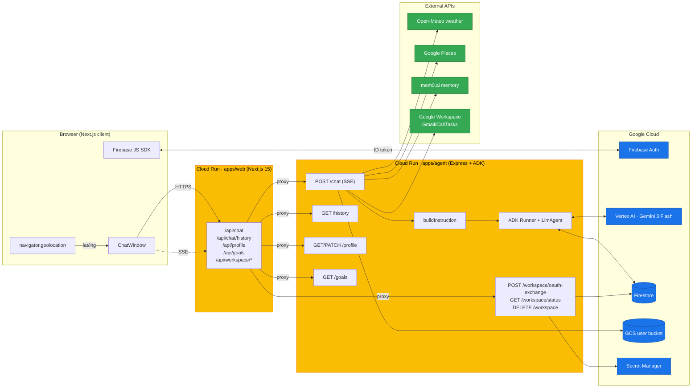
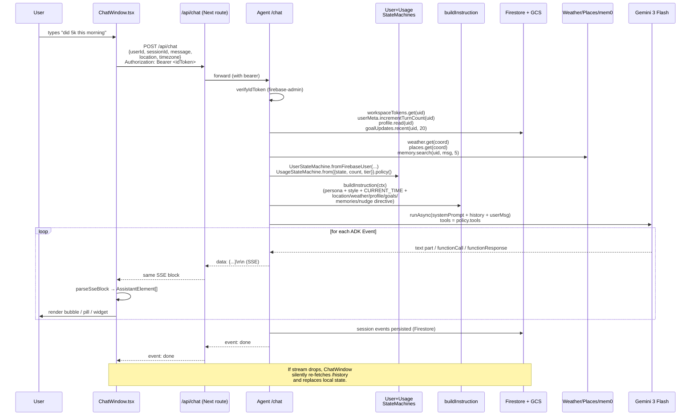
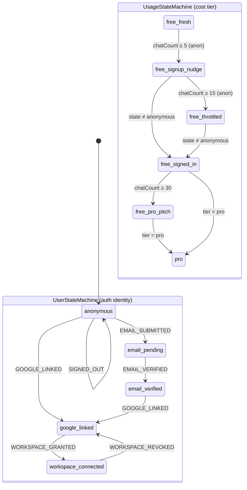

# Lifecoach

A warm, conversational AI life coach. Chats like a friend texting, not a robot writing an email. Remembers you across sessions, knows what's on your calendar, can read your inbox and your task list, and never asks twice for things you've already told it.

The repo is a TypeScript monorepo with two deployables:

- **apps/web** — Next.js 15 (App Router, React 19) on Cloud Run, behind Firebase Auth
- **apps/agent** — A [Google ADK](https://github.com/google/adk-python) agent (Node port) running Gemini 3 Flash on Vertex AI, served from Cloud Run as an Express HTTP/SSE service

Shared code lives in `packages/*`. Infrastructure is Terraform in `infra/`. CI gates the whole thing on **90% line + branch coverage**.

---

## Features

### For the user

- **No friction first run** — anonymous Firebase sign-in, talk to the coach immediately. Upgrade to Google or email later; nothing is lost.
- **Warm, short, non-corporate replies** — the system prompt explicitly forbids "as an AI…" openings, bullet lists, and three-paragraph affirmations.
- **Knows the local context** — current time in *your* timezone, your weather, nearby places, recent goal progress — all injected into the prompt every turn so the agent doesn't have to ask.
- **Browser-only geolocation.** Location comes from `navigator.geolocation`. If you deny permission, location is `null` and the coach operates without weather/places. **No IP-based geolocation, ever** — there's a CI guard that fails the build if anyone adds `geoip-lite`, `cf-connecting-ip`, etc.
- **Real Google Workspace integration** — once connected, the agent can read your Gmail, manage your Calendar, and triage your Tasks via natural language. OAuth tokens never touch the LLM.
- **Long-term memory** via [mem0](https://mem0.ai) — important facts (kids' names, fitness goals, what you don't like) survive across sessions.
- **Turn recovery** — if the network drops mid-stream, the browser silently re-fetches the canonical transcript from Firestore so you don't lose the agent's reply.
- **Markdown rendering** in assistant bubbles (lists, bold, inline code).
- **Cost-tier nudges** — anonymous heavy users get a gentle "create an account?" suggestion; signed-in heavy users get an organic "want to try Pro?" pitch. The LLM never sees billing state — tier decisions happen server-side.

### For the developer

- **Strict architectural invariants** (see `CLAUDE.md`):
  - The agent has **no read tools** for routine context. Time, weather, profile, goal updates — all *injected into the system prompt* by `buildInstruction()`. Reading via tool wastes LLM turns.
  - Only **writes** and **UI directives** are tools.
  - `UserStateMachine` is the single source of truth for which tools/affordances are available — no ad-hoc `user.isAnonymous` branching.
  - `packages/shared-types` Zod schemas are the contract between web and agent.
  - All infra is Terraform. No `gcloud services enable`, no console clicks.
- **Red-Green-Refactor TDD** — every change ships with a failing test first.
- **One logical change per PR**, hooks enforce Biome + typecheck + the no-IP grep guard.

---

## Architecture

### High-level



### One chat turn end-to-end



### Auth + tools state machine

`packages/user-state` exposes two **orthogonal** state machines that compose at the `runnerFor` call site:



| `UserState` | Tools available | Web affordances |
|---|---|---|
| `anonymous` | choice/profile/goals/memory/`auth_user` | "Sign in" |
| `email_pending` | choice/profile/goals/memory | "Check your inbox" |
| `email_verified` | choice/profile/goals/memory | "Link Google" |
| `google_linked` | choice/profile/goals/memory/`connect_workspace` | "Connect Workspace" |
| `workspace_connected` | choice/profile/goals/memory/`call_workspace` | "Workspace connected" badge |

| `UsageState` | Model | Nudge directive | `upgrade_to_pro` tool |
|---|---|---|---|
| `free_fresh` (anon, 0–4 turns) | `gemini-3-flash-preview` | none | off |
| `free_signup_nudge` (anon, 5–14) | `gemini-3-flash-preview` | `signup` | off |
| `free_throttled` (anon, 15+) | **`gemini-flash-lite-latest`** | `signup` | off |
| `free_signed_in` (signed-in, 0–29) | `gemini-3-flash-preview` | none | off |
| `free_pro_pitch` (signed-in, 30+) | `gemini-3-flash-preview` | `pro` | **on** |
| `pro` (any tier=pro) | `gemini-3-flash-preview` | none | off |

### Repo layout

```
.
├── apps/
│   ├── agent/                    Express + ADK runtime, Cloud Run
│   │   ├── src/
│   │   │   ├── server.ts         /chat (SSE), /history, /profile, /goals, /workspace/*
│   │   │   ├── agent.ts          createRootAgent(ctx, tools, {model})
│   │   │   ├── auth.ts           verifyIdToken (firebase-admin)
│   │   │   ├── prompt/
│   │   │   │   └── buildInstruction.ts   system-prompt assembly
│   │   │   ├── context/          weather, places, memory (mem0)
│   │   │   ├── storage/          userProfile, goalUpdates (GCS),
│   │   │   │                     userMeta, workspaceTokens,
│   │   │   │                     firestoreSession (Firestore)
│   │   │   ├── tools/            askChoice, authUser, connectWorkspace,
│   │   │   │                     callWorkspace, logGoalUpdate, memorySave,
│   │   │   │                     updateUserProfile, upgradeToPro
│   │   │   └── oauth/            workspaceClient.ts (google-auth-library)
│   │   └── Dockerfile
│   └── web/                      Next.js 15 App Router, React 19
│       ├── src/
│       │   ├── app/
│       │   │   └── api/          /chat, /chat/history, /profile, /goals,
│       │   │                     /workspace/{oauth-exchange,status,*}
│       │   ├── components/       ChatWindow, AccountMenu, ...
│       │   └── lib/              firebase, geolocation, sse, eventHistory,
│       │                         workspace
│       └── Dockerfile
├── packages/
│   ├── user-state/               UserStateMachine + UsageStateMachine
│   ├── shared-types/             Zod schemas (web↔agent contract)
│   ├── ui/                       React components (Tailwind 4)
│   ├── testing/                  Fakes + test utilities
│   └── config/                   Shared metadata
├── infra/
│   ├── bootstrap/                One-time per env (project + state bucket)
│   ├── envs/{dev,prod}/          terraform.tfvars + backend.hcl
│   ├── modules/                  apis, artifact_registry, firebase_auth,
│   │                             cloud_run, firestore, storage,
│   │                             gws_oauth_secret
│   └── deploy.sh                 Build Docker, push to AR, terraform apply
├── Justfile
├── biome.json
├── turbo.json
└── pnpm-workspace.yaml
```

---

## What lives where

### `apps/agent`

Routes (Express, JSON body, ≤256 KB):

| Method + path | Purpose |
|---|---|
| `GET /health` | Liveness for Cloud Run |
| `POST /chat` | The conversation. Streams ADK events as SSE. |
| `GET /history` | Replay of Firestore-backed session events |
| `GET /profile` | Read user.yaml |
| `PATCH /profile` | Bearer-verified write of full user.yaml |
| `GET /goals` | Last 20 goal updates |
| `POST /workspace/oauth-exchange` | Exchanges GIS popup code → tokens, stores in Firestore |
| `GET /workspace/status` | `{connected, scopes, grantedAt}` (never echoes tokens) |
| `DELETE /workspace` | Revokes refresh token at Google + drops the doc |

Per-uid Firestore stores (`apps/agent/src/storage/*`):

- **`userProfile.ts`** — schema-free YAML at `users/{uid}/user.yaml` in GCS. Dotted-path writes (`update_user_profile` tool); coerces obvious cases (`age`, goal arrays) but otherwise lets the agent invent keys.
- **`goalUpdates.ts`** — append-only JSON array at `users/{uid}/goal_updates.json` in GCS.
- **`userMeta.ts`** — Firestore `userMeta/{uid}` doc: `chatTurnCount`, `tier`, `firstSeenAt`. Counter increments at the start of every `/chat`. Drives `UsageStateMachine`.
- **`workspaceTokens.ts`** — Firestore `workspaceTokens/{uid}`: `accessToken`, `refreshToken`, `scopes`, `grantedAt`. Refresh-on-expiry with a per-uid mutex. Tokens never leave the agent.
- **`firestoreSession.ts`** — ADK `BaseSessionService` impl. One doc per session, `events: Event[]` array. Persists across cold starts and page reloads.

Tools (`apps/agent/src/tools/*`):

- `update_user_profile(path, value)` — schema-free user.yaml writes
- `log_goal_update({goal, status, note?})` — append a goal update
- `ask_single_choice_question` / `ask_multiple_choice_question` — UI directives (turn-ending widgets)
- `auth_user({mode: 'google'|'email', email?})` — UI directive: opens sign-in flow
- `connect_workspace()` — UI directive: opens OAuth popup
- `call_workspace({service, resource, method, params})` — generic Google Workspace dispatcher (Gmail, Calendar, Tasks). `params` is a JSON-encoded **string** to dodge schema mismatches. Returns rich error codes: `scope_required`, `network`, `rate_limited`, `not_found`, `forbidden`, `bad_request`, `timeout`, `upstream`.
- `memory_save({text})` — write to mem0
- `upgrade_to_pro()` — UI directive: shows the Pro upgrade card. Gated by `UsageStateMachine.upgradeToolAvailable`.

Context providers (`apps/agent/src/context/*`):

- **weather** — Open-Meteo, cached 30 min per region (~10 km grid)
- **places** — Google Places API via ADC bearer token, cached 30 min per region
- **memory** — mem0 silent retrieval (top 5, capped at 1 s, errors → empty)

System prompt (`apps/agent/src/prompt/buildInstruction.ts`) is rebuilt every turn with:

```
PERSONA_HEADER       (warm, supportive coach)
STYLE                (short, no bullets, every turn produces visible reply)
EXAMPLES             (BAD/GOOD pairs)
USER_STATE           (from UserStateMachine)
STATE_DIRECTIVE      (per-state guidance)
SIGNUP_NUDGE         (only when nudgeMode=signup)
PRO_NUDGE            (only when nudgeMode=pro)
WORKSPACE_CHEATSHEET (only when state=workspace_connected)
CURRENT_TIME         (now_local pre-formatted in user TZ; "single source of truth")
LOCATION             (or "user_location: unknown" — never IP-fall-back)
WEATHER              (current + 5-day forecast)
NEARBY_PLACES        (top N within ~2 km)
USER_PROFILE         (full user.yaml; nulls preserved)
RECENT_GOAL_UPDATES  (last 20)
RELEVANT_MEMORIES    (mem0 top 5)
```

Model selection is per-turn from `UsagePolicy.model` — heavy anonymous users drop to Flash Lite, everyone else gets Flash. Pinned to Vertex's `global` location (regional endpoints 404 for Gemini 3 Flash today). Configured via `GOOGLE_CLOUD_LOCATION=global`.

### `apps/web`

Each `/api/<thing>/route.ts` is a thin proxy to the agent — Next does TLS termination, attaches the verified Bearer token, and pipes SSE bytes through unmodified. Notable client-side files:

- **`components/ChatWindow.tsx`** — the whole chat UI. Manages auth state via `UserStateMachine.fromFirebaseUser()`, drives location prompts, parses SSE deltas via `parseSseBlock()`, recovers from interrupted streams by re-pulling `/history`, and renders all assistant element kinds (`text`, `choice`, `auth`, `workspace`, `upgrade`, `tool-call`).
- **`lib/firebase.ts`** — `signInAnonymously` on first load, then `linkWithGoogle` (popup) or `sendSignInLinkToEmail` for upgrade. Email-link return uses `completeEmailSignInLink`.
- **`lib/geolocation.ts`** — `navigator.geolocation.getCurrentPosition` only. Caches permission state with `navigator.permissions.query`.
- **`lib/sse.ts`** — streaming parser. Two surfaces: `parseSseAssistant` (whole-blob) and `parseSseBlock` (delta-reducer). Both produce `AssistantElement[]`.
- **`lib/eventHistory.ts`** — converts a Firestore session's `events: Event[]` into the same UI shape, dropping UI-directive tool calls (those widgets were already rendered live; replaying a frozen badge is noise).
- **`lib/workspace.ts`** — runs the GIS popup, exchanges the auth code via `/api/workspace/oauth-exchange`. The browser never sees a token.

### `packages/user-state`

Two state machines, both pure (no I/O):

- **`UserStateMachine`** — auth identity. States: `anonymous`, `email_pending`, `email_verified`, `google_linked`, `workspace_connected`. `policy()` returns `{tools, directive, affordances}`. `fromFirebaseUser(user, workspaceScopesGranted)` reconstructs from Firebase claims.
- **`UsageStateMachine`** — cost tier (orthogonal to auth). `from({userState, chatCount, tier}).policy()` returns `{state, model, nudgeMode, upgradeToolAvailable}`. Thresholds: `SIGNUP_NUDGE_AFTER=5`, `MODEL_DOWNGRADE_AFTER=15`, `PRO_NUDGE_AFTER=30`.

Both are exhaustively unit-tested; transitions assert illegal moves throw.

### `packages/shared-types`

Zod schemas crossing the web↔agent boundary:

- `UserProfileSchema` — schema-free YAML, but the *frame* (top-level keys) is typed
- `GoalUpdateSchema` — `{timestamp, goal, status, note?}`
- `ChoiceQuestionSchema` + `CHOICE_TOOL_NAMES` — picker tool args
- `AuthUserArgsSchema` + `AUTH_MODES` — `'google' | 'email'`
- `WorkspaceStatusSchema`, `WORKSPACE_SCOPES`
- `openUISystemPrompt` — exported string (the Picker convention for OpenUI rendering)

### `packages/ui`

React components consumed by source by `apps/web`:

- `ChatShell`, `Bubble`, `Markdown`, `Input`, `Button`
- `ChoicePrompt`, `AuthPrompt`, `WorkspacePrompt`, `UpgradePrompt` — inline action widgets
- `ToolCallBadge` — green/red/spinning pill for in-flight + completed tool calls
- `LocationBadge`, `AccountMenu`, `YamlTree`
- OpenUI `Renderer` + library (Picker)

### `infra/`

Pure Terraform. `infra/deploy.sh <env> {agent|web|both}` does:

1. Read `project_id`, `region` from `infra/envs/<env>/terraform.tfvars`
2. `terraform apply -target=module.apis,...` for prerequisite infra
3. `gcloud auth configure-docker ${region}-docker.pkg.dev`
4. Docker build agent + web (build-args inject `NEXT_PUBLIC_FIREBASE_*` from Terraform outputs)
5. Push to Artifact Registry, tag = git short SHA (`-dirty-<ts>` if uncommitted)
6. `terraform apply -var image_tag=${tag}`

The only non-Terraform GCP touch is `infra/bootstrap/bootstrap.sh` — runs once per env to create the project and the Terraform state bucket.

---

## Running locally

Prereqs: Node ≥ 22, pnpm ≥ 9.12.3 (`pnpm@9.12.3` is pinned), `just`, Docker (for deploys), `gcloud`, `terraform`.

```bash
just install        # pnpm install
just dev            # web (Next on :3000) + agent (Express on :8080) concurrently
just dev-web        # just web
just dev-agent      # just agent
just test           # vitest across all packages
just coverage       # 90% gate; CI fails below
just lint           # biome --write
just typecheck      # tsc -b
just e2e            # playwright
just deploy dev     # build + push + terraform apply
just logs-agent dev # gcloud logging read for the agent service
```

`.env.local` (gitignored) holds local secrets. Production uses GCP Secret Manager via Terraform.

---

## Workflow

Red-Green-Refactor TDD on every change:

1. **Red** — write a failing test that names the behavior. Run, confirm it fails *for the expected reason*.
2. **Green** — minimum code to pass. No adjacent features, no premature generalization.
3. **Refactor** — rename/extract/dedupe with tests green. Re-run after each step.

90% line + branch coverage across the monorepo. CI fails below. No `/* istanbul ignore */`.

Pre-commit hooks (Biome, typecheck, test, no-IP grep guard) must pass — never `--no-verify`.

---

## Non-negotiable invariants

These are not opinions. Violating any of them fails CI.

1. **No IP-based geolocation — ever.** Location is `navigator.geolocation` only. Forbidden: `x-forwarded-for`, `cf-connecting-ip`, `geoip-lite`, `@maxmind/*`, `ipinfo`, `ip-api`, `ipapi`, `node-geoip`. CI greps for these.
2. **The agent has no read tools for routine context.** Time, weather, profile, goals — all injected via `buildInstruction()` every turn.
3. **`UserStateMachine` is the single source of truth** for which tools the agent gets and which UI affordances render. No ad-hoc `user.isAnonymous` branching.
4. **`packages/shared-types` is the contract** for all data crossing web↔agent.
5. **All infra is Terraform.** No console clicks, no `gcloud services enable`, no `terraform import` to retrofit manual changes.
6. **The LLM never sees auth or billing state.** OAuth tokens, refresh tokens, customer IDs — none of it is in the prompt or tool args. The agent emits UI-directive tools (`auth_user`, `connect_workspace`, `upgrade_to_pro`); the application owns the actual auth/billing plane.

See `CLAUDE.md` for the full guide aimed at AI coding assistants working in this repo.
