# ADR 0001: Background and scheduled agent work

- **Status:** Proposed
- **Date:** 2026-05-15
- **Decision makers:** Lifecoach maintainers
- **Related areas:** `apps/agent_py`, Google Workspace integration, Firestore storage, Terraform infrastructure, web digest UI
- **Synthesizes:** PRs #120, #121, #122, and #123, including review feedback about Cloud Tasks failure handling and task ID validity.

## Context

Lifecoach currently runs the coaching agent in response to foreground chat turns. The browser sends a chat request through `apps/web`, the Python FastAPI service in `apps/agent_py` verifies the Firebase bearer token, assembles context, invokes the ADK runner, executes tools, persists state, and streams the result back over SSE.

Google Workspace is connected through OAuth, with per-user tokens stored server-side and used by agent-owned Workspace tools for Gmail, Calendar, and Tasks. OAuth tokens must never be included in prompts, task payloads, logs, browser responses, or model-visible tool arguments.

We want the agent to do useful work when the user is not actively chatting, starting with scheduled Workspace routines such as:

- daily or weekday morning Gmail triage;
- urgent-email scans;
- digests of actionable emails, upcoming calendar conflicts, and open tasks;
- preparation before a daily planning session;
- later event-triggered work such as Gmail push notifications.

Background work changes the execution model. A scheduled run cannot rely on browser-held Firebase ID tokens, SSE delivery, geolocation, or a user sitting in front of an approval prompt. It also creates stricter requirements for opt-in consent, idempotency, retries, rate limits, observability, privacy, retention, and cost controls.

## Decision

Build a **server-owned background work subsystem** in the existing Python agent Cloud Run service, triggered by managed Google Cloud scheduling and queueing primitives and persisted in Firestore.

The initial implementation will use one Terraform-managed Cloud Scheduler job per environment as a coarse wake-up trigger, one Terraform-managed Cloud Tasks queue for per-run execution, and explicit background endpoints in `apps/agent_py`. The MVP workflow is read-only scheduled inbox triage that writes Lifecoach-owned run records, proposed actions, and reviewable digest artifacts. It must not archive email, send email, create calendar events, create tasks, or otherwise mutate third-party systems until the user confirms the exact action in a foreground flow.

```mermaid
flowchart LR
  CS["Cloud Scheduler<br/>coarse environment tick"] -->|OIDC service identity| DISPATCH["agent_py<br/>POST /background/scheduler/tick"]
  DISPATCH --> FS[("Firestore<br/>schedules + leases + runs")]
  DISPATCH --> CT["Cloud Tasks queue<br/>background-agent-runs"]
  CT -->|OIDC service identity| RUN["agent_py<br/>POST /background/runs/&#123;runId&#125;/execute"]
  RUN --> TOK[("Firestore<br/>Workspace tokens")]
  RUN --> GWS["Google Workspace APIs"]
  RUN --> BG["Background workflow runner"]
  BG --> LLM["ADK sub-agent / deterministic classifier"]
  RUN --> OUT[("Firestore<br/>backgroundRuns + notifications + proposedActions")]
  OUT --> UI["Web / chat review UI"]
```



## Runtime model

### 1. Store durable user automation preferences in Firestore

Each user-configured automation is application state, not model state. Exact collection names can change during implementation, but the schema should keep schedules, execution attempts, and user-visible output separate.

A suggested schedule document shape is:

```text
backgroundSchedules/{scheduleId}
  uid: string
  kind: "email_triage_daily" | "email_urgent_scan" | future workflow kind
  enabled: boolean
  timezone: IANA timezone
  cadence: structured policy, e.g. {type:"daily", localTime:"08:00", weekdays:[1,2,3,4,5]}
  lookbackWindow: "12h" | "1d" | "3d"
  consentVersion: string
  permittedActions:
    archiveNoise: "never" | "after_confirmation" | "auto_if_rule_matches"
    createTasks: "never" | "after_confirmation" | "auto_if_rule_matches"
    createCalendarEvents: "never" | "after_confirmation" | "auto_if_rule_matches"
  notify:
    inApp: boolean
    email: boolean
    chatSummaryOnNextOpen: boolean
  nextRunAt: timestamp
  lastRunAt?: timestamp
  lastStatus?: "ok" | "skipped" | "failed"
  createdAt: timestamp
  updatedAt: timestamp
```

The first release should support only `email_triage_daily` and treat every third-party write as `after_confirmation` at most. Future automatic actions require a separate ADR or explicit follow-up decision that defines consent text, audit logs, per-action limits, reversibility, and recovery UX.

### 2. Use Cloud Scheduler only as a coarse coordinator trigger

Add a service-to-service endpoint in `apps/agent_py` such as:

```http
POST /background/scheduler/tick
```

Responsibilities:

- Authenticate with Cloud Scheduler OIDC / IAM and reject browser Firebase bearer tokens. Background routes must bypass the existing `x-agent-internal-bearer` middleware in `apps/agent_py/src/lifecoach_agent/server.py` (which gates `/chat`); mount them on a sub-router or update the middleware to accept Cloud Scheduler / Cloud Tasks OIDC as an alternative gate. The chosen approach belongs in the implementing PR's description.
- Query Firestore for enabled schedules with `nextRunAt <= now`. Always bound the query with `.limit(N).order_by("nextRunAt")` and drain backlogs across multiple ticks rather than in one call, so a post-outage backlog spike cannot exceed the Cloud Run request deadline.
- Claim due schedules transactionally: in a single Firestore transaction, write a short-TTL lease (`pendingRunId`, `leaseExpiresAt`) on the schedule document and create the `backgroundRuns/{runId}` record. Skip schedules whose lease is still valid (a prior tick is mid-enqueue). This is the **required** dedupe primitive — Cloud Tasks task-ID uniqueness is a second layer only.
- Enqueue one Cloud Task per due run after the lease is held.
- After enqueue succeeds, advance `nextRunAt` and clear the lease in a second transaction. If the process crashes between the two, the lease auto-expires and the next tick re-attempts; the Cloud Tasks task-ID dedupe (§4) makes the retry a no-op.
- Do **not** call Gmail, Calendar, Tasks, or the LLM from this endpoint; it is a pure dispatcher.

This avoids one Cloud Scheduler job per user, keeps user timezones and schedule policy in application code, and prevents one slow mailbox from blocking dispatch for other users.

### 3. Use Cloud Tasks for per-run execution, but own terminal failure state in the app

Add a Terraform-managed Cloud Tasks queue with bounded dispatch rate, bounded concurrency, and a retry policy. Add a worker endpoint in `apps/agent_py` such as:

```http
POST /background/runs/{runId}/execute
```

Task payloads should contain only identifiers needed to load server-side state:

```json
{
  "runId": "run_20260515_080000Z_3ff1a2",
  "scheduleId": "sched_abc123",
  "uid": "firebase uid",
  "kind": "email_triage_daily",
  "scheduledFor": "2026-05-15T08:00:00Z"
}
```

Requirements:

- Authenticate the caller as Cloud Tasks using OIDC / IAM. The OIDC token's `audience` claim must equal the Cloud Run service URL (`module.agent.url`, or the equivalent for a future dedicated background service); enforce this server-side rather than trusting `iss` alone.
- **As the very first operation, before any external I/O**, read the schedule document and validate: `enabled == true`, Workspace token presence, required scope grants, consent version match, eligible product tier. A failed validation returns HTTP 200 with `status: "skipped"` (not 4xx) so Cloud Tasks does not retry. This is the only safe handler for the race "user disables schedule or disconnects Workspace between enqueue and execute".
- After validation passes, load user state, profile, and billing/usage policy server-side.
- Apply per-user usage limits before LLM/Gmail calls. The existing `UsageStateMachine` (`packages/user-state/src/UsageStateMachine.ts`) tracks **chat turns only** today; the automation-vs-chat quota choice is an open question (see §Open questions). Implementations must temporarily fall back to the existing chat quota until a follow-up ADR resolves this, and explicitly mark calls as background-origin in usage records.
- Use Cloud Tasks for retry/backoff and dispatch throttling, but **do not rely on Cloud Tasks as a dead-letter queue**. HTTP tasks that exhaust retry limits can be deleted by Cloud Tasks, so the worker must persist every terminal state itself.
- Record `terminal_failed` or `skipped` in `backgroundRuns` for revoked tokens, missing scopes, disabled schedules, invalid consent, ineligible users, or exhausted attempts that the app observes.
- Optionally publish app-owned terminal failures to a separate queue/topic later if operational needs require it.

Cloud Tasks is at-least-once, not exactly-once. The application must own idempotency, leases, and duplicate suppression.

### 4. Make deterministic task IDs valid and collision-resistant

Use a deterministic Cloud Tasks task ID as the first dedupe layer and a Firestore claim as the second dedupe layer. The task ID must be sanitized because Cloud Tasks task IDs allow only letters, numbers, hyphens, and underscores.

Do **not** use raw ISO timestamps such as `2026-05-15T08:00:00Z` in the task ID because the colon characters are invalid. Prefer one of these shapes:

```text
background-{safeKind}-{uidHash}-{YYYYMMDDTHHMMSSZ}-{shortHash}
background-email_triage_daily-a1b2c3d4-20260515T080000Z-7f9e2a
```

Guidelines:

- Encode the scheduled timestamp as `YYYYMMDDTHHMMSSZ`.
- Hash the `uid` and any long or sensitive identifiers (truncated SHA-256) before including them in the task ID.
- Derive `shortHash` deterministically from `(scheduleId, kind, scheduledFor)` — for example `hmac_sha256(secret, f"{scheduleId}:{kind}:{scheduledFor}")[:6]`. **Never use a random nonce here**; randomness defeats the dedupe property the deterministic ID is built for.
- Replace any non-`[A-Za-z0-9_-]` character in workflow names or IDs with `_`.
- On `CreateTask` returning `ALREADY_EXISTS` (gRPC `AlreadyExists` / HTTP 409), treat the call as **success** — the prior enqueue already happened and the worker will run (or has run) the task. Do not retry, do not error.
- Persist the full idempotency key `{scheduleId}:{kind}:{scheduledFor}` in `backgroundRuns/{runId}.idempotencyKey` (see §6) for auditability, even when the public Cloud Tasks task ID is hashed or shortened.
- Be aware of the ~1-hour Cloud Tasks task-name "tombstone" after completion/deletion. The `(scheduleId, scheduledFor)` deterministic ID is unique-per-occurrence, so this is only relevant if a workflow's MVP ever needs sub-hour retry of the *same* `scheduledFor` — which the read-only triage MVP does not.

### 5. Execute workflows through a background-safe agent path

Background execution should not post a hidden synthetic message to `/chat`. Create an explicit background runner that shares infrastructure with chat but makes non-interactive semantics visible in code:

```python
class BackgroundWorkflow(Protocol):
    name: str

    async def run(self, ctx: BackgroundRunContext) -> BackgroundRunResult:
        ...
```

The runner should:

- build a `BackgroundRunContext` from the schedule, user profile, Workspace status, usage policy, safe context providers, and run record. Per project invariant #2, this context is **injected as prompt text** by the runner — never read by the model via a tool call. Background runs have no `navigator.geolocation` source, so location/weather/places/air-quality are always `null`; the MVP triage workflow does not need them, and future workflows that do must declare a non-geolocation context provider explicitly rather than adding a read tool;
- reuse the existing Workspace token store and Workspace projection boundary so OAuth tokens stay server-side. The token store factory lives at `apps/agent_py/src/lifecoach_agent/storage/workspace_tokens.py`; the projection boundary is `apps/agent_py/src/lifecoach_agent/workspace_agent/projections/`. Tool factories follow the existing `create_*_tool(deps)` pattern (e.g. `workspace_agent/tools/list_inbox.py`) so background tools bind tokens the same way foreground tools do;
- expose only background-safe tools, initially read-only inbox triage / lookup tools and a digest-writing tool;
- disable UI-directive tools such as `ask_single_choice_question`, `auth_user`, `connect_workspace`, and `upgrade_to_pro`;
- disable destructive Workspace writes in background mode until foreground approval consumes a proposed action;
- cap model/tool steps, Gmail page sizes, message-body bytes, and wall-clock runtime;
- produce validated structured output rather than free-form hidden chat turns.

### 6. Persist reviewable artifacts and proposed actions

Every run should create a queryable run record and any user-visible output as separate records.

Suggested run record:

```text
backgroundRuns/{runId}
  uid: string
  scheduleId: string
  kind: string
  status: "queued" | "running" | "succeeded" | "retryable_failed" | "terminal_failed" | "skipped" | "cancelled" | "superseded"
  idempotencyKey: string  # see §4: {scheduleId}:{kind}:{scheduledFor}
  scheduledFor: timestamp
  inputWindowStart: timestamp
  inputWindowEnd: timestamp
  startedAt?: timestamp
  finishedAt?: timestamp
  attempt: number
  leaseExpiresAt?: timestamp
  outputRef?: string
  errorCode?: string         # short stable code, e.g. "WORKSPACE_TOKEN_REVOKED"
  errorMessage?: string      # sanitized — see "Error sanitization" below
  model?: string
  tokenCostEstimate?: number
```

Status transitions:

- `queued` — set when the dispatcher writes the run record and enqueues the task.
- `running` — set by the executor on lease claim (atomic with reading the schedule).
- `succeeded` — workflow completed and persisted output.
- `skipped` — opt-in / token / scope / consent / quota check failed; HTTP 200 returned so Cloud Tasks does not retry.
- `retryable_failed` — transient infra error; executor returns 5xx and relies on Cloud Tasks retry.
- `terminal_failed` — retries exhausted, or a non-retryable error the app classifies as terminal.
- `cancelled` — user paused or disabled the schedule after enqueue; executor returned `skipped` and the dispatcher rewrites the run record to `cancelled` on its next pass.
- `superseded` — a newer run for the same `idempotencyKey` claimed the lease (rare; only possible if dispatcher logic is bypassed).

### Error sanitization

`errorMessage` must be safe to persist and surface to the digest UI. Implementation rules:

- Store an error class name + short stable code only (`errorCode`), e.g. `"WORKSPACE_TOKEN_REVOKED"`. Raw exception messages from Gmail / Calendar / Vertex API calls **must not** be stored.
- If a free-text excerpt is necessary for debugging, route it to Cloud Logging (structured field), not to Firestore.
- Apply the existing OAuth-token redaction pattern from `apps/agent_py/src/lifecoach_agent/server.py` (`re.sub(r"ya29\.\S+", "[redacted]", …)`) to any string that might transit a log line.
- Never log raw email bodies, snippets, subjects, addresses, or display names.

Suggested notification or digest record:

```text
backgroundNotifications/{notificationId}
  uid: string
  runId: string
  kind: "email_triage_daily"
  status: "unread" | "read" | "dismissed" | "acted_on"
  title: string
  summary: client-safe digest text
  items: structured triage rows with stable Workspace IDs and short snippets
  proposedActions: action IDs requiring foreground confirmation
  createdAt: timestamp
  expiresAt?: timestamp
```

Suggested action records should be individually addressable and auditable, for example `archive_message`, `create_task`, or `create_calendar_event`, each with source message IDs, current approval status, and execution result.

**Background run output must not be written to the user's foreground ADK session.** The digest review UI reads from `backgroundNotifications` directly. If a foreground turn needs to reference a digest, it does so via a narrow AgentTool that reads notification records server-side — never by replaying background events into the chat session history. This preserves the boundary noted in project memory: transient task data lives in a delegated sub-agent / store, not in the main agent's prompt.

## Scheduled inbox triage MVP

The first workflow is `email_triage_daily`:

1. Verify the schedule is still enabled and the user is eligible.
2. Verify Workspace is connected and required scopes are available.
3. Select a bounded Gmail query/window from `lastSucceededAt` or the scheduled input window.
4. Fetch projected message headers/snippets/bodies through existing Gmail projection code; avoid persisting full bodies unless a UX need and retention policy require it.
5. Classify messages into buckets such as `noise`, `actions`, `events`, and `info` using the existing triage schema or sub-agent.
6. Persist a digest, source message IDs, and proposed actions.
7. Notify the user only according to preferences, initially in-app or on next chat open.
8. Require foreground confirmation before any Gmail, Calendar, or Tasks write executes.

The executor should return a 2xx response for completed runs and permanent skips so Cloud Tasks does not retry non-retryable conditions. It should return retryable 5xx responses only for transient infrastructure, Firestore, Gmail, Vertex, or network failures within bounded attempts.

## Security, privacy, and safety requirements

- Background workflows are explicit opt-in per user and per workflow; connecting Workspace must not create schedules implicitly.
- Consent copy must state what will be read, how often, where the digest appears, which notifications may be sent, and what actions still require confirmation.
- Internal scheduler and task endpoints require Cloud Scheduler / Cloud Tasks OIDC identities and reject browser Firebase tokens.
- User-facing schedule and notification endpoints continue to use Firebase bearer auth.
- Task payloads contain identifiers only; OAuth tokens and raw email data are loaded server-side.
- OAuth tokens are never sent to the LLM, task payloads, logs, notifications, or client-visible documents.
- Logs may include IDs, counts, status, latency, and sanitized error classes; never log OAuth tokens, raw email bodies, or full snippets.
- Disconnecting Workspace disables or skips future Workspace-dependent runs before any Workspace read.
- Users can pause schedules, disable schedules, dismiss/delete pending artifacts, and disconnect Workspace.
- Background LLM usage must respect product-defined per-tier quotas and model/tool budgets.
- The digest UI must clearly distinguish model-generated classifications and proposals from completed actions.

## API surface

Exact paths can change during implementation, but separate service-to-service routes from user-facing routes:

| Endpoint | Auth | Purpose |
| --- | --- | --- |
| `POST /background/scheduler/tick` | Cloud Scheduler OIDC / IAM | Sweep due schedules and enqueue run tasks. |
| `POST /background/runs/{runId}/execute` | Cloud Tasks OIDC / IAM | Execute one idempotent background run. |
| `GET /background/notifications` | Firebase bearer | List current user's digest cards. |
| `PATCH /background/notifications/{id}` | Firebase bearer | Mark digest read, dismissed, or acted on. |
| `POST /background/schedules` | Firebase bearer | Create or update a user-owned schedule from UI or chat. |
| `DELETE /background/schedules/{id}` | Firebase bearer | Soft-disable a user-owned schedule for auditability. |

Do not proxy service-to-service scheduler/task endpoints through `apps/web`.

## Infrastructure

All production infrastructure changes must be represented in Terraform (project invariant #5). Concretely:

- Add `cloudscheduler.googleapis.com` and `cloudtasks.googleapis.com` to `infra/modules/project-apis/main.tf`.
- Create one Cloud Scheduler job per environment:
  - Cadence: **5 min in prod, 15 min in dev** (pinned values, not a range). Document the SLO: "scheduled time + tick interval, p99".
  - `retry_config { retry_count = 0, max_retry_duration = "0s" }` — the dispatcher's lease + dedupe makes Cloud Scheduler retries unsafe (a slow tick that succeeds eventually still gets the bench claim).
  - `attempt_deadline = "60s"`. The dispatcher uses `.limit(N)` and drains backlog over multiple ticks, not in one.
- Create one Cloud Tasks queue per environment with rate limits (`max_dispatches_per_second`), concurrency cap (`max_concurrent_dispatches`), and retry policy (`max_attempts`, `min_backoff`, `max_backoff`) aligned to Gmail API and model budget. Tunable via `infra/envs/<env>/variables.tf` (`background_queue_max_dispatch_per_second`, `background_queue_max_concurrent_dispatches`).
- Service accounts + IAM:
  - `sa-background-scheduler@…` is the OIDC identity Cloud Scheduler uses to call the tick endpoint. The scheduler job's `oidc_token { audience = module.agent.url, service_account_email = google_service_account.background_scheduler.email }` must point at the **exact** Cloud Run service URL — if the worker later splits to a dedicated service, the audience must move with it.
  - `sa-background-invoker@…` is the OIDC identity Cloud Tasks uses to call the run endpoint. Same audience binding.
  - Both SAs get `roles/run.invoker` on the target Cloud Run service.
- Firestore indexes (composite — single-field auto-index is **not** sufficient for these queries):
  - `backgroundSchedules`: composite on `(enabled ASC, nextRunAt ASC)`.
  - `backgroundRuns`: composite on `(uid ASC, createdAt DESC)`.
  - `backgroundNotifications`: composite on `(uid ASC, status ASC, createdAt DESC)`.
  - No `google_firestore_index` resources exist in the repo today; add to `infra/modules/firestore/` (currently DB-only) or a new sibling module.

**Cloud Run colocation**: keep the first version inside the existing agent Cloud Run service if `min_instances` can absorb the tick load without contending with chat. The default `max_instances=3` is tight for any Vertex-heavy classifier; if Background-related foreground-latency regressions appear in dev, split to a dedicated `lifecoach-background-worker` service with `min_instances=0` and its own IAM/OIDC bindings before going beyond the internal allowlist.

## Observability and operations

**Structured-log JSON fields** (every log line from background paths):

`runId`, `scheduleId`, `uid_hash`, `kind`, `status`, `attempt`, `error_code`, `latency_ms`, `tick_id` (where applicable).

`uid_hash` is the same truncated SHA-256 used in task IDs (§4). The raw `uid` is never logged — log queries route through `uid_hash` so an operator joining via the auth-plane (Firestore lookup) is the only path from logs back to user identity.

**Log-based metrics** (Cloud Monitoring, defined in Terraform):

- `background_run_terminal_failed_total` — counter, by `kind`, `error_code`.
- `background_run_succeeded_total` — counter, by `kind`.
- `background_queue_oldest_task_age_seconds` — gauge, derived from Cloud Tasks queue stats.
- `background_tick_duration_seconds` — distribution, by `tick_id`.
- `background_model_cost_estimate_usd` — sum, by `kind`, `model`.

**Alert policies** (start values — tune after first week of real traffic):

- `background_queue_oldest_task_age_seconds > 900` for 10 min → page (queue is more than tick-interval × 3 behind).
- `rate(terminal_failed_total) / rate(run_total) > 0.05` over 1h → page (>5% failure rate).
- `daily sum(model_cost_estimate_usd) > $X` (X = product-defined budget; ADR open question) → notify.
- `background_run_terminal_failed_total{error_code="WORKSPACE_TOKEN_REVOKED"} rate > N/h` → notify (likely a Google-side incident or scope rollout).

**Admin / debug**: add `GET /background/admin/runs?uid=<firebase-uid>&limit=50` returning sanitized run records — no OAuth tokens, no email content, no raw error messages from third-party APIs. Cloud Logging queries with structured fields are the primary debug surface; this endpoint is the convenience layer.

**Auth on the admin route is load-bearing.** Cloud Run IAM (`roles/run.invoker`) alone is **not** sufficient as long as the agent service stays `allow_unauthenticated = true` in dev/preview (which it currently is — see `infra/modules/cloud-run-service/main.tf` and `infra/envs/dev/main.tf`). Co-locating the admin route on the public agent service would expose per-user run data to anyone with the URL. Pick one of:

1. **Dedicated non-public Cloud Run service** for admin endpoints (e.g. `lifecoach-background-admin`) with `allow_unauthenticated = false`. Cloud Run IAM does the gating. Operator group gets `roles/run.invoker`. Simplest if you don't mind a second deploy unit.
2. **In-app verification on the admin route** when colocated on the public agent service. The handler must verify a Google-signed OIDC token in `Authorization: Bearer <token>` (verify `iss`, `aud` = the agent's URL, signature against Google's JWKS) AND check that the principal's email is in an operator allowlist. The shared `x-agent-internal-bearer` middleware is **not** appropriate here — it's a static secret meant for service-to-service calls from `apps/web`, not for human operator auth.

Choose option 1 unless splitting the service has higher friction than implementing the OIDC verifier; for the first iteration of background work, option 1 is recommended because it keeps the auth model trivial to reason about. Either way, the ADR is now explicit that "IAM-only Cloud Run invoker" is **only** acceptable when the service is non-public — and the existing agent service is public.

**Budget alert**: a separate `google_billing_budget` alert at the project level (independent of per-user usage caps) — caps the worst-case runaway cost from a misbehaving classifier loop. Track as a follow-up if not in the first implementation PR.

## Testing requirements

- Unit-test schedule due-time calculation across timezones and daylight-saving changes.
- Unit-test deterministic sanitized task ID generation.
- Storage-test schedule, run, lease, idempotency, notification, and proposed-action repositories with Firestore fakes.
- Endpoint-test IAM-only background routes and Firebase-only user routes.
- Replay-test duplicate Cloud Task deliveries to prove the same run does not duplicate digests or actions.
- Workspace-fake tests for missing scopes, revoked tokens, rate limits, empty inboxes, and disconnected users.
- Prompt/eval tests for background mode that assert foreground-only UI tools and destructive tools are unavailable.
- Integration smoke-test the sweep -> task -> executor -> notification path with all external APIs faked.

## Alternatives considered

| Option | Decision | Reason |
| --- | --- | --- |
| Browser timers / service workers | Rejected | Requires an active browser session; pushes background logic to the client; no durable scheduling. |
| Long-running worker loop inside Cloud Run | Rejected (v1) | Cloud Run scales to zero; sleeping loops couple scheduling to container lifecycle and complicate retries / rate limits. |
| Cloud Scheduler directly executes every due user run | Rejected | Inline fan-out coarsens retries, risks request timeouts, and lets one slow mailbox block others. One Scheduler job per user turns schedule changes into infra changes. |
| Pub/Sub as the primary per-user execution queue | Deferred | Viable for event fan-out + future Gmail push, but Cloud Tasks maps better to authenticated HTTP handlers, deterministic task names, dispatch-rate controls, and per-run retry policy. |
| Cloud Run Jobs | Deferred | Useful for batch / backfill, less ergonomic for many small per-user HTTP-style runs and user-level retries. |
| Workflows / Temporal | Deferred | Powerful for multi-step long-lived workflows + human approval, but too much orchestration surface for a read-only triage MVP. |
| Full conversational root agent on a synthetic chat prompt | Rejected | A fake "triage my inbox now" message mixes interactive + autonomous semantics, complicates SSE/session history, and blurs policy/audit boundaries. |
| Next.js web app owns background work | Rejected | Workspace tokens and agent orchestration live in `apps/agent_py`; moving automation to the web app would blur auth-plane boundaries and duplicate storage/tooling. |

## Consequences

### Positive

- The agent can do useful work without an active browser session.
- Scheduling policy stays in application data instead of per-user cloud infrastructure.
- The design reuses the existing Python agent, Workspace OAuth storage, projections, and triage behavior.
- Foreground chat remains isolated from slow or retrying background work.
- Runs, digests, and proposed actions are reviewable and auditable.
- The system can grow from scheduled digests to event-triggered workflows using the same execution model.

### Negative / trade-offs

- Adds operational complexity: Scheduler, Tasks, IAM/OIDC, queue configuration, Firestore indexes, leases, and run-state storage.
- Requires a second execution path beside foreground `/chat`.
- Background prompt/tool behavior needs its own evals and safety tests.
- Background LLM calls create cost when users are not actively chatting.
- OAuth refresh failures and revoked Workspace permissions become asynchronous user-facing states.
- Digest UI, schedule settings, retention, and approval UX become required product surfaces before broad rollout.

## Rollout plan

1. Confirm this ADR and close PRs #120, #121, #122, and #123 in favor of the synthesized decision.
2. Add Zod schemas in `packages/shared-types/src/background.ts` for `BackgroundSchedule`, `BackgroundRun`, `BackgroundNotification`, `BackgroundProposedAction`, and a `sanitizeTaskId(input): string` helper. Re-export from the package barrel. Python side mirrors as Pydantic models in `apps/agent_py/src/lifecoach_agent/contracts/background.py`.
3. Add Firestore storage adapters in two passes:
   - (a) schedule store + due-query (with `.limit()` + cursor);
   - (b) run store + lease claim + idempotency check + terminal-failure persistence.
   Unit-test each with the existing Firestore fakes in `packages/testing/`.
4. Add service-to-service endpoint skeletons for scheduler tick and run execution behind OIDC/IAM, initially with a no-op workflow. Document how they bypass the existing `x-agent-internal-bearer` middleware.
5. Add Terraform in five separate PRs (each independently revertable):
   - (a) enable `cloudscheduler.googleapis.com` + `cloudtasks.googleapis.com` in `infra/modules/project-apis/`;
   - (b) new `infra/modules/background-scheduler/` (per-env job, retry_count=0, attempt_deadline=60s);
   - (c) new `infra/modules/background-tasks-queue/` (rate, concurrency, retry policy as env-tunable vars);
   - (d) IAM bindings + OIDC audience env vars on `module.agent` (scheduler-SA + invoker-SA, both `roles/run.invoker`);
   - (e) extend `infra/modules/firestore/` with composite indexes (currently DB-only — these are greenfield).
6. Implement read-only `email_triage_daily` for an internal allowlist. The allowlist is a Firestore doc `backgroundConfig/global { allowlistUids: [...] }`, edited by an operator (or seeded via Terraform) — **not** a Cloud Run env var, which would couple revisions to allowlist changes. All external APIs faked in tests.
7. Add the opt-in settings UI (separate PR) and the pending digest review UI (separate PR). Each needs explicit acceptance criteria — file as follow-up issues.
8. Add foreground approval flows for proposed archive / task / calendar actions using existing Workspace write tools. This warrants its own design pass — flag as a follow-up ADR.
9. Block widening past the allowlist until: per-tier quota wired (resolves the automation-quota open question), GCP billing-budget alert active, and observability dashboards reviewed in dev.
10. Evaluate Gmail push notifications and limited automatic rules only after scheduled triage has reliable observability and demonstrated user value.

## Open questions

These block widening past the internal allowlist (per Rollout step 9). Each should be resolved by a follow-up ADR, design doc, or implementation PR before public rollout.

- **Quota model.** Background usage as part of the chat quota, a separate `AutomationStateMachine` (mirroring `UsageStateMachine`), or Pro-only? Recommend resolving before step 6 lands so the implementation isn't retrofit.
- **Retention.** Run records, projected snippets, digests, proposed actions — keep how long? Suggested defaults to validate: runs 90d, notifications 30d after read/dismissed, proposed actions 14d after creation.
- **Notification channels v1.** In-app only, email summary, push, or "summarized in next chat"? In-app + next-chat is the lowest-surface combination.
- **Digest UI scope.** What's the minimum surface in `apps/web` before scheduled triage is useful? File a separate UX design issue.
- **Chat-history visibility.** ADR §6 forbids writing background output to the foreground ADK session, but the UI surface (drawer, banner, inline summary) is still open.
- **Workspace consent copy.** Does the current connection consent already cover background Gmail processing, or do we need a separate scope/consent screen?
- **Model selection.** Same `gemini-3-flash-preview` as interactive Workspace calls, or `gemini-flash-lite-latest` for scheduled triage? Cost-vs-quality tradeoff — measure in dev allowlist.
- **Pause / snooze UX.** How should users pause automations during vacations or outside working days?

## Status

- **Proposed** (this PR). Merging this ADR commits to the design; implementation lands across the follow-up PRs in the Rollout plan.
