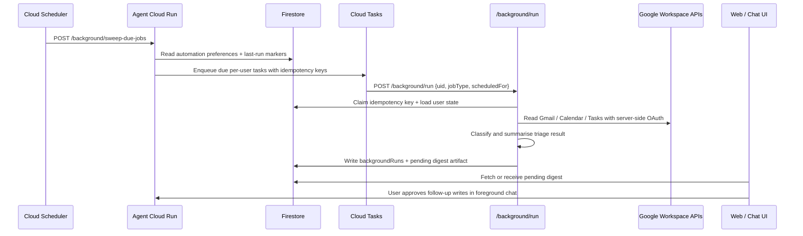

# ADR 0001: Background and scheduled agent work

- **Status:** Proposed
- **Date:** 2026-05-14
- **Decision makers:** Lifecoach maintainers
- **Related areas:** `apps/agent_py`, Google Workspace integration, Terraform infrastructure, Firestore storage

## Context

Lifecoach currently runs the coaching agent in response to foreground chat turns. This works well for interactive help, including Workspace-connected turns where the user asks to triage email, inspect calendar events, or manage tasks. The next product step is to let the agent do useful work while the user is away, for example:

- triage a user's inbox every weekday morning before their first planning session;
- prepare a "what needs attention" digest from Gmail, Calendar, and Tasks;
- refresh cached context so the first foreground reply is faster;
- eventually react to external events such as important new email.

The background design must preserve current safety and product constraints:

- OAuth tokens stay server-side and never appear in prompts, browser responses, or tool arguments.
- Workspace writes such as archiving messages, creating calendar events, or adding tasks remain explicit user-approved actions unless a future permission model grants a narrow automation policy.
- User state remains the source of truth for whether Workspace tools may run.
- Infrastructure changes are represented in Terraform rather than manual cloud console changes.
- The foreground `/chat` streaming path should not be blocked by slow or retrying background work.

## Decision

We will add a **background work subsystem** to the existing Python agent Cloud Run service, backed by managed Google Cloud scheduling and queueing primitives:

1. **Store user automation preferences in Firestore.**
   - Add a per-user document such as `users/{uid}/automation.yaml` or `automations/{uid}` with enabled jobs, timezone, schedule, consent version, and notification preferences.
   - Treat this preference document as application state, not prompt context. The worker reads it before deciding which jobs to enqueue.

2. **Use Cloud Scheduler only as a coarse trigger.**
   - A Terraform-managed Cloud Scheduler job calls a secured agent endpoint such as `POST /background/sweep-due-jobs` every 5-15 minutes.
   - The sweep endpoint computes which users are due based on stored timezone-aware schedules and last-run records.
   - This avoids creating one Cloud Scheduler job per user and keeps schedule changes in application data.

3. **Use Cloud Tasks for per-user execution.**
   - The sweep endpoint enqueues one Cloud Task per due job, for example `POST /background/run` with `{uid, jobType, scheduledFor, idempotencyKey}`.
   - Cloud Tasks provides retries, rate limits, concurrency controls, and dead-letter handling without holding open a foreground request.
   - Task names include the idempotency key so duplicate sweeps cannot run the same job twice.

4. **Run jobs inside the existing agent service, but through a non-chat runner path.**
   - The worker reuses the current Workspace token store, Workspace tools, prompt-contract models, and storage adapters.
   - It does **not** emit SSE events or mutate a live chat session.
   - It calls deterministic orchestration code first, and only invokes an LLM sub-agent where classification or summarisation is valuable.

5. **Persist results as reviewable artifacts.**
   - Background triage writes a `backgroundRuns/{runId}` record and a user-facing artifact such as `users/{uid}/digests/{digestId}`.
   - Artifacts contain structured results: urgent items, proposed actions, candidate archive messages, candidate calendar events, and errors requiring reconnect.
   - Foreground chat and the web UI can surface the latest pending artifact and ask the user to approve any writes.

6. **Keep the MVP read-only.**
   - The first scheduled email triage implementation may read Gmail, Calendar, and Tasks and write only Lifecoach-owned metadata.
   - It must not archive email, create events, create tasks, or send email automatically.
   - Future automatic writes require a separate ADR defining user consent, revocation, audit logs, per-action limits, and recovery UX.

## Proposed architecture

### Background run lifecycle

Each run should move through explicit states:

1. `queued` — Cloud Task accepted.
2. `running` — worker claimed the idempotency key.
3. `succeeded` — artifact persisted and `lastSucceededAt` updated.
4. `retryable_failed` — transient error; Cloud Tasks may retry.
5. `terminal_failed` — auth revoked, missing scopes, invalid preference, or repeated failures.
6. `superseded` — a newer run made this result stale before the user reviewed it.

The state machine should be stored outside the chat transcript so retries do not create duplicate assistant messages.

### Scheduled inbox triage MVP

For `jobType = "inbox_triage"`:

1. Load the user's automation settings and verify the user is still Workspace-connected.
2. Fetch a bounded set of messages, for example unread or recent inbox messages since the last successful run.
3. Run the existing triage classifier/sub-agent against projected message data, not raw OAuth tokens.
4. Persist a digest with buckets aligned to the current triage report model:
   - noise / likely archive candidates;
   - action-needed items;
   - calendar event candidates;
   - informational items;
   - reconnect or scope errors.
5. Notify the user only according to their preferences:
   - in-app pending digest for the MVP;
   - optional email or push notification later.
6. Require foreground confirmation before any Gmail, Calendar, or Tasks write is executed.

## Security and privacy requirements

- Cloud Scheduler and Cloud Tasks must invoke private endpoints with OIDC-signed service-account identity. The endpoint rejects browser bearer tokens for background routes.
- Background endpoints accept only minimal task payloads. They load tokens and preferences by `uid` server-side.
- Service accounts should have least privilege: task enqueuer, task invoker, Firestore access, Secret Manager access needed by the existing agent, and no broad owner/editor roles.
- Every artifact should record source message IDs and action proposals, but avoid storing full email bodies unless necessary. Prefer projected snippets and headers already used by Workspace tools.
- The user can disable automation, delete pending artifacts, and disconnect Workspace. Disconnecting Workspace must prevent new runs and make queued runs terminate before reading Workspace data.
- All writes to third-party systems require explicit foreground approval for the MVP.

## Idempotency, retries, and rate limits

- Generate idempotency keys from `{uid, jobType, scheduledFor}`.
- Use the Cloud Task name as the first dedupe layer and a Firestore claim document as the second dedupe layer.
- Keep per-user and global concurrency low enough to respect Gmail API quota and model budget.
- Use exponential retry only for transient failures. Treat revoked tokens, missing scopes, and disabled automation as terminal failures.
- Record input window boundaries so a retry triages the same time range instead of drifting.

## Observability

- Emit structured logs with `runId`, `uidHash`, `jobType`, `scheduledFor`, and final status.
- Track metrics for due jobs, queued tasks, successful runs, terminal failures, retry counts, queue age, Workspace API errors, and model cost.
- Add an admin/debug endpoint or script to inspect a user's last background run without exposing OAuth tokens.
- Add eval fixtures for background triage classification once the orchestration path exists.

## Alternatives considered

### A. Run an always-on worker loop inside Cloud Run

Rejected. Cloud Run instances can scale to zero and are not a durable scheduler. Long-running loops also make deployments, retries, and per-user rate limiting harder.

### B. Create one Cloud Scheduler job per user

Rejected. It would turn user preference changes into infrastructure changes, create too many cloud resources, and conflict with the repository rule that infrastructure shape belongs in Terraform while user schedules belong in application data.

### C. Cloud Scheduler directly calls `/background/run` for every job type

Rejected for all but tiny internal maintenance tasks. Direct calls lack per-user retry isolation, queue backpressure, and dedupe controls.

### D. Use Pub/Sub as the only queue

Viable for event fan-out, but not the primary per-user execution queue. Pub/Sub has at-least-once delivery but weaker per-task scheduling, task naming, and HTTP retry controls than Cloud Tasks for this workload. Pub/Sub remains a good fit later for Gmail push notifications or broad "wake up and sweep" events.

### E. Use Cloud Run Jobs

Viable for batch maintenance or one-off backfills. Less ideal for small per-user jobs because the agent already runs as an HTTP service and Cloud Tasks can call authenticated HTTP handlers with fine-grained dedupe and retry semantics.

### F. Put background work in the Next.js web app

Rejected. Workspace tokens and agent orchestration live in `apps/agent_py`; moving automation into the web app would blur the auth-plane boundary and duplicate storage/tooling.

## Consequences

### Positive

- Reuses the existing Python agent, Workspace OAuth storage, projections, and triage behavior.
- Keeps foreground chat fast and separate from retrying background work.
- Gives us explicit audit records for what ran, what it read, and what it proposed.
- Supports both scheduled jobs and future event-triggered jobs with the same execution model.
- Avoids per-user cloud infrastructure resources.

### Negative / trade-offs

- Adds new moving parts: Cloud Scheduler, Cloud Tasks, background endpoints, and run-state storage.
- Requires careful quota and cost controls before broad rollout.
- Requires a new UX surface for pending digests and approvals.
- The MVP will prepare triage results but will not fully "do the inbox cleanup" until a later consent model exists.

## Rollout plan

1. Add the ADR and agree on the architecture.
2. Add shared/background contract types for automation preferences, run status, and digest artifacts.
3. Add Firestore storage adapters and unit tests for preference reads, run claiming, and idempotency.
4. Add `/background/sweep-due-jobs` and `/background/run` behind service-account authentication.
5. Add Terraform for Cloud Scheduler, Cloud Tasks queue, IAM, and any required environment variables.
6. Implement read-only scheduled inbox triage for a small allowlisted set of users.
7. Add UI for automation settings and pending digest review.
8. Expand evals, observability, and rollout gates before enabling more users.

## Open questions

- Should digest artifacts live in Firestore for queryability, GCS for larger payloads, or a hybrid where Firestore stores metadata and GCS stores verbose details?
- What is the exact notification policy for a completed digest: silent in-app card, email summary, browser notification, or morning chat prompt?
- How should the user configure schedules: fixed local time, weekday presets, or "before my first calendar event"?
- What retention period should apply to background run records and email-derived artifacts?
- Which actions, if any, should become eligible for pre-approved automation in a future ADR?
