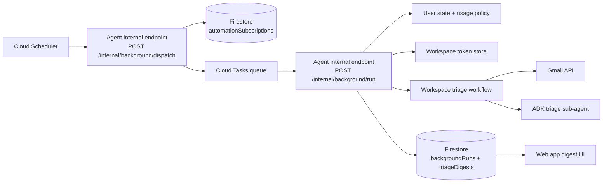

# ADR 0001: Background and scheduled agent work

- **Status:** Proposed
- **Date:** 2026-05-14
- **Owners:** Lifecoach engineering
- **Related areas:** `apps/agent_py`, Google Workspace integration, Terraform infrastructure

## Context

Lifecoach is currently request-driven: a user opens the web app, sends a chat turn, and the FastAPI agent assembles context, runs the ADK runner, calls tools, and streams an answer back to the browser. Google Workspace support is also initiated by a live chat turn: when a user is `workspace_connected`, the root agent may call the Workspace tools, including the read-only `triage_inbox` AgentTool and the narrower write tools for archive, calendar, and tasks.

We want the agent to be able to work while the user is not actively chatting, especially for routines such as:

- morning inbox triage;
- periodic checks for urgent emails;
- generating a digest of actionable mail, events, and goal-relevant information;
- turning confirmed or pre-approved triage outcomes into tasks, calendar holds, or archive actions.

The design must preserve existing product and architecture constraints:

- Google Workspace access requires explicit user OAuth connection and must never expose tokens to the model.
- Background work must not bypass the same user-state, billing, and tool-policy rules used by interactive turns.
- Routine context should still be assembled by application code rather than by giving the model broad read tools.
- All infrastructure must be declared in Terraform.
- The first version should be safe: read-only triage by default, visible audit trail, and no irreversible mailbox actions without explicit opt-in.

## Decision

Build background agent work as **durable, scheduled jobs owned by `apps/agent_py` and orchestrated by Google Cloud Scheduler + Cloud Tasks**, with Firestore as the source of truth for user automation settings, run state, idempotency, and results.

Cloud Scheduler will trigger a lightweight coordinator endpoint on the agent service. The coordinator will query Firestore for due automation subscriptions and enqueue one Cloud Task per user/workflow. Each Cloud Task will call an internal agent endpoint that executes a single idempotent workflow run, such as `email_triage_daily` or `email_urgent_scan`.

The initial workflow will be **scheduled inbox triage**:

1. User opts in from the web app after connecting Google Workspace.
2. The app stores an automation subscription in Firestore, including cadence, timezone, permitted actions, and notification preferences.
3. The scheduler coordinator periodically finds due subscriptions and enqueues per-user tasks.
4. The task handler loads the user profile, user state, usage policy, OAuth token metadata, and automation settings server-side.
5. If the user is no longer eligible (`workspace_connected` revoked, OAuth refresh fails, over quota, disabled automation, etc.), the run exits with a recorded skip reason.
6. If eligible, the handler invokes a deterministic workflow wrapper that uses the existing Workspace service and triage sub-agent to produce a structured triage report.
7. The handler stores the result as a durable triage run and emits a user-visible notification/digest record.
8. The web app presents the digest and lets the user approve suggested writes. Only separately configured, narrow, reversible actions may run automatically.

The scheduled pathway should reuse the existing Workspace tool implementations where possible, but it should not pretend to be a browser chat turn. It should have its own internal workflow entry point, logs, tests, quotas, and audit records.

## Proposed architecture



### Main components

#### 1. Automation subscriptions

Add a Firestore collection for durable user preferences:

```text
automationSubscriptions/{uid}_{workflow}
  uid: string
  workflow: "email_triage_daily" | "email_urgent_scan"
  enabled: boolean
  timezone: IANA timezone
  cadence: cron-like policy or structured schedule
  lookbackWindow: "12h" | "1d" | "3d"
  permittedActions:
    archiveNoise: "never" | "after_confirmation" | "auto_if_rule_matches"
    createTasks: "never" | "after_confirmation" | "auto_if_rule_matches"
    createCalendarEvents: "never" | "after_confirmation"
  notify: {
    inApp: boolean
    email: boolean
    chatSummaryOnNextOpen: boolean
  }
  nextRunAt: timestamp
  lastRunAt?: timestamp
  lastStatus?: "ok" | "skipped" | "failed"
  createdAt: timestamp
  updatedAt: timestamp
```

The subscription is product state, not model state. The model may summarize and classify messages, but deterministic code decides whether a run is due and whether any write is permitted.

#### 2. Scheduler coordinator

Add an internal endpoint such as:

```http
POST /internal/background/dispatch
```

Responsibilities:

- Authenticate with an internal-only mechanism, preferably Cloud Scheduler OIDC or the existing internal bearer pattern until OIDC is in place.
- Query Firestore for subscriptions with `enabled = true` and `nextRunAt <= now`.
- Enqueue one Cloud Task per due subscription.
- Include a deterministic task name such as `{workflow}-{uid}-{scheduledAt}` so duplicate dispatches collapse.
- Advance `nextRunAt` transactionally only after enqueue succeeds, or use a lease field to avoid duplicate fan-out.

The coordinator must not run LLM or Gmail work directly; it only fans out durable tasks so one user's slow mailbox cannot block dispatch for everyone else.

#### 3. Per-user run handler

Add an internal endpoint such as:

```http
POST /internal/background/run
```

Payload:

```json
{
  "uid": "firebase uid",
  "workflow": "email_triage_daily",
  "scheduledAt": "2026-05-14T08:00:00Z",
  "attempt": 1
}
```

Responsibilities:

- Authenticate the caller as Cloud Tasks.
- Create or load a `backgroundRuns/{runId}` document with an idempotency key.
- Load user state, billing/usage policy, profile, and Workspace token state.
- Enforce eligibility before touching Gmail or the LLM.
- Execute a workflow-specific handler with bounded timeouts and quotas.
- Persist structured results and audit metadata.
- Return a 2xx response for permanent skips and completed runs; return retryable 5xx only for transient infrastructure/API failures.

#### 4. Background workflow abstraction

Introduce a small workflow interface in `apps/agent_py`, for example:

```python
class BackgroundWorkflow(Protocol):
    name: str

    async def run(self, ctx: BackgroundRunContext) -> BackgroundRunResult:
        ...
```

Initial implementations:

- `email_triage_daily`: runs once per user-defined morning window, summarizes messages since the last successful run, and stores a digest.
- `email_urgent_scan`: optional later workflow for shorter cadence scans that only reports likely urgent/actionable mail.

This keeps the orchestration generic while keeping each workflow explicit, testable, and policy-controlled.

#### 5. Inbox triage behavior

The first release should be read-only by default:

- List recent inbox messages with the configured lookback window.
- Fetch message bodies through existing Gmail projection code.
- Run the existing triage sub-agent instruction to classify messages into `noise`, `actions`, `events`, and `info`.
- Store the structured triage report.
- Create a digest notification for the next app open.
- Do not archive, delete, send mail, create calendar events, or create tasks unless the user has explicitly approved that exact action class.

Suggested digest record:

```text
triageDigests/{uid}/items/{digestId}
  uid: string
  runId: string
  workflow: "email_triage_daily"
  status: "ready" | "partially_applied" | "dismissed"
  report: TriageReport
  suggestedActions: array
  createdAt: timestamp
  expiresAt?: timestamp
```

Suggested action records should be individually addressable and auditable, for example `archive_message`, `create_task`, or `create_calendar_event`, each with source message IDs and user approval status.

## Alternatives considered

### Alternative A: Do everything inside the Next.js web app

Rejected. The browser and web service are not the right owner for Workspace OAuth token use, long-running background execution, retries, LLM orchestration, or mailbox audit logs. `apps/agent_py` already owns agent execution and Workspace access.

### Alternative B: Long-running loop inside Cloud Run

Rejected. A sleeping process loop in Cloud Run is less reliable and harder to scale than managed scheduling and queues. It also couples scheduler availability to container instance lifecycle and makes retries/idempotency ad hoc.

### Alternative C: Cloud Scheduler calls every user's run directly

Rejected. Scheduler is good for small numbers of coarse schedules, not per-user fan-out. A coordinator plus Cloud Tasks provides backpressure, retries, rate limits, deduplication, and per-task observability.

### Alternative D: Gmail push notifications as the only trigger

Deferred. Gmail push notifications can be useful for near-real-time email workflows, but they add watch renewal, Pub/Sub plumbing, history IDs, and more edge cases. They also do not cover non-email routines. We should add Gmail push later for urgent scans if the scheduled workflow proves valuable.

### Alternative E: Run the full conversational root agent on a synthetic chat prompt

Rejected for v1. It is tempting to create a fake user message such as "triage my inbox now", but that mixes interactive and autonomous semantics, complicates SSE/session history, and makes policy/audit boundaries less clear. A dedicated background workflow can still reuse the same triage sub-agent and tools while producing deterministic run records.

## Consequences

### Positive

- Durable execution with retries, deduplication, and rate limits.
- Clear audit trail for every background action.
- Safer product behavior: read-only triage can ship before automatic writes.
- Reuses existing Workspace OAuth/token storage and triage logic.
- Keeps scheduling policy in application code and Firestore rather than in model prompts.
- Scales from one global cron to many per-user workflows without adding per-user Cloud Scheduler jobs.

### Negative

- Adds infrastructure: Cloud Scheduler, Cloud Tasks, IAM/OIDC, and queue configuration.
- Adds new product state and UI requirements for opt-in, schedule management, digest display, and approvals.
- Requires careful idempotency handling to avoid duplicate digests or repeated actions.
- Background LLM calls introduce cost even when the user is not actively using chat.
- OAuth refresh failures and revoked Workspace permissions become asynchronous user-facing states.

## Security, privacy, and safety requirements

- Background workflows are opt-in per user and per workflow.
- Workspace OAuth refresh tokens remain in the server-side token store and are never included in prompts.
- Internal endpoints reject public traffic and require Cloud Scheduler/Cloud Tasks authentication.
- Every run records `uid`, `workflow`, `scheduledAt`, `startedAt`, `finishedAt`, status, skip/failure reason, model used, token/cost metadata where available, and action IDs.
- Mailbox write operations are disabled by default.
- Destructive operations such as delete, send, or broad auto-archive are out of scope for v1.
- Automatic actions must be narrow, reversible where possible, and backed by explicit user configuration.
- The digest UI must clearly distinguish model-generated classifications from completed actions.

## Operational requirements

- Configure a Cloud Tasks queue with concurrency and rate limits suitable for Gmail and model quotas.
- Use deterministic task IDs for idempotency.
- Store run state before external calls so retries can resume or safely no-op.
- Treat OAuth revocation, missing Workspace tokens, disabled automations, and ineligible user states as permanent skips, not retryable errors.
- Treat transient Gmail, Firestore, Vertex, and network failures as retryable within bounded attempts.
- Add Cloud Logging fields for `runId`, `uid`, `workflow`, `scheduledAt`, and `attempt`.
- Add metrics for due subscriptions, enqueued tasks, successful runs, skipped runs, failed runs, retry count, run duration, Gmail API calls, and LLM cost.

## Infrastructure changes

All changes must be represented in Terraform:

- Enable Cloud Scheduler API.
- Enable Cloud Tasks API.
- Create one scheduler job per environment for background dispatch, for example every five minutes.
- Create one Cloud Tasks queue per environment, with rate limits and retry policy.
- Grant the scheduler service account permission to invoke the dispatch endpoint.
- Grant the Cloud Tasks service account permission to invoke the run endpoint.
- Add any required environment variables to the agent service, such as queue name, project, region, and internal audience.

## Testing strategy

- Unit-test schedule calculation, due-subscription queries, idempotency keys, and eligibility checks.
- Unit-test workflow behavior with fake Workspace clients and fake LLM/triage outputs.
- Integration-test dispatch fan-out against Firestore and a fake Cloud Tasks client.
- Contract-test internal endpoint payload validation and auth failures.
- Regression-test that background runs cannot execute Workspace tools for users outside `workspace_connected`.
- Eval-test triage quality separately from the scheduler mechanics.
- Add replay tests for duplicate Cloud Task deliveries to prove the same run does not create duplicate digests or repeat writes.

## Phased rollout

1. **Foundation:** Firestore schemas, internal endpoint skeletons, Terraform for Scheduler/Tasks, and no-op workflow.
2. **Read-only daily triage:** opt-in setting, due-run dispatch, triage report persistence, and in-app digest display.
3. **Approval actions:** allow users to approve individual suggested archive/task/calendar actions from the digest.
4. **Limited automatic rules:** allow narrow pre-approved rules such as auto-archiving messages from explicitly selected senders or creating tasks from explicitly selected recurring senders.
5. **Event triggers:** evaluate Gmail push notifications for urgent scans after scheduled triage has reliable observability and user value.

## Open questions

- Should background LLM usage count against the user's existing chat quota, a separate automation quota, or only Pro plans?
- What exact notification channels should v1 support: in-app only, email summary, push, or next-chat summary?
- What is the minimum digest UI needed before enabling scheduled triage for real users?
- How long should triage digests and message-derived metadata be retained?
- Should the triage sub-agent use the same model as interactive Workspace calls or a cheaper model for scheduled work?
- How should users pause automations during vacations or outside working days?
