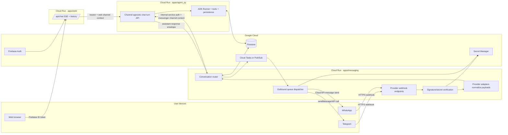

# ADR 0001: Messaging add-on architecture for Telegram and WhatsApp

- **Status:** Proposed
- **Date:** 2026-05-14
- **Owners:** Product + platform engineering
- **Related systems:** `apps/web`, `apps/agent_py`, Firebase Auth, Firestore, Cloud Run, Secret Manager

## Context

Lifecoach currently has one production conversation entry point: the web app calls `apps/web` API routes, which proxy authenticated requests to `apps/agent_py`. The agent owns prompt assembly, model execution, tools, persistence, and server-side enforcement of user state and usage tier.

We want to let users talk to the same coach from messaging apps such as Telegram and WhatsApp without forking the coach, duplicating business logic, or weakening the current auth, privacy, and routing guarantees.

The hard problems are:

1. **Ingress identity differs by channel.** Web requests arrive with Firebase ID tokens. Telegram and WhatsApp arrive as provider webhooks signed or secret-protected by the provider, and identify users by provider-specific chat IDs, sender phone numbers, bot IDs, phone-number IDs, and update/message IDs.
2. **A message needs a deterministic destination.** A webhook tells us which provider account received the message, but we must know which Lifecoach user, session, and delivery channel should own the turn.
3. **The agent should remain channel-agnostic.** Coaching behavior, state machines, memory, Workspace integration, usage enforcement, and billing tier should not be reimplemented per channel.
4. **Provider rules differ.** Telegram and WhatsApp support webhook delivery, but payloads, retry semantics, media handling, outbound APIs, and WhatsApp session/template constraints differ.
5. **Web and messenger conversations must not race each other.** A user may have the web app open while sending messages from WhatsApp or Telegram. Routing and persistence must make the active channel explicit instead of guessing.

## Decision

Build a **separate messaging add-on service** in front of the existing agent rather than adding provider webhooks to the Next.js web app or exposing provider-specific logic inside the agent.

The add-on will be a new Cloud Run service, tentatively `apps/messaging`, responsible for:

- accepting provider webhooks;
- verifying provider authenticity;
- normalizing incoming payloads into a canonical `ChannelMessage` envelope;
- resolving the envelope to a Lifecoach user, session, and reply channel;
- calling the same agent conversation runtime used by web chat;
- queuing outbound provider sends;
- storing message-route and idempotency metadata in Firestore.

`apps/agent_py` remains the owner of coaching behavior. It receives channel metadata as request context, but it does not verify Telegram or WhatsApp signatures, call provider send APIs directly, or decide whether a message came from web or messenger.

## Architecture



### Component responsibilities

| Component | Responsibility | Must not do |
|---|---|---|
| `apps/web` | Browser UI, Firebase-authenticated web chat proxy, web SSE delivery. | Parse Telegram/WhatsApp webhooks or own messaging account secrets. |
| `apps/messaging` | Provider webhook verification, provider adapters, route lookup, idempotency, outbound queueing, provider send APIs. | Build prompts, make coaching decisions, bypass usage policy, or store provider tokens outside Secret Manager. |
| `apps/agent_py` | One channel-agnostic chat turn runtime: state machines, prompt assembly, model call, tool execution, conversation persistence. | Know provider webhook details or directly send Telegram/WhatsApp messages. |
| Firestore | Source of truth for channel links, route mappings, idempotency records, conversation metadata, and outbound status. | Store raw secrets or long-lived provider access tokens in plain documents. |
| Secret Manager | Bot tokens, WhatsApp app secrets, verify tokens, access tokens, and per-environment signing material. | Store user conversation content. |

## Routing model

Routing is based on an explicit route record, not on heuristics.

### Canonical channel identity

Every inbound or outbound message is represented as:

```ts
type Channel = 'web' | 'telegram' | 'whatsapp';

type ChannelMessage = {
  channel: Channel;
  direction: 'inbound' | 'outbound';
  providerAccountId: string; // Telegram bot id or WhatsApp phone_number_id
  externalConversationId: string; // Telegram chat.id or WhatsApp sender wa_id/thread key
  externalMessageId: string; // Telegram update_id/message_id or WhatsApp message id
  userId?: string; // resolved Lifecoach uid, absent before linking
  sessionId?: string; // resolved Lifecoach session/conversation id
  text?: string;
  media?: Array<{
    kind: 'image' | 'audio' | 'voice' | 'document' | 'unknown';
    providerMediaId: string;
    mimeType?: string;
  }>;
  receivedAt: string;
  providerPayloadRef: string; // pointer to redacted raw payload if retained
};
```

### Firestore records

Add these collections when the add-on is implemented:

| Collection | Key | Purpose |
|---|---|---|
| `messagingAccounts/{accountId}` | Provider account, environment, display name, secret references, enabled status. | Knows which Telegram bot or WhatsApp phone number belongs to this deployment. |
| `messagingLinks/{nonce}` | Short-lived connect nonce, requested channel, requester uid, expiry, consumed timestamp. | Lets a signed-in web user start a provider-link flow safely. |
| `messagingRoutes/{routeId}` | Unique tuple of `channel`, `providerAccountId`, `externalConversationId`. | Resolves inbound messages to `uid`, `sessionId`, route status, and preferred reply behavior. |
| `messageEvents/{eventId}` | Hash of `channel + providerAccountId + externalMessageId`. | Idempotency and audit trail for inbound/outbound provider events. |
| `outboundMessages/{messageId}` | Provider send task state. | Tracks queued/sent/failed/retry-deadline status and provider response IDs. |

`routeId` should be a stable encoded key derived from `(channel, providerAccountId, externalConversationId)` so webhook handling can do one deterministic read.

### How we know where to route messages

#### Web

Web routing remains request-authenticated:

1. The browser obtains a Firebase ID token.
2. `apps/web` proxies `/api/chat` to `apps/agent_py` with the bearer token.
3. The agent verifies the token and resolves `uid` from Firebase Auth.
4. The request carries `channel = 'web'` and a `sessionId` chosen by the web UI or server default.
5. Replies stream back to the same HTTP/SSE connection; no provider route lookup is required.

#### Telegram and WhatsApp

Messenger routing is route-record-authenticated:

1. Provider sends a webhook to `apps/messaging`.
2. The service verifies authenticity:
   - Telegram: validate the webhook secret token configured with `setWebhook` and deduplicate by `update_id`.
   - WhatsApp: answer the verification challenge during setup, validate `x-hub-signature-256` on POSTs, and deduplicate by WhatsApp message ID.
3. The provider adapter extracts `(channel, providerAccountId, externalConversationId, externalMessageId)`.
4. The router reads `messagingRoutes/{routeId}`.
5. If the route is active, the router calls the agent with `uid`, `sessionId`, and `channelContext`.
6. If the route is missing, disabled, or unverified, the router does not invoke the agent. It sends a safe linking/help response or no-ops, depending on provider policy.
7. The agent response is stored and then enqueued for provider-specific outbound delivery.

### Linking flow

Use web as the control plane for account linking because it already has Firebase Auth and billing/profile affordances.

1. Signed-in user opens **Settings → Messaging** in web.
2. User selects Telegram or WhatsApp.
3. `apps/web` asks the backend to create `messagingLinks/{nonce}` with `uid`, channel, expiry, and one-time-use state.
4. Web displays a provider-specific action:
   - Telegram: `https://t.me/<bot>?start=<nonce>`.
   - WhatsApp: a click-to-chat link or QR code that sends a prefilled connect phrase containing `<nonce>`.
5. User sends the start/connect message in the provider app.
6. `apps/messaging` verifies the webhook, consumes the nonce transactionally, and creates `messagingRoutes/{routeId}` pointing to the web uid and default session.
7. The provider gets a confirmation message explaining what will be sent in that app and how to disconnect.

If an unlinked user messages the bot without a nonce, the add-on should reply with a short link to sign in on web and connect the channel. Creating anonymous users from arbitrary phone/chat IDs is deferred until product explicitly wants messenger-first onboarding.

## Web vs messenger delivery rules

Do not infer delivery destination from “last message wins” alone. Persist an explicit delivery policy on the route/session.

| Scenario | Decision |
|---|---|
| User sends from web | Reply on the web SSE connection. Persist conversation with `channel = 'web'`. |
| User sends from Telegram | Reply to the Telegram chat resolved by `messagingRoutes/{routeId}`. |
| User sends from WhatsApp | Reply to the WhatsApp sender resolved by `messagingRoutes/{routeId}`, subject to WhatsApp conversation-window/template rules. |
| User has web open and sends from messenger | Reply in messenger. Web history can show the turn after refresh or via future cross-channel sync. |
| Agent/tool needs an interactive UI control not available in messenger | Send a messenger-friendly fallback plus a signed deep link to continue in web. |
| User disconnects a channel | Mark route disabled; keep historical events; stop delivery; require a fresh nonce to reconnect. |

The session record should store the originating channel for each event and the route used for outbound delivery. This makes audits and future cross-channel UI sync possible.

## Agent API impact

The implementation should introduce a channel-agnostic internal request shape that both web and messaging can use. For example:

```ts
type ChatTurnRequest = {
  uid: string;
  sessionId: string;
  message: string;
  channelContext: {
    channel: 'web' | 'telegram' | 'whatsapp';
    routeId?: string;
    providerAccountId?: string;
    externalConversationId?: string;
    capabilities: {
      supportsMarkdown: boolean;
      supportsButtons: boolean;
      supportsImages: boolean;
      supportsVoice: boolean;
      supportsSse: boolean;
    };
  };
};
```

The current `/chat` SSE endpoint can remain for web. Messaging should either call a new non-SSE internal endpoint, such as `POST /internal/chat-turn`, or the agent service can factor the existing chat implementation into a shared function used by both `/chat` and the internal endpoint.

The agent may use `channelContext.capabilities` to choose response rendering, but product policy should remain centralized in existing state machines. Messenger-specific UI directives should degrade into text or deep links rather than adding provider-specific tool branches.

## Outbound messaging

Outbound delivery should be asynchronous:

1. Agent returns a normalized assistant response.
2. `apps/messaging` writes `outboundMessages/{messageId}`.
3. Cloud Tasks or Pub/Sub invokes a provider dispatcher.
4. Dispatcher formats text/media/buttons for the provider.
5. Dispatcher sends via Telegram Bot API or WhatsApp Cloud API.
6. Dispatcher records provider response IDs and retry state.

Reasons for an outbox:

- provider sends can be retried without rerunning the agent;
- WhatsApp failures and template requirements can be handled out-of-band;
- provider rate limits are isolated from the agent runtime;
- observability can distinguish “agent succeeded” from “provider delivery failed.”

## Security and privacy

- Store bot tokens, WhatsApp access tokens, verify tokens, app secrets, and internal service credentials in Secret Manager.
- Verify every webhook before parsing business content.
- Use Cloud Run service-to-service IAM for `apps/messaging → apps/agent_py` internal calls.
- Use Firestore transactions when consuming link nonces and creating routes.
- Deduplicate inbound events before invoking the agent.
- Redact raw provider payloads by default; if payload retention is needed for debugging, store short-lived redacted payloads with a retention policy.
- Never use phone numbers as primary user IDs. Treat WhatsApp `wa_id` and Telegram chat IDs as external identifiers scoped to a provider account.
- Provide a web disconnect action and a messenger command such as `/disconnect` or `disconnect`.
- Re-check user tier and usage policy in the agent for every turn; the messaging service must not make billing decisions.

## Consequences

### Positive

- Keeps the agent channel-agnostic and preserves the current web architecture.
- Lets Telegram, WhatsApp, and future channels share the same route resolver and outbox.
- Provides deterministic routing through `messagingRoutes` instead of fragile “last active client” heuristics.
- Gives users a clear web-based control plane for linking and disconnecting channels.
- Isolates provider retry/rate-limit behavior from the model runtime.

### Negative / trade-offs

- Adds a new deployable, new Firestore collections, and new infrastructure.
- Requires a new internal chat-turn contract in or around the agent.
- Requires product decisions for messenger-first onboarding, WhatsApp template copy, media support, and cross-channel history sync.
- Makes local development more complex because provider webhooks need tunnels or replay fixtures.

## Alternatives considered

### Add provider webhooks to `apps/web`

Rejected. The web app should remain a browser/API proxy and UI host. Provider secrets, webhook verification, outbox retries, and provider adapters would make it a backend integration service and couple messaging deploy risk to web UI deploys.

### Add provider webhooks directly to `apps/agent_py`

Rejected. This would mix provider transport concerns with coaching/runtime concerns and make the agent harder to evaluate. It would also encourage provider-specific branching in prompt/tool logic.

### Use a third-party omnichannel inbox first

Deferred. A broker may help later, but the platform still needs canonical route records, channel identity, idempotency, user linking, and agent contracts. Starting with our own minimal gateway keeps the domain model explicit.

### Route replies to the last active channel

Rejected. It is surprising, hard to audit, and unsafe for private coaching content. The inbound route or explicit user preference should decide delivery.

## Open questions

1. Should messenger-first onboarding create anonymous Lifecoach users, or should linking always begin on web?
2. Should each messaging app have one shared Lifecoach session or a per-channel session by default?
3. How much cross-channel history should web show in real time?
4. Which WhatsApp message templates are required for re-engagement outside the customer-service window?
5. Which media types should be supported in v1: text only, images, voice notes, or documents?
6. Do we need a human handoff/inbox mode before enabling WhatsApp for production users?

## Implementation plan

1. Define shared channel and route schemas in `packages/shared-types` and mirror them in Python contracts.
2. Add Firestore route/link/event/outbox storage modules.
3. Add `apps/messaging` with provider adapter interfaces and local replay tests.
4. Implement Telegram webhook verification, normalization, link nonce consumption, and text replies.
5. Add internal agent chat-turn endpoint or shared service function.
6. Add outbox dispatcher with retries and delivery-state tests.
7. Add WhatsApp webhook verification, normalization, and text replies.
8. Add web Settings UI for connect/disconnect and route status.
9. Update Terraform for Cloud Run, IAM, Secret Manager entries, and any queue resources.
10. Add eval and integration fixtures for route resolution, duplicate webhooks, disabled routes, and unavailable messenger UI affordances.

## References

The provider-specific notes in this ADR were checked against provider documentation on 2026-05-14. Re-check them during implementation because provider APIs and policy windows change.

- [Telegram Bot API: `setWebhook`](https://core.telegram.org/bots/api#setwebhook) — HTTPS POST updates, webhook secret header, and `update_id`-based duplicate handling.
- [WhatsApp Business Platform Node.js SDK webhook docs hosted by Meta](https://whatsapp.github.io/WhatsApp-Nodejs-SDK/api-reference/webhooks/start/) — verification challenge behavior, `x-hub-signature-256` authenticity checks, and `messages` webhook event examples.
