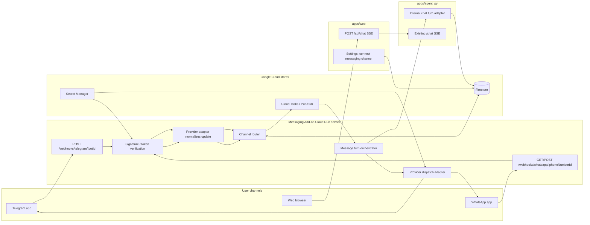

# ADR 0001: Messaging Add-on for Telegram and WhatsApp Channels

- **Status:** Proposed
- **Date:** 2026-05-14
- **Owners:** Lifecoach architecture
- **Deciders:** Product + engineering
- **Technical story:** Add chat-channel integrations so a signed-in Lifecoach user can talk to the same coaching agent from web, Telegram, or WhatsApp without losing session continuity or duplicating platform-specific logic.

## Context

Lifecoach currently has one user-facing chat surface: `apps/web` posts browser messages to the Next.js `/api/chat` route, which proxies to the Python agent `/chat` endpoint and streams SSE back to the browser. The agent verifies Firebase identity, derives user state, fetches context, builds the prompt, executes tools, persists conversation state, and emits events.

Messaging apps introduce a different delivery shape:

- Telegram and WhatsApp deliver inbound messages by webhook updates rather than by a browser-held SSE connection.
- Outbound replies must be sent through provider-specific APIs, not returned over SSE to the user device.
- Telegram identifies a conversation with provider chat/user identifiers such as `chat.id` and `from.id`; WhatsApp Cloud API identifies the business phone number and sender with values such as `metadata.phone_number_id`, `contacts[].wa_id`, and `messages[].from`.
- WhatsApp additionally has policy constraints such as business-number ownership, webhook verification, message templates for business-initiated conversations, and provider-side delivery-status events.
- The current agent contract expects `{ userId, sessionId, message, location?, timezone? }`, which assumes the caller already knows the Lifecoach user and session.

The main architectural question is therefore not just “how do we call Telegram/WhatsApp APIs?” It is “how do provider webhooks become authenticated Lifecoach chat turns, and how do agent events get routed back to the correct channel?”

## Decision

Create a **Messaging Add-on** as an application-owned channel gateway in front of the existing agent. The add-on will normalize provider webhooks into an internal `ChannelMessage` envelope, resolve the external provider conversation to a Lifecoach identity and session, call the existing agent turn path through a reusable internal agent adapter, and dispatch assistant output back through the provider adapter that owns the inbound channel.

The web app remains a first-class channel. Web traffic continues to use SSE through `/api/chat`; messaging traffic uses asynchronous webhook ingestion plus provider send APIs. Both channels share the same agent, profile, goals, usage metering, state machine policies, and memory stores.

## Architecture



### Runtime components

1. **Provider webhooks**
   - Telegram webhook endpoint receives Bot API updates for one configured bot.
   - WhatsApp webhook endpoint handles Meta verification challenges and message/status notifications for one or more business phone numbers.
   - Each endpoint performs provider-specific authenticity checks before parsing payloads.

2. **Provider adapters**
   - Convert raw provider updates into an internal `ChannelMessage`.
   - Convert internal outbound `ChannelReply` objects into provider API calls.
   - Own provider-specific limits, formatting, retry behavior, media handling, and delivery receipts.

3. **Channel router**
   - Resolves `(provider, providerTenantId, providerConversationId, providerUserId)` to a Lifecoach `uid` and `sessionId`.
   - Rejects or starts an account-linking flow when a provider sender is unknown.
   - Decides whether the inbound message is a user chat turn, a link command, an opt-out command, a delivery-status event, or unsupported content.

4. **Message turn orchestrator**
   - Creates an idempotency key from the provider event id.
   - Acknowledges provider webhooks quickly and processes the turn asynchronously via Cloud Tasks or Pub/Sub.
   - Calls a shared internal agent-turn adapter rather than duplicating prompt/tool logic.
   - Aggregates stream events into messaging-friendly replies, because Telegram/WhatsApp do not consume Lifecoach's SSE stream directly.

5. **Agent turn adapter**
   - Refactor the current agent `/chat` implementation so the core turn is callable from both:
     - the existing SSE HTTP endpoint for web, and
     - the messaging orchestrator for async channels.
   - The adapter should expose structured events plus final assistant text/tool directives.

6. **Provider dispatch**
   - Sends typing indicators when supported.
   - Sends assistant text in provider-safe chunks.
   - Maps supported UI-directive tools to native quick replies/buttons when possible.
   - Falls back to plain-text numbered choices when a provider cannot render the web UI affordance.

## Internal contracts

### `ChannelConnection`

A durable record binding a provider identity to one Lifecoach user.

```ts
type ChannelConnection = {
  connectionId: string;
  uid: string;
  provider: 'telegram' | 'whatsapp';
  providerTenantId: string; // bot id for Telegram; phone_number_id or WABA/phone tuple for WhatsApp
  providerConversationId: string; // Telegram chat.id; WhatsApp sender wa_id for one-to-one chat
  providerUserId: string; // Telegram from.id; WhatsApp sender wa_id
  defaultSessionId: string;
  status: 'pending_link' | 'active' | 'revoked' | 'blocked';
  createdAt: string;
  linkedAt?: string;
  lastInboundAt?: string;
  lastOutboundAt?: string;
  capabilities: {
    quickReplies: boolean;
    buttons: boolean;
    mediaInbound: boolean;
    mediaOutbound: boolean;
  };
};
```

Recommended Firestore path: `channelConnections/{connectionId}` with lookup indexes/materialized documents for provider routing:

- `channelConnectionLookups/{provider}:{providerTenantId}:{providerConversationId}` → `{ connectionId, uid }`
- `users/{uid}/channelConnections/{connectionId}` or an equivalent collection-group-queryable shape for settings UI.

### `ChannelMessage`

The normalized inbound event passed from provider adapters to the router/orchestrator.

```ts
type ChannelMessage = {
  idempotencyKey: string; // provider + tenant + event/update/message id
  provider: 'telegram' | 'whatsapp';
  providerTenantId: string;
  providerConversationId: string;
  providerUserId: string;
  occurredAt: string;
  kind: 'text' | 'choice_response' | 'media' | 'location' | 'status' | 'command' | 'unsupported';
  text?: string;
  command?: 'start' | 'link' | 'unlink' | 'stop' | 'help';
  choicePayload?: string;
  media?: Array<{ providerMediaId: string; mimeType?: string; caption?: string }>;
  location?: { lat: number; lng: number; accuracy?: number };
  rawRef: { bucket: string; path: string };
};
```

### `ChannelReply`

The normalized outbound message produced by the orchestrator.

```ts
type ChannelReply = {
  provider: 'telegram' | 'whatsapp';
  providerTenantId: string;
  providerConversationId: string;
  replyToProviderMessageId?: string;
  parts: Array<
    | { type: 'text'; text: string }
    | { type: 'quick_replies'; prompt: string; options: Array<{ label: string; value: string }> }
    | { type: 'button_url'; label: string; url: string }
  >;
};
```

## Routing: web vs. messenger

Routing is determined by **entry point**, then by **connection lookup**.

| Inbound path | Identity source | Session source | Outbound path |
|---|---|---|---|
| Web `/api/chat` | Firebase ID token from browser; fallback body `userId` only when auth is optional/local | Browser-provided `sessionId` | SSE response to browser |
| Telegram webhook | Verified Telegram update plus `channelConnectionLookups/telegram:{botId}:{chat.id}` | Connection `defaultSessionId`, or a thread-specific session if configured later | Telegram Bot API `sendMessage` / related methods |
| WhatsApp webhook | Verified Meta webhook plus `channelConnectionLookups/whatsapp:{phone_number_id}:{wa_id}` | Connection `defaultSessionId`, or a campaign/support-session id if configured later | WhatsApp Cloud API messages endpoint |

The agent should not decide the channel. Channel is an application concern derived before the agent turn begins. The agent receives a Lifecoach `uid`, `sessionId`, message text, optional user-provided location, and channel metadata in context. It may produce UI directives, but the channel adapter decides whether those directives can be rendered natively or must be converted to text.

## Account linking

A messaging provider identity must be linked to an existing Lifecoach user before it can access profile, goals, workspace, memory, or paid-tier state.

Preferred flow:

1. User signs in on web.
2. Settings page offers “Connect Telegram” and “Connect WhatsApp”.
3. The app creates a short-lived, single-use `channelLinkToken` stored server-side with `{ uid, provider, expiresAt, nonce }`.
4. User opens the provider deep link:
   - Telegram: bot start parameter contains the nonce.
   - WhatsApp: wa.me link pre-fills or starts a link phrase containing the nonce.
5. First provider webhook carrying the nonce creates or activates the `ChannelConnection`.
6. The add-on confirms in the messaging app and the web settings page shows the linked channel.

Fallback flow for users who start in the messaging app:

- Send a safe explanation and a web sign-in link.
- Keep the connection in `pending_link` with no agent access until the user completes browser auth.
- Do not create anonymous Firebase users from unverified provider identities unless product explicitly accepts the account-recovery and abuse trade-offs.

## Conversation/session model

For the first version, use **one default Lifecoach session per provider connection**. This keeps messages from the same Telegram chat or WhatsApp sender in one coherent thread and avoids asking users to manage sessions in a messaging interface.

Future extension points:

- `/new` command creates a new session and updates `defaultSessionId`.
- `/sessions` command lists recent sessions with short labels.
- Telegram group chats require an explicit policy before launch; group messages may expose other people’s text to the user’s coach profile, so v1 should support one-to-one chats only.
- WhatsApp business-initiated reminders should use a separate notification/campaign concept and only enter the coaching session when the user replies.

## Security and privacy

- Store provider secrets and access tokens in Secret Manager, wired by Terraform.
- Verify webhook authenticity before writing payloads or enqueueing work.
- Persist raw webhook payloads only for short-lived debugging/audit windows, and store them in a restricted GCS prefix referenced by `rawRef`.
- Treat provider IDs and phone numbers as personal data.
- Support unlink/revoke from both web settings and provider commands (`/stop`, `unlink`, `STOP`).
- Do not expose Google Workspace OAuth tokens, Firebase tokens, or internal user ids to provider APIs.
- Keep the existing no-IP-geolocation invariant: messaging channels may use a user-shared location message, but the server must not infer location from network metadata.

## Reliability and operations

- Webhook handlers return 2xx after verification and enqueueing, not after the LLM turn completes.
- Deduplicate provider retries by `idempotencyKey`.
- Serialize turns per `connectionId` initially to preserve conversational order.
- Record delivery status events separately from chat messages.
- Track metrics by provider, tenant, and outcome: webhook accepted/rejected, route miss, link pending, agent success/failure, provider send success/failure, latency, and duplicate count.
- Include a dead-letter queue for messages that repeatedly fail provider dispatch.
- Add replay tooling that can reprocess a raw webhook payload in a non-production environment with secrets redacted.

## UI directive mapping

| Lifecoach output | Web rendering | Telegram rendering | WhatsApp rendering |
|---|---|---|---|
| Assistant text | Chat bubble via SSE | Text message, chunked by provider limits | Text message, chunked by provider limits |
| Single choice | Radio cards | Inline keyboard or numbered options | Interactive buttons/list where allowed; otherwise numbered options |
| Multiple choice | Checkbox cards | Inline keyboard with callback payloads or numbered reply instructions | List/numbered options depending on policy/support |
| Auth prompt | Web modal/button | Deep link to web auth | Deep link to web auth |
| Connect Workspace | Web OAuth button | Deep link to web settings/OAuth | Deep link to web settings/OAuth |
| Upgrade prompt | Web upgrade affordance | Deep link to web checkout | Deep link to web checkout |

The agent should continue to emit product-level directives. Provider adapters handle presentation. Unsupported directives become concise text with a web link.

## Implementation plan

1. **Document contracts in `packages/shared-types`**
   - Add Zod schemas for `ChannelConnection`, `ChannelMessage`, `ChannelReply`, and provider names.
   - Add unit tests for routing keys and idempotency keys.

2. **Extract agent core turn**
   - Split `apps/agent_py` `/chat` into a reusable service function that accepts a validated turn request and returns an async event stream or collected result.
   - Keep `/chat` byte-compatible for web SSE.

3. **Add messaging add-on service**
   - Prefer a separate Cloud Run service (`apps/messaging`) so webhook traffic, provider dependencies, and retries are isolated from the web UI and agent runtime.
   - Use FastAPI or Next route handlers consistently with team ownership; FastAPI aligns well with the Python agent and async webhook processing.

4. **Add Telegram MVP**
   - Implement webhook verification, `/start <nonce>` linking, text messages, stop/unlink, and outbound text/quick replies.
   - Use Telegram first because the bot model is straightforward and good for exercising the internal channel contracts.

5. **Add WhatsApp MVP**
   - Implement Meta verification challenge, message webhook parsing, phone-number routing, text replies, stop/unlink, and template-aware notifications.
   - Do not launch WhatsApp reminders until template approval and opt-in/opt-out flows are implemented.

6. **Add web settings UI**
   - Show connected channels, last activity, revoke buttons, and provider-specific setup instructions.

7. **Harden operations**
   - Add Terraform for service, secrets, queues, IAM, dashboards, and alerts.
   - Add replay tooling, dead-letter handling, and provider contract tests using recorded redacted fixtures.

## Alternatives considered

### A. Put Telegram/WhatsApp webhook routes in `apps/web`

Rejected for v1. It is simple to add Next.js route handlers, but it couples provider webhook retries and secrets to the browser-facing app and does not naturally fit asynchronous dispatch. A separate add-on service creates a clearer operational boundary.

### B. Put provider webhooks directly in `apps/agent_py`

Rejected. The agent should remain the coaching runtime, not the owner of provider-specific transport, verification, retries, account linking, and delivery policies. Keeping provider concerns outside the agent preserves the current architecture where the application owns auth and the LLM receives already-authorized context.

### C. Make each provider a separate agent tool

Rejected. Incoming Telegram/WhatsApp messages are user turns, not tools the model should call. Outbound provider dispatch is deterministic application I/O and must not depend on model-selected tool calls.

### D. Mirror every messaging conversation into a web session UI immediately

Deferred. We should persist enough metadata to make cross-channel history possible, but v1 can treat web and each messaging connection as separate session entry points over shared user memory/profile. A full omnichannel inbox can follow after routing and consent semantics are proven.

## Consequences

Positive:

- Web and messaging channels share one coaching brain and storage model.
- Provider complexity is isolated behind adapters.
- Routing is explicit, auditable, and testable.
- Web SSE remains unchanged for current users.
- The architecture can add future channels such as SMS, Discord, Slack, or email by implementing the same adapter contracts.

Negative / trade-offs:

- Adds a new service, queues, secrets, and operational surface area.
- Requires account-linking UX before messaging can be useful.
- Messaging channels cannot render every web UI directive exactly.
- WhatsApp production readiness depends on Meta business setup, policy compliance, templates, and opt-in/opt-out processes.

## Open questions

1. Should a messaging channel always use one default session, or should it expose session switching from day one?
2. Should users be allowed to create a Lifecoach account starting from Telegram/WhatsApp, or must linking always begin on web?
3. How much raw provider payload retention is acceptable for debugging while honoring privacy expectations?
4. Which provider message types are in scope for v1: text only, location, voice notes, images, or documents?
5. Should proactive coaching reminders be part of this add-on, or a separate notifications subsystem?
6. What is the product stance on Telegram group chats and WhatsApp multi-person contexts?

## References

- Telegram Bot API: https://core.telegram.org/bots/api
- Telegram webhook guide: https://core.telegram.org/bots/webhooks
- WhatsApp Cloud API webhooks: https://developers.facebook.com/docs/whatsapp/cloud-api/webhooks
- Current Lifecoach architecture source of truth: `ARCHITECTURE.md`
