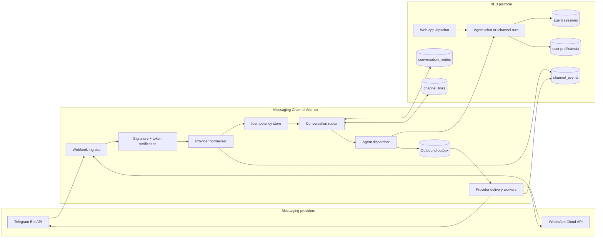

# ADR 0001: Messaging Channel Add-on for Telegram and WhatsApp

- **Status:** Proposed
- **Date:** 2026-05-14
- **Decision owner:** Product + Platform Engineering
- **Related system:** BEB/Lifecoach chat platform

## Context

BEB currently treats the web chat as the primary conversation surface: the browser calls the web app, the web app proxies to the agent, and the agent owns conversation orchestration, persistence, prompt assembly, tool execution, and streamed responses. The next product step is to let users talk to the same coach through messaging applications such as Telegram and WhatsApp without forking the coach, duplicating conversation state, or exposing channel-specific credentials to the agent.

The main architectural questions are:

1. How do inbound Telegram/WhatsApp webhooks enter the BEB platform?
2. How do we map a provider-specific sender to the correct BEB user, workspace, and conversation session?
3. How do we decide whether a message should route to the web experience or to a messaging app conversation?
4. What should the messaging add-on own versus what should remain in the existing web/agent services?
5. How do we support channel-specific constraints such as WhatsApp's customer-care window, Telegram commands, attachments, retries, idempotency, and outbound delivery failures?

## Decision

Build messaging support as a **Messaging Channel Add-on**: a separate channel-ingress and delivery layer that normalises provider webhooks into a BEB conversation envelope, resolves identity and routing, calls the existing agent conversation API, and adapts the agent response back to each provider. The agent remains channel-aware only through explicit metadata in the request context; it must not know provider tokens, webhook signatures, phone numbers, chat IDs, or delivery APIs.

The web app and messaging apps are treated as peer channels over the same underlying user, session, usage, memory, and tool-policy model. The routing decision is made by a new server-side `conversation_routes` registry, not by the LLM and not by client-side heuristics.

## Goals

- Let users message BEB from Telegram and WhatsApp while preserving the same coach identity, user state, usage limits, profile, goals, and memory.
- Keep provider-specific concerns outside of the agent service wherever practical.
- Make every inbound provider event idempotent and auditable.
- Provide a clear user-linking flow from web to messenger and from messenger to web.
- Support asynchronous delivery because messaging platforms do not consume SSE streams directly.
- Make channel routing explicit and inspectable so support can answer “why did this reply go to Telegram instead of web?”

## Non-goals

- Do not replace the web chat transport or remove SSE from the web experience.
- Do not let the LLM decide where to send messages.
- Do not expose WhatsApp access tokens, Telegram bot tokens, webhook secrets, or raw provider identifiers inside prompts.
- Do not allow unauthenticated provider webhooks to create durable BEB users without a deliberate linking or anonymous-on-messenger policy.
- Do not attempt cross-channel live co-browsing in the first version; web and messenger can share history after persistence, but they do not need to render the same in-flight turn.

## Architecture



### Components

| Component | Responsibility | Notes |
|---|---|---|
| Provider webhooks | Receive Telegram and WhatsApp callbacks. | Each provider gets a dedicated route such as `POST /messaging/webhooks/telegram` and `POST /messaging/webhooks/whatsapp` so verification logic stays simple. |
| Signature/token verifier | Reject spoofed callbacks before parsing user content. | Telegram should verify the configured webhook secret token. WhatsApp should verify Meta's webhook signature and support the subscription challenge endpoint. |
| Provider normaliser | Convert provider payloads into a common `ChannelInboundEvent`. | The normalised event uses internal field names and stores raw payloads only in an audit/debug collection with retention controls. |
| Idempotency store | Ensure each provider update/message is processed once. | Key format: `{provider}:{provider_event_id}`. Duplicate webhooks return 2xx without re-running the agent. |
| Conversation router | Resolve the BEB `uid`, channel, session, workspace, and target response channel. | The router is deterministic and uses `channel_links` plus `conversation_routes`; it does not call the LLM. |
| Agent dispatcher | Call the existing agent with a channel-aware request. | For messaging, prefer a non-SSE internal endpoint or consume SSE server-side and fold it into messages for the provider outbox. |
| Outbound outbox | Durable queue of outbound provider messages. | Prevents provider downtime from losing agent replies. Delivery workers retry with backoff and record final failure. |
| Delivery workers | Send messages through Telegram/WhatsApp APIs. | They apply provider formatting limits, split long responses, and handle delivery errors. |
| Linking flow | Connect a provider identity to an authenticated BEB user. | Web generates a short-lived link code or deep link; messenger confirms it; `channel_links` records the verified binding. |

## Data model

### `channel_links/{linkId}`

A verified mapping from a provider identity to a BEB user.

```ts
type ChannelLink = {
  linkId: string; // e.g. sha256(provider + providerAccountId)
  uid: string;
  provider: "telegram" | "whatsapp";
  providerAccountIdHash: string;
  providerChatIdEncrypted?: string; // Telegram chat ID or WhatsApp phone ID/conversation target
  displayName?: string;
  status: "pending" | "active" | "revoked";
  capabilities: {
    supportsMarkdown: boolean;
    supportsButtons: boolean;
    supportsAttachments: boolean;
  };
  createdAt: string;
  updatedAt: string;
  lastInboundAt?: string;
  lastOutboundAt?: string;
};
```

### `conversation_routes/{uid}`

The deterministic routing preferences for a BEB user.

```ts
type ConversationRoutes = {
  uid: string;
  defaultInboundSessionPolicy: "daily" | "thread";
  preferredOutboundChannel: "web" | "telegram" | "whatsapp" | "last_active";
  activeChannel?: "web" | "telegram" | "whatsapp";
  activeUntil?: string;
  channelQuietHours?: Record<string, { start: string; end: string; timezone: string }>;
  fallbackChannel: "web" | "none";
  updatedAt: string;
  updatedBy: "user" | "system" | "support";
};
```

### `channel_events/{provider}:{providerEventId}`

An audit trail and idempotency record for inbound and outbound provider events.

```ts
type ChannelEvent = {
  id: string;
  direction: "inbound" | "outbound";
  provider: "telegram" | "whatsapp";
  uid?: string;
  sessionId?: string;
  providerEventId?: string;
  idempotencyKey: string;
  normalizedType: "text" | "command" | "button" | "attachment" | "delivery_status";
  status: "received" | "routed" | "dispatched" | "delivered" | "failed" | "ignored";
  failureReason?: string;
  createdAt: string;
  updatedAt: string;
};
```

### `message_outbox/{outboxId}`

A durable delivery job for asynchronous provider replies.

```ts
type MessageOutboxItem = {
  outboxId: string;
  uid: string;
  sessionId: string;
  provider: "telegram" | "whatsapp";
  channelLinkId: string;
  payload: {
    text?: string;
    buttons?: Array<{ id: string; label: string }>;
    attachments?: Array<{ type: string; url: string }>;
  };
  status: "pending" | "sending" | "sent" | "retrying" | "failed";
  attemptCount: number;
  nextAttemptAt?: string;
  createdAt: string;
  updatedAt: string;
};
```

## Routing model

Routing answers two different questions:

1. **Inbound routing:** “Which BEB user/session should handle this provider message?”
2. **Outbound routing:** “Where should the reply be delivered?”

### Inbound routing

The router applies these rules in order:

1. Verify the provider webhook authenticity.
2. Normalise the payload and calculate an idempotency key.
3. Look up `channel_links` by hashed provider identity.
4. If an active link exists, resolve `uid`.
5. If no link exists:
   - Telegram: reply with a link/login instruction or support a limited anonymous-messenger state if product approves it.
   - WhatsApp: reply with approved onboarding copy if permitted by WhatsApp templates and consent rules; otherwise ignore with an audit record.
6. Resolve `sessionId` using the route policy:
   - `daily`: `{uid}-{YYYY-MM-DD}` for continuity with the web convention.
   - `thread`: `{uid}-{provider}-{providerThreadId}` for group/thread-specific use cases.
7. Dispatch the message to the agent with `channelContext`.

### Outbound routing

Replies to a messenger-originated message should return to the same provider by default. Replies to a web-originated message should stay on web by default. Proactive or delayed replies use `conversation_routes.preferredOutboundChannel` and the user's consent/capability state.

Recommended precedence:

1. **Turn affinity:** respond on the channel that produced the current inbound message.
2. **Explicit user choice:** `/use telegram`, `/use whatsapp`, or a settings-page preference updates `conversation_routes`.
3. **Active channel TTL:** after a messenger message, set `activeChannel` to that provider for a short window such as 30 minutes.
4. **Provider constraints:** if WhatsApp's allowed response window is closed, use an approved template or fall back to web/no delivery based on consent.
5. **Fallback:** use `fallbackChannel` if delivery fails or the preferred channel is revoked.

This means the platform never guesses from the text “send this to WhatsApp.” The user can ask to change delivery preferences, but the application persists that preference before it affects routing.

## Agent contract

Add a channel-aware request envelope while preserving the existing web contract.

```ts
type ChannelContext = {
  channel: "web" | "telegram" | "whatsapp";
  provider?: "telegram" | "whatsapp";
  channelLinkId?: string;
  inboundEventId?: string;
  supports: {
    markdown: boolean;
    buttons: boolean;
    attachments: boolean;
    streaming: boolean;
  };
  locale?: string;
  timezone?: string;
};
```

For web, `supports.streaming` is `true` and the response remains SSE. For Telegram/WhatsApp, `supports.streaming` is `false`; the messaging add-on either calls a new internal `POST /channel-turn` endpoint that returns a completed assistant response or consumes `/chat` SSE internally and writes final chunks to the outbox.

The first implementation should prefer a dedicated internal `POST /channel-turn` endpoint because provider webhooks require fast acknowledgement and because messaging apps do not benefit from token-level streaming. The endpoint can reuse the same core turn runner as `/chat`.

## Linking and user experience

### Web-to-messenger linking

1. Authenticated user opens Settings → Connections.
2. BEB creates a short-lived `channel_link_codes/{code}` document with `uid`, provider, expiry, and nonce.
3. UI shows a Telegram deep link or WhatsApp click-to-chat link containing the code.
4. User opens the provider and sends `/start <code>` or a prefilled “connect” message.
5. Messaging add-on verifies the provider event and code, writes `channel_links`, marks the code consumed, and sends a confirmation message.

### Messenger-to-web linking

1. Unlinked user messages the bot/account.
2. Messaging add-on returns a sign-in link with a nonce.
3. User signs in on web.
4. Web confirms the nonce and attaches the provider identity to the signed-in `uid`.
5. Provider receives a confirmation message.

### Revocation

Users must be able to disconnect each provider from web settings and from provider commands such as `/disconnect`. Revocation sets `channel_links.status = "revoked"`; it should not delete audit records immediately.

## Provider-specific handling

### Telegram

- Use a bot webhook with a secret token.
- Treat `chat.id` as the delivery target and hash/encrypt it at rest.
- Support `/start`, `/help`, `/disconnect`, and `/settings` commands.
- Telegram supports relatively flexible session initiation, so it is the best first provider for an MVP.

### WhatsApp

- Use WhatsApp Cloud API webhooks and signature verification.
- Respect Meta's customer-care window and template-message requirements.
- Store only the minimum phone/account identifiers needed for routing, preferably hashed for lookup and encrypted for delivery.
- Do not send proactive coaching nudges unless the user has explicitly opted in and the message type is policy-compliant.

## Security, privacy, and compliance

- Webhook verification is mandatory before parsing or storing trusted fields.
- Provider account IDs and phone numbers are personal data. Store lookup hashes separately from encrypted delivery targets.
- Raw provider payloads should have a retention period and should be redacted from normal logs.
- Provider credentials live in Secret Manager and are used only by the messaging add-on/delivery workers.
- The agent receives only `channelContext`, not raw provider identifiers.
- Linking codes must be single-use, short-lived, and bound to a provider.
- Support tooling must show route decisions without exposing phone numbers or chat IDs by default.

## Failure handling

| Failure | Handling |
|---|---|
| Duplicate webhook | Return 2xx after idempotency hit; do not re-run the agent. |
| Provider webhook verification fails | Return 401/403 and write a security metric, not a user event. |
| No channel link | Send linking instructions if allowed; otherwise record `ignored`. |
| Agent times out | Acknowledge provider webhook, enqueue a “still working” or failure message if product-approved, and alert after threshold. |
| Provider delivery fails transiently | Retry from `message_outbox` with exponential backoff. |
| Provider delivery fails permanently | Mark route/channel degraded and fall back according to `conversation_routes`. |
| User disconnects provider mid-turn | Stop pending outbox items for that channel before delivery. |

## Rollout plan

1. **Design contracts:** add shared `ChannelContext`, `ChannelInboundEvent`, route, link, event, and outbox schemas.
2. **Build Telegram MVP:** webhook ingress, linking from web, deterministic routing, internal non-streaming agent turn, and outbound delivery.
3. **Add route settings:** web settings page for preferred channel, disconnect, and fallback behavior.
4. **Add WhatsApp:** Cloud API webhook, template/onboarding handling, and compliance review.
5. **Add support observability:** route decision logs, channel health metrics, delivery failure dashboard, and audit views.
6. **Evaluate proactive messaging:** only after consent, quiet hours, and provider policy constraints are implemented.

## Alternatives considered

### 1. Put Telegram/WhatsApp logic directly in the agent

Rejected. It would leak provider credentials and routing concerns into the LLM-facing service, make tests harder, and blur the boundary between conversation intelligence and transport delivery.

### 2. Make the web app own messaging webhooks

Rejected for the long term. The web app is already a thin proxy for web chat. Messaging needs provider verification, durable outbox processing, retries, and asynchronous workers, which are better isolated from the browser-facing web service.

### 3. Use a third-party omnichannel inbox as the routing source of truth

Deferred. A provider such as Twilio, MessageBird, or an inbox platform could reduce provider integration work, especially for WhatsApp. However, BEB still needs internal identity linking, route preferences, agent dispatch, and privacy controls. The internal add-on boundary remains useful even if provider adapters are later backed by a third-party gateway.

### 4. Merge all channels into one global session with no channel metadata

Rejected. It simplifies persistence but makes support, audit, provider-specific rendering, and route decisions opaque. Shared user memory is valuable; hidden shared transport state is not.

## Consequences

### Positive

- The agent remains focused on coaching and tool execution.
- Provider-specific delivery can evolve independently from web chat.
- Route decisions are deterministic, explainable, and testable.
- Telegram can ship first without blocking on WhatsApp policy complexity.
- The architecture supports future channels such as SMS, email, or Slack by adding adapters rather than changing the agent core.

### Negative

- Adds new infrastructure: webhook routes, route/link stores, idempotency records, outbox, and workers.
- Requires schema and endpoint work to support non-streaming agent turns.
- Cross-channel history rendering will need careful UX decisions.
- WhatsApp compliance and template management add operational overhead.

## Open questions

1. Should unlinked Telegram users be allowed to have anonymous BEB sessions, or must every messenger session link to a web-authenticated account first?
2. Should web and messenger share the exact same daily session or should messenger maintain channel-specific threads with shared memory?
3. What is the initial delivery fallback if WhatsApp delivery is blocked: web notification, no-op, or email?
4. Which provider gateway should be used for WhatsApp: direct Meta Cloud API or a managed provider?
5. What retention period should apply to raw provider payloads and channel audit events?
6. How should rich UI directives, such as choice prompts and connection prompts, degrade into Telegram/WhatsApp buttons or plain text?
