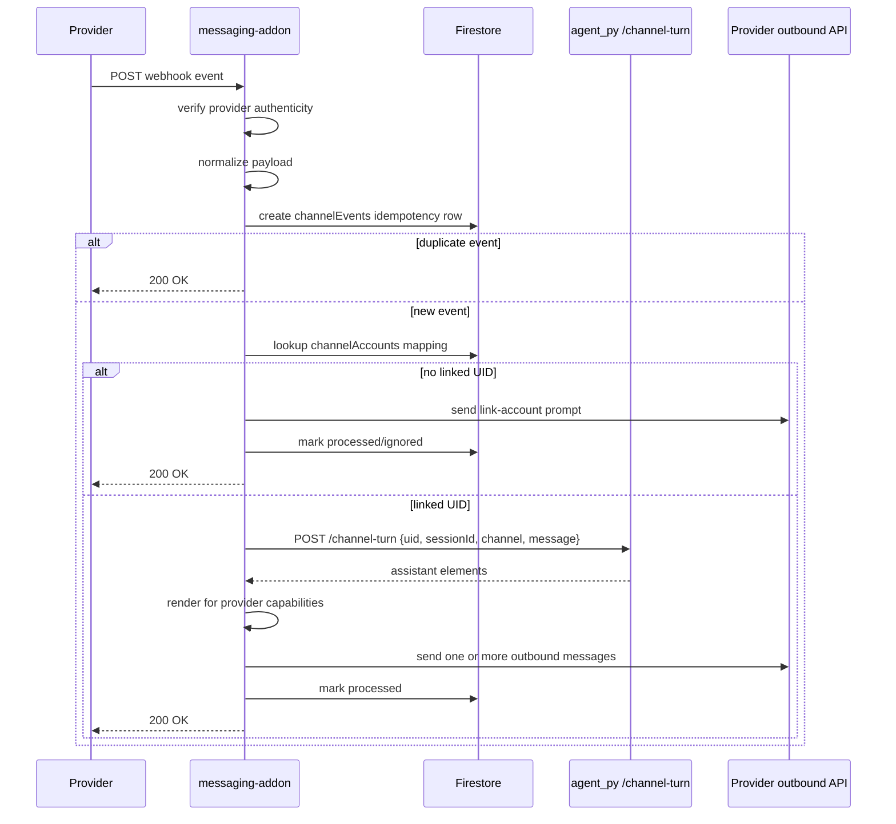

# ADR 0001: Messaging Channel Add-on for Telegram and WhatsApp

- **Status:** Proposed
- **Date:** 2026-05-14
- **Decision owners:** BEB platform engineering
- **Related system:** `apps/web`, `apps/agent_py`, Terraform-managed Cloud Run / Firestore / Secret Manager

## Context

BEB currently treats the web chat as the primary conversational surface: the browser sends `POST /api/chat` to the Next.js BFF, the BFF forwards to the Python agent `POST /chat`, and the agent streams assistant output back over SSE. The user identity, session history, profile, goal updates, workspace connection, usage tier, and prompt context are all resolved in or behind `apps/agent_py`.

We want users to be able to talk to the same coach from messaging apps such as Telegram and WhatsApp without forking the coach, duplicating profile state, or teaching the LLM channel-specific routing rules. Messaging apps differ from the web app in important ways:

- They deliver inbound messages through provider webhooks rather than a browser-controlled SSE request.
- They identify the sender as a channel-scoped address, such as a Telegram `chat.id` or WhatsApp sender phone number, not a Firebase UID.
- They have provider-specific reply APIs, payload shapes, retries, delivery status webhooks, and policy constraints.
- They cannot render the full web UI component set; rich prompts must degrade to channel-native buttons, links, or plain text.
- They may receive non-text inputs such as voice notes, images, stickers, contacts, or location shares.

Provider references used for this ADR:

- Telegram Bot API webhook model, including HTTPS webhook delivery and `X-Telegram-Bot-Api-Secret-Token`: <https://core.telegram.org/bots/api#setwebhook>
- WhatsApp Cloud API webhooks overview and payload examples: <https://developers.facebook.com/docs/whatsapp/cloud-api/webhooks/payload-examples>
- Meta Graph API webhook verification model: <https://developers.facebook.com/docs/graph-api/webhooks/getting-started>

## Decision

Add a **Messaging Channel Add-on** as a separate Cloud Run service that adapts Telegram, WhatsApp, and future messaging apps into a shared internal channel contract. The add-on owns provider webhook verification, sender-to-user binding, message normalization, delivery acknowledgements, outbound provider calls, and channel-specific rendering. The existing agent remains the source of truth for coaching behavior, state machines, prompt assembly, tools, profile, memory, usage, and session persistence.

The add-on will call a new internal, non-SSE agent endpoint, `POST /channel-turn`, rather than trying to consume `/chat` SSE directly. `/channel-turn` returns a complete assistant turn as structured assistant elements plus updated session metadata. Web chat keeps using `/chat` SSE for low-latency token streaming.

## Goals

- Reuse one coach brain across web, Telegram, WhatsApp, and later channels.
- Route every inbound message to the correct BEB user, conversation session, and provider reply target.
- Preserve current web behavior and avoid degrading the SSE path.
- Make channel support modular: adding Signal, Messenger, SMS, or Slack should require a new adapter, not agent rewrites.
- Keep provider credentials, webhook secrets, and phone/bot tokens out of the browser and out of LLM context.
- Support safe account-linking from a messaging app to an existing Firebase user.
- Fail closed on identity ambiguity, webhook signature failures, replayed provider events, and unlinked accounts where policy requires linking.

## Non-goals

- Building a human support inbox or multi-agent customer service queue.
- Replacing Firebase Auth as the canonical web identity system.
- Mirroring every web UI widget in every messaging app.
- Giving the LLM provider credentials or provider dispatch tools.
- Supporting group chats in the first release. Telegram groups and WhatsApp groups introduce privacy and routing ambiguity and should be explicitly disabled or ignored at launch.

## Proposed architecture

```mermaid
flowchart LR
    subgraph Providers[Messaging providers]
        TG[Telegram Bot API]
        WA[WhatsApp Cloud API]
    end

    subgraph Addon[Cloud Run · messaging-addon]
        WH[Webhook ingress]
        VERIFY[Provider verification]
        NORM[Normalize inbound message]
        ROUTE[Channel identity router]
        DEDUPE[Event dedupe + idempotency]
        RENDER[Channel renderer]
        OUT[Outbound provider clients]
    end

    subgraph Agent[Cloud Run · apps/agent_py]
        TURN[POST /channel-turn]
        CHAT[POST /chat SSE]
        BRAIN[State machines + prompt + ADK Runner]
    end

    subgraph Stores[Google Cloud]
        FS[(Firestore)]
        GCS[(GCS user bucket)]
        SM[Secret Manager]
    end

    subgraph Web[Cloud Run · apps/web]
        WEBCHAT[/api/chat SSE proxy]
        LINK[/settings/channel linking UI]
    end

    TG -- webhook --> WH
    WA -- webhook --> WH
    WH --> VERIFY --> NORM --> DEDUPE --> ROUTE
    ROUTE --> FS
    ROUTE -- internal auth --> TURN --> BRAIN
    BRAIN --> FS
    BRAIN --> GCS
    TURN --> RENDER --> OUT
    OUT -- sendMessage/messages API --> TG
    OUT -- messages API --> WA
    LINK --> FS
    SM --> VERIFY
    SM --> OUT
    WEBCHAT --> CHAT --> BRAIN
```

### Why a separate add-on service?

The add-on is a boundary adapter, not part of the coach brain. Keeping it separate avoids adding public Telegram/WhatsApp webhook concerns to `apps/agent_py`, lets us scale and rate-limit provider traffic independently, and keeps the existing web SSE route simple. It also matches the existing architecture principle that application-owned flows, such as OAuth and auth prompts, should not be handed to the LLM.

## Channel contract

Normalize provider payloads into a provider-agnostic event before routing:

```ts
type Channel = "web" | "telegram" | "whatsapp";

type ChannelInboundMessage = {
  channel: Channel;
  providerEventId: string;
  providerMessageId: string;
  providerConversationId: string;
  providerSenderId: string;
  providerTenantId?: string;
  receivedAt: string;
  text?: string;
  attachments: ChannelAttachment[];
  locale?: string;
  timezone?: string;
  location?: { latitude: number; longitude: number; source: "user_shared" };
  rawRef: string;
};

type ChannelTurnRequest = {
  uid: string;
  sessionId: string;
  channel: Channel;
  message: string;
  location?: { latitude: number; longitude: number; source: "user_shared" };
  timezone?: string;
  channelCapabilities: ChannelCapabilities;
  correlationId: string;
};

type ChannelTurnResponse = {
  uid: string;
  sessionId: string;
  elements: AssistantElement[];
  usageState: string;
  userState: string;
};
```

`AssistantElement` should reuse the existing shared contract from web SSE parsing where possible. Channel renderers then map elements to provider-native responses:

| Assistant element | Web | Telegram | WhatsApp |
|---|---|---|---|
| Text | streaming markdown bubble | `sendMessage` text, chunked to provider limits | Cloud API text message, chunked to provider limits |
| Single choice | UI card | inline keyboard or numbered reply fallback | interactive buttons/list where allowed, otherwise numbered reply |
| Multiple choice | UI card | inline keyboard with confirm step or numbered fallback | list/numbered fallback |
| Auth prompt | sign-in card | one-time web link to linking flow | one-time web link to linking flow |
| Workspace prompt | connect card | web link to settings OAuth flow | web link to settings OAuth flow |
| Upgrade prompt | upgrade card | web link to billing/settings | web link to billing/settings |
| Tool-call badge | visible web badge | usually suppressed or summarized | usually suppressed or summarized |

## Routing model: web vs messenger

Routing has two independent decisions:

1. **Which transport should receive the response?** Reply on the same channel that delivered the inbound user message unless a server-side notification policy explicitly says otherwise. A Telegram message gets a Telegram response; a WhatsApp message gets a WhatsApp response; a web `/chat` turn streams back to the browser.
2. **Which user and session should handle the message?** Resolve the provider sender to a canonical BEB UID and a channel-specific session key before calling the agent.

The LLM must not decide whether a message is “web” or “messenger.” That decision is made before the agent call from trusted request metadata:

| Inbound source | Trust signal | Transport route | User route |
|---|---|---|---|
| Web app | Firebase ID token forwarded through `apps/web` | SSE response to the browser request | UID from verified Firebase token |
| Telegram | Telegram webhook endpoint + secret header + bot token ownership | Telegram Bot API reply to `chat.id` | `channelAccounts/{telegram:<botId>:<chatId>}` mapping |
| WhatsApp | Meta webhook verification/signature + configured phone number ID | WhatsApp Cloud API reply to sender `wa_id` through `phone_number_id` | `channelAccounts/{whatsapp:<phoneNumberId>:<waId>}` mapping |
| Future channels | Adapter-specific verification | Provider reply API | `channelAccounts/{channel}:{tenant}:{sender}` mapping |

### Session routing

Use deterministic channel sessions unless the user explicitly starts a new session:

```text
sessionId = channel:<channel>:<providerTenantId>:<providerConversationId>
```

Examples:

- `channel:telegram:bot_123:chat_456`
- `channel:whatsapp:phone_789:wa_15551234567`

This keeps messaging history separate from the web session drawer while still sharing profile, goals, memory, usage state, and workspace state through the same UID. A later product iteration may expose channel sessions in the web session drawer with a channel badge.

## Identity and account linking

### Firestore data model

```text
channelAccounts/{channelAccountId}
  channel: "telegram" | "whatsapp"
  providerTenantId: string        # bot id, WhatsApp phone_number_id, etc.
  providerSenderId: string        # Telegram chat/user id, WhatsApp wa_id
  uid: string                     # Firebase UID
  status: "pending" | "linked" | "revoked" | "blocked"
  linkedAt: timestamp | null
  lastInboundAt: timestamp | null
  lastOutboundAt: timestamp | null
  displayName?: string
  locale?: string
  timezone?: string
  metadata: map                  # provider-specific non-secret facts

channelLinkCodes/{codeHash}
  uid: string
  channel: "telegram" | "whatsapp"
  expiresAt: timestamp
  consumedAt: timestamp | null
  createdFrom: "web" | "messenger"
  nonceHash: string

channelEvents/{channel}/{providerEventId}
  firstSeenAt: timestamp
  processedAt: timestamp | null
  status: "processing" | "processed" | "ignored" | "failed"
  uid?: string
  sessionId?: string
  correlationId: string
```

Secrets such as bot tokens, webhook verify tokens, app secrets, and WhatsApp access tokens live in Secret Manager and are exposed to the add-on only through Cloud Run environment bindings. They are never stored in `channelAccounts` and never sent to the agent or the LLM.

### Linking flows

Support two safe linking flows:

1. **Web-first linking.** A signed-in user opens Settings, chooses “Connect Telegram” or “Connect WhatsApp,” and receives a short-lived code or deep link. When they message the bot/number with that code, the add-on links the provider sender to the Firebase UID.
2. **Messenger-first linking.** An unknown sender messages the bot/number. The add-on replies with a one-time HTTPS link to the web app. The user signs in with Firebase Auth, the web app consumes the code, and the mapping becomes `linked`.

For unlinked senders, the first release should not create durable coaching profiles automatically. It may allow a tightly limited anonymous trial if product chooses, but the safer default is to require linking before coaching begins because phone numbers and chat IDs are not equivalent to BEB account ownership.

## Inbound processing sequence



The webhook should acknowledge quickly. If a provider has a tight acknowledgement deadline, the add-on can enqueue the normalized event to Cloud Tasks or Pub/Sub after verification and return `200 OK`, then process asynchronously. The ADR decision does not depend on sync vs queue; the important boundary is that provider retries are deduped by `providerEventId`.

## Outbound processing

The add-on owns outbound delivery and provider policy handling:

- **Telegram:** Send replies to the inbound `chat.id`. Configure webhooks using a secret token and validate the `X-Telegram-Bot-Api-Secret-Token` header on every webhook request.
- **WhatsApp:** Send replies through the configured `phone_number_id` to the sender `wa_id`. Verify the webhook subscription challenge during setup and validate Meta signatures for POST requests. Track delivery status webhooks separately from inbound user messages.
- **Chunking:** Split long assistant text into provider-safe message chunks without splitting Markdown entities where possible.
- **Rich controls:** Use channel-native buttons only when the provider supports the required interaction. Always provide a plain-text fallback because provider capabilities and approval states vary.
- **Failures:** Persist outbound failures with provider error codes and retry only idempotent sends. Do not call the agent again just because provider delivery failed.

## Agent changes required

Add `POST /channel-turn` to `apps/agent_py` with internal service-to-service authentication. The endpoint should share the same turn-building path as `/chat` but collect model events into a complete `ChannelTurnResponse` instead of streaming SSE blocks. It must:

- Verify the caller is the messaging add-on service account, not a public user token.
- Accept an already-resolved `uid`, `sessionId`, `channel`, message text, user-shared location, timezone, and capabilities.
- Reuse `UserStateMachine`, `UsageStateMachine`, prompt assembly, ADK Runner, tools, Firestore sessions, GCS profile/goals, and Vertex Memory Bank.
- Add a prompt context line such as `CHANNEL telegram` or `CHANNEL whatsapp` so the coach can keep replies concise and avoid saying “click the button below” when the renderer may use numbered text.
- Return assistant elements and metadata without provider secrets or raw provider payloads.

Do **not** expose provider-specific send-message tools to the LLM. Provider routing and outbound delivery are deterministic application responsibilities.

## Security and privacy

- All webhook endpoints must reject unverifiable requests before reading or processing user content.
- All raw webhook bodies used for signature checks must be captured before JSON parsing.
- Deduplicate before invoking the agent to prevent provider retries from consuming usage credits or creating duplicate memory/session events.
- Store only necessary provider identifiers. Treat WhatsApp phone numbers as personal data.
- Never infer location from IP addresses. Messaging location context is available only when the user explicitly shares a provider location message.
- Keep group chat support disabled for launch to avoid accidentally mixing multiple humans into one BEB profile.
- Apply per-channel rate limits keyed by provider tenant and sender ID.
- Make account unlinking available from web settings and via a messenger command such as `/unlink` where supported.

## Rollout plan

1. **Foundation:** Add shared channel contracts and `POST /channel-turn` behind internal auth. Unit-test parity with `/chat` for state machine and persistence behavior.
2. **Telegram alpha:** Implement `messaging-addon` with Telegram webhook verification, account linking, text-only inbound/outbound, deterministic sessions, and duplicate-event handling.
3. **WhatsApp beta:** Add WhatsApp webhook verification, message normalization, Cloud API outbound text, delivery-status ingestion, and account linking.
4. **Rich controls:** Map choice/auth/workspace/upgrade elements to Telegram inline keyboards and WhatsApp interactive messages with text fallbacks.
5. **Operations:** Add Terraform for the add-on service, service account, IAM, secrets, logs, SLO dashboards, and runbooks.
6. **Product hardening:** Add web settings for linked channels, unlink/revoke flows, session drawer badges, and user-facing privacy copy.

## Alternatives considered

### Put Telegram and WhatsApp routes directly in `apps/agent_py`

Rejected. This mixes public provider webhook security, provider retries, raw payload formats, and outbound API clients into the agent service. It would make the coach brain harder to test and would risk breaking the web SSE path when adding channel-specific code.

### Make every messaging app call the existing web `/api/chat` route

Rejected. Messaging apps do not have browser Firebase tokens or an SSE response surface. The Next.js BFF is intentionally thin and web-oriented; making it impersonate messaging users would blur identity boundaries.

### Let the LLM decide which channel to reply on

Rejected. Transport routing is deterministic metadata, not language reasoning. The LLM may tailor wording to channel capabilities, but it must never choose provider tokens, recipient IDs, or delivery routes.

### Use a third-party omnichannel inbox first

Deferred. A third-party provider could reduce initial WhatsApp/Telegram API work, but it would add another trust boundary, another data processor for sensitive coaching messages, and a vendor-specific abstraction. The add-on design still allows replacing individual provider clients with a managed gateway later if product or compliance needs change.

## Consequences

### Positive

- Web chat remains unchanged and optimized for SSE.
- The coach, profile, usage, memory, and workspace logic stay centralized.
- Provider-specific complexity is isolated and independently deployable.
- Account routing is auditable through `channelAccounts` and `channelEvents`.
- Future channels can reuse the same add-on shape and internal agent endpoint.

### Negative / trade-offs

- Introduces a new deployable service, Terraform surface, secrets, and operational runbook.
- Requires a non-SSE agent endpoint and tests to ensure parity with the web turn path.
- Rich web UI elements need thoughtful degradation in messaging apps.
- WhatsApp policy, template, and conversation-window rules may constrain proactive outbound messaging.
- Identity linking adds UX friction but prevents accidental profile takeover or ambiguous routing.

## Open questions

- Should unlinked messaging users get a short anonymous trial, or must all messenger use require account linking first?
- Should web and messenger sessions remain separate forever, or should users be able to merge a messenger session into a web session?
- Which channels can initiate proactive reminders, and how will opt-in/quiet-hours preferences be represented?
- Do we need media transcription for voice notes in v1, or should non-text inputs receive a “text me instead” fallback?
- What retention policy should apply to raw provider payload references and delivery-status events?
