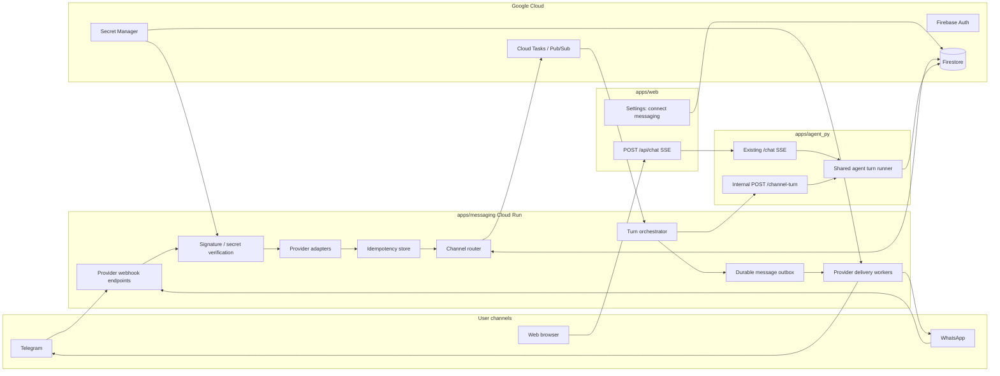

# ADR 0001: Messaging Channel Add-on for Telegram and WhatsApp

- **Status:** Proposed
- **Date:** 2026-05-15
- **Decision owners:** Product + Platform Engineering
- **Related systems:** `apps/web`, `apps/agent_py`, Firebase Auth, Firestore, Cloud Run, Cloud Tasks or Pub/Sub, Secret Manager
- **Supersedes:** PR #124, PR #125, PR #126, PR #127

## Context

Lifecoach currently has one production chat surface: the web app sends browser chat requests to `apps/web`, which proxies authenticated requests to `apps/agent_py`. The Python agent owns prompt assembly, model execution, tools, persistence, user-state and usage-policy enforcement, and server-sent event (SSE) streaming back to the browser.

We want users to message the same coach from Telegram and WhatsApp without forking coaching behavior, duplicating business logic, or weakening the current auth, billing, privacy, memory, and state-machine invariants.

Messaging channels differ from web chat in several load-bearing ways:

1. **Ingress identity differs.** Web requests arrive with Firebase identity. Telegram and WhatsApp arrive as provider webhooks, authenticated by provider-specific verification mechanisms, and identify people through channel-scoped addresses such as Telegram chat/user identifiers or WhatsApp business-phone and sender identifiers.
2. **Delivery is asynchronous.** The browser can hold an SSE connection, but messaging providers deliver inbound updates by webhook and require outbound replies through provider APIs.
3. **Routing must be deterministic.** The system must know which Lifecoach `uid`, session, provider account, provider conversation, and reply target owns each turn. The LLM must not infer a route from user text.
4. **Provider constraints differ.** Telegram bot commands, webhook update identifiers, message identifiers, and chat identifiers have different uniqueness scopes from WhatsApp Cloud API webhook event fields, business phone numbers, delivery-status callbacks, customer-care windows, and template-message requirements.
5. **UI capabilities differ.** The web can render the full `AssistantElement` surface and stream partial output; messaging apps need completed messages, links, plain text, small button sets, and graceful degradation for UI directives.
6. **Concurrency matters.** A user may have the web open while also messaging Telegram or WhatsApp. The platform must serialize turns per route/session and make active-channel choices explicit.

Provider references considered for this decision:

- Telegram Bot API webhook delivery and secret-token verification: <https://core.telegram.org/bots/api#setwebhook>
- WhatsApp Cloud API webhook payloads and delivery-status callbacks: <https://developers.facebook.com/docs/whatsapp/cloud-api/webhooks/payload-examples>
- Meta Graph API webhook verification: <https://developers.facebook.com/docs/graph-api/webhooks/getting-started>

## Decision

Build a separate **Messaging Channel Add-on** as an application-owned Cloud Run service, tentatively `apps/messaging`, that adapts Telegram, WhatsApp, and future messaging apps into the existing Lifecoach conversation platform.

The add-on will:

- receive provider webhooks on provider-specific endpoints;
- verify provider authenticity before trusting, routing, or persisting user content;
- normalize provider payloads into a canonical channel envelope;
- deduplicate provider events with tenant- and conversation-scoped idempotency keys;
- resolve external provider conversations to a Lifecoach `uid`, session, and reply target;
- call a new internal, non-streaming agent turn endpoint for messaging-originated turns;
- enqueue outbound provider replies in a durable outbox; and
- dispatch provider-specific sends through delivery workers.

The existing agent remains the source of truth for coaching behavior, state machines, prompt assembly, profile, goals, Workspace tools, memory, session persistence, and usage enforcement. It may receive explicit channel metadata as request context, but it must not verify provider webhooks, hold provider credentials, call provider delivery APIs, or decide whether a response should go to web, Telegram, or WhatsApp.

Web chat remains a first-class channel and continues using the existing SSE path. Messaging traffic uses asynchronous webhook ingestion plus provider send APIs. Both paths share user state, profile, goals, usage metering, memory, and the same core agent turn runner.

## Goals

- Let users talk to Lifecoach from Telegram and WhatsApp while preserving one coach identity and one policy model.
- Keep provider credentials, webhook secrets, raw provider identifiers, and delivery APIs out of the LLM-facing agent context.
- Make inbound routing and outbound delivery deterministic, inspectable, and testable.
- Make every inbound provider event idempotent and auditable.
- Support account linking from web to messenger and from messenger to web.
- Preserve web SSE behavior and avoid slowing or complicating the browser chat path.
- Allow Telegram to ship first without blocking on WhatsApp policy and template complexity.
- Keep the architecture extensible to later channels such as SMS, email, Signal, Messenger, or Slack.

## Non-goals

- Replacing web chat or removing SSE.
- Building a human-support inbox or multi-agent customer-service queue.
- Mirroring every web UI widget in every messaging app.
- Letting the LLM choose delivery channels from natural-language instructions.
- Creating durable users from unauthenticated provider webhooks without an explicit linking or anonymous-messenger product policy.
- Using server-side network-location inference for messaging users; location context remains explicit user/device-provided data only.

## Architecture



### Component responsibilities

| Component | Responsibility | Notes |
|---|---|---|
| Provider webhook endpoints | Receive Telegram and WhatsApp callbacks. | Use provider-specific routes such as `POST /webhooks/telegram/:providerTenantId` and `GET/POST /webhooks/whatsapp/:providerTenantId` so verification and tenant lookup stay explicit. |
| Verification layer | Reject spoofed or malformed callbacks before trusting content. | Telegram uses the configured webhook secret token. WhatsApp/Meta uses subscription challenge handling plus request signature verification. |
| Provider adapters | Convert raw provider payloads into a canonical `ChannelInboundMessage`. | Raw payload storage is optional, redacted, retention-bound, and never normal application logging. |
| Idempotency store | Ensure provider retries do not run the agent twice. | Keys must include channel, provider tenant/account, external conversation when needed, and provider event/message identity. |
| Channel router | Resolve `uid`, `sessionId`, route status, reply behavior, and capabilities. | Deterministic application logic only; no LLM route decisions. |
| Turn orchestrator | Serializes a route/session turn, calls the agent, and writes outbox jobs. | Provider webhooks should be acknowledged quickly; slow agent work continues asynchronously. |
| Internal agent turn endpoint | Runs the same agent behavior as web chat without SSE. | `POST /channel-turn` returns complete assistant elements and session metadata for channel rendering. |
| Durable outbox | Stores provider delivery jobs and retry state. | Prevents provider outages or worker crashes from losing replies. |
| Delivery workers | Send messages through Telegram/WhatsApp APIs. | Apply formatting limits, split long replies, handle provider errors, and record delivery status. |
| Linking UI and commands | Connect or disconnect provider identities and Lifecoach users. | Web settings and provider commands both update the same link/route records. |

## Data model

Firestore collection names are illustrative but define the required boundaries and uniqueness constraints.

### `channelAccounts/{channel}:{providerTenantId}`

Represents a provider account owned by this Lifecoach environment, such as one Telegram bot or one WhatsApp business phone number.

```ts
type ChannelAccount = {
  id: string; // `${channel}:${providerTenantId}`
  channel: "telegram" | "whatsapp";
  providerTenantId: string; // bot id, phone number id, or managed gateway tenant id
  environment: "dev" | "preview" | "prod";
  displayName: string;
  secretRefs: {
    webhookSecret?: string;
    accessToken?: string;
    appSecret?: string;
  };
  status: "enabled" | "disabled";
  createdAt: string;
  updatedAt: string;
};
```

### `channelConnections/{connectionId}`

A verified binding between a provider conversation/sender and a Lifecoach user.

```ts
type ChannelConnection = {
  connectionId: string;
  uid: string;
  channel: "telegram" | "whatsapp";
  providerTenantId: string;
  externalConversationIdHash: string;
  externalSenderIdHash?: string;
  encryptedDeliveryTarget: string;
  displayName?: string;
  status: "pending" | "active" | "revoked";
  capabilities: ChannelCapabilities;
  createdAt: string;
  updatedAt: string;
  lastInboundAt?: string;
  lastOutboundAt?: string;
};
```

Lookup documents may be created at `channelConnectionLookups/{channel}:{providerTenantId}:{externalConversationIdHash}` so inbound routing can resolve a connection without scanning.

### `channelLinkCodes/{codeHash}`

Single-use, short-lived linking nonces for web-to-messenger or messenger-to-web flows.

```ts
type ChannelLinkCode = {
  codeHash: string;
  uid?: string;
  requestedChannel: "telegram" | "whatsapp";
  providerTenantId?: string;
  createdFrom: "web" | "messenger";
  externalConversationIdHash?: string;
  expiresAt: string;
  consumedAt?: string;
  createdAt: string;
};
```

Codes must be random, hashed at rest, provider-bound, single-use, and consumed transactionally with connection creation.

### `conversationRoutes/{uid}`

User-level channel preferences and explicit active-channel state.

```ts
type ConversationRoutes = {
  uid: string;
  defaultInboundSessionPolicy: "daily" | "thread";
  preferredOutboundChannel: "web" | "telegram" | "whatsapp" | "last_active";
  activeChannel?: "web" | "telegram" | "whatsapp";
  activeConnectionId?: string;
  activeUntil?: string;
  fallbackChannel: "web" | "none";
  quietHours?: Record<string, { start: string; end: string; timezone: string }>;
  updatedAt: string;
  updatedBy: "user" | "system" | "support";
};
```

### `channelEvents/{idempotencyKey}`

Audit and deduplication records for inbound provider events and delivery callbacks.

```ts
type ChannelEvent = {
  idempotencyKey: string;
  direction: "inbound" | "outbound";
  channel: "telegram" | "whatsapp";
  providerTenantId: string;
  externalConversationIdHash?: string;
  providerEventId: string;
  providerMessageId?: string;
  uid?: string;
  connectionId?: string;
  sessionId?: string;
  normalizedType: "text" | "command" | "button" | "attachment" | "delivery_status" | "unsupported";
  status: "received" | "linked" | "routed" | "dispatched" | "delivered" | "failed" | "ignored";
  failureReason?: string;
  createdAt: string;
  updatedAt: string;
};
```

The idempotency key must be collision-resistant across all configured provider tenants and conversations:

```text
sha256(channel + ":" + providerTenantId + ":" + externalConversationIdHash + ":" + providerEventId)
```

If a provider offers a tenant-wide unique update/event id, use it as `providerEventId`. If the provider exposes only conversation-scoped message ids, include `externalConversationIdHash` as shown above. This intentionally addresses the review feedback from PR #125 and PR #126: Telegram-style `message_id` values are not globally unique across chats, and provider event ids can collide across multiple Telegram bots or WhatsApp phone-number tenants if the tenant/account is omitted.

### `messageOutbox/{outboxId}`

Durable outbound delivery jobs for provider replies.

```ts
type MessageOutboxItem = {
  outboxId: string;
  uid: string;
  sessionId: string;
  channel: "telegram" | "whatsapp";
  providerTenantId: string;
  connectionId: string;
  replyToEventId?: string;
  payload: ChannelReply;
  status: "pending" | "sending" | "sent" | "retrying" | "failed" | "cancelled";
  attemptCount: number;
  nextAttemptAt?: string;
  providerDeliveryId?: string;
  failureReason?: string;
  createdAt: string;
  updatedAt: string;
};
```

## Internal channel contract

### Inbound envelope

```ts
type ChannelInboundMessage = {
  channel: "telegram" | "whatsapp";
  providerTenantId: string;
  externalConversationId: string;
  externalSenderId?: string;
  providerEventId: string;
  providerMessageId?: string;
  idempotencyKey: string;
  receivedAt: string;
  message: {
    type: "text" | "command" | "button" | "attachment" | "unsupported";
    text?: string;
    command?: string;
    buttonId?: string;
    attachments?: Array<{ type: "image" | "audio" | "file" | "location"; providerRef: string }>;
  };
  capabilities: ChannelCapabilities;
};

type ChannelCapabilities = {
  markdown: boolean;
  buttons: boolean;
  attachments: boolean;
  streaming: false;
  maxTextLength?: number;
};
```

### Agent request

```ts
type ChannelTurnRequest = {
  uid: string;
  sessionId: string;
  message: string;
  channelContext: {
    channel: "telegram" | "whatsapp";
    providerTenantId: string;
    connectionId: string;
    inboundEventId: string;
    capabilities: ChannelCapabilities;
    locale?: string;
    timezone?: string;
  };
};
```

### Agent response

```ts
type ChannelTurnResponse = {
  sessionId: string;
  assistantElements: AssistantElement[];
  usage: {
    model: string;
    policy: string;
  };
};
```

`POST /channel-turn` must reuse the same core turn runner as the web `/chat` path. It differs only at the transport boundary: it returns a completed assistant turn instead of SSE deltas so the messaging add-on can render and enqueue provider replies.

## Routing model

Routing answers two questions:

1. **Inbound routing:** Which Lifecoach user and session should handle this provider message?
2. **Outbound routing:** Which channel should receive the assistant reply?

### Inbound routing

The add-on applies these rules in order:

1. Match the webhook URL tenant to a configured `channelAccounts/{channel}:{providerTenantId}` record.
2. Verify the webhook signature or secret token for that tenant before trusting content.
3. Normalize the payload to `ChannelInboundMessage`.
4. Compute the idempotency key using channel, provider tenant, external conversation, and provider event identity.
5. Create the `channelEvents/{idempotencyKey}` row transactionally. If it already exists, return 2xx and do not call the agent again.
6. Resolve the active `ChannelConnection` by `channel`, `providerTenantId`, and external conversation/sender hash.
7. If no active connection exists:
   - Telegram may respond with `/start` or sign-in/link instructions, or create a limited anonymous messenger session only if product explicitly enables that policy.
   - WhatsApp may respond only with policy-compliant onboarding copy or approved templates where required; otherwise record `ignored`.
8. Resolve `sessionId` from the connection and route policy:
   - `daily`: stable per-user daily session, e.g. `{uid}:{YYYY-MM-DD}`.
   - `thread`: stable per provider conversation, e.g. `{uid}:{channel}:{providerTenantId}:{externalConversationIdHash}`.
9. Enqueue the turn orchestrator and acknowledge the provider webhook quickly.
10. The orchestrator serializes work for the route/session, calls `/channel-turn`, renders elements into provider-native replies, and writes `messageOutbox` jobs.

### Outbound routing

Replies to a messenger-originated inbound message return to the same provider connection by default. Replies to web-originated turns remain on web by default. Proactive or delayed replies use explicit route preferences and consent state.

Recommended precedence:

1. **Turn affinity:** reply on the channel that produced the current inbound turn.
2. **Explicit user preference:** settings UI or provider commands such as `/use telegram`, `/use whatsapp`, or `/disconnect` update durable route records before they affect delivery.
3. **Active-channel TTL:** after a messenger inbound, `activeChannel` and `activeConnectionId` may be set for a short window such as 30 minutes.
4. **Provider constraints:** if WhatsApp's customer-care window is closed, use approved templates or fall back according to consent and `conversationRoutes`.
5. **Fallback:** if delivery fails permanently or the connection is revoked, use `fallbackChannel` (`web` or `none`) and record the route decision.

The platform never treats user text like “send this to WhatsApp” as an immediate delivery instruction. The agent may surface a preference-change UI/directive, but routing changes take effect only after application state is updated.

## Linking and revocation

### Web-to-messenger linking

1. A signed-in user opens Settings → Connections.
2. `apps/web` creates a short-lived `channelLinkCodes/{codeHash}` for the selected provider and current `uid`.
3. The UI shows a Telegram deep link or WhatsApp click-to-chat link containing the plaintext code.
4. The user opens the provider and sends `/start <code>` or a prefilled connect message.
5. `apps/messaging` verifies the provider webhook, hashes the code, consumes it transactionally, creates `channelConnections/{connectionId}`, and sends a confirmation.

### Messenger-to-web linking

1. An unlinked user messages a configured bot or WhatsApp number.
2. The add-on records an unlinked event and returns a sign-in or connect link with a nonce if provider policy allows.
3. The user signs in on web.
4. Web verifies and consumes the nonce, then binds the provider conversation to the signed-in `uid`.
5. The provider receives confirmation.

### Revocation

Users must be able to disconnect a provider from web settings and from provider commands such as `/disconnect`. Revocation sets `channelConnections.status = "revoked"`, clears active route preferences for that connection, and cancels pending outbox jobs for that connection. Audit records remain until their retention period expires.

## Rendering assistant output to messaging channels

The add-on converts `AssistantElement[]` into provider-native replies:

| Assistant element | Telegram/WhatsApp behavior |
|---|---|
| Text | Render as provider-safe Markdown or plain text, split to provider length limits. |
| Single-choice or multiple-choice prompt | Use native buttons when available and within limits; otherwise number options in plain text. |
| Auth/connect prompt | Render as a signed web link or provider deep link. |
| Workspace connection prompt | Prefer web link because OAuth remains browser-based. |
| Tool/status metadata | Usually omit from provider messages unless product defines a user-facing status. |
| Unsupported rich UI | Fall back to concise plain-text explanation and link to web when required. |

The agent receives channel capabilities but not raw provider identifiers. Rendering decisions live in `apps/messaging` so provider behavior can evolve independently.

## Provider-specific handling

### Telegram

- Use bot webhooks over HTTPS with a configured secret token.
- Treat the configured bot as `providerTenantId` and the Telegram chat as the external conversation.
- Prefer Telegram update ids as provider event ids when available.
- If falling back to Telegram message ids, include the external conversation hash in the idempotency key because message ids are only unique within a chat.
- Support `/start`, `/help`, `/settings`, and `/disconnect` in the MVP.
- Ship Telegram first because it has simpler user-initiated messaging and onboarding constraints.

### WhatsApp

- Use WhatsApp Cloud API webhook verification and request signature validation.
- Treat the business phone-number id, or managed gateway tenant id, as `providerTenantId`.
- Respect customer-care windows, approved templates, opt-in requirements, and delivery-status callbacks.
- Store only the minimum sender and phone-number identifiers needed for lookup and delivery; use lookup hashes and encrypted delivery targets.
- Do not send proactive coaching nudges until consent, quiet hours, template policy, and fallback behavior are implemented.

## Security, privacy, and compliance

- Verify webhooks before parsing content into trusted internal events.
- Store provider credentials in Secret Manager and grant access only to the add-on and delivery workers.
- Never expose provider credentials, raw chat ids, phone numbers, bot tokens, or webhook secrets to prompts or LLM tools.
- Store lookup hashes separately from encrypted delivery targets.
- Redact provider identifiers from normal logs and support views by default.
- Apply retention limits to raw provider payloads and channel audit events.
- Make linking codes short-lived, random, provider-bound, single-use, and hashed at rest.
- Fail closed on ambiguous identity, replayed events, disabled provider accounts, and revoked connections.
- Keep server-side location handling aligned with the repository invariant: location is explicit user/device-provided context, not inferred from network metadata.

## Failure handling

| Failure | Handling |
|---|---|
| Duplicate webhook | Return 2xx after idempotency hit; do not re-run the agent. |
| Webhook verification fails | Return 401/403 and emit a security metric; do not create user-visible events. |
| Unknown provider tenant | Return 404/403 and alert if repeated. |
| No active channel connection | Send linking instructions only when provider policy allows; otherwise record `ignored`. |
| Link code expired or reused | Refuse linking and ask the user to generate a new code. |
| Agent turn times out | Keep the webhook acknowledged; retry or send product-approved “still working/failure” copy from the outbox. |
| Provider send fails transiently | Retry from `messageOutbox` with exponential backoff and jitter. |
| Provider send fails permanently | Mark the connection or route degraded, record the provider error class, and apply fallback routing. |
| User disconnects mid-turn | Cancel pending outbox jobs for the revoked connection before delivery. |
| Unsupported attachment | Acknowledge with provider-safe copy explaining the limitation; optionally link to web. |

## Rollout plan

1. **Contracts:** add shared Zod schemas in `packages/shared-types` for channel capabilities, inbound messages, route records, link codes, events, outbox jobs, and `ChannelTurnRequest`/`ChannelTurnResponse`.
2. **Agent refactor:** extract the core agent turn runner so `/chat` SSE and internal `/channel-turn` use the same policy, prompt, tools, persistence, and usage enforcement.
3. **Messaging service skeleton:** add `apps/messaging` with health checks, provider-account config, Secret Manager access, and Terraform-managed Cloud Run infrastructure.
4. **Telegram MVP:** implement webhook verification, `/start` linking, idempotency, deterministic routing, `/channel-turn` dispatch, and delivery workers.
5. **Settings UI:** add web controls for connect, disconnect, preferred channel, fallback behavior, and quiet hours.
6. **Observability:** add route-decision logs, channel health metrics, idempotency hit rates, outbox dashboards, and support-safe audit views.
7. **WhatsApp:** add Cloud API webhook handling, template/onboarding flows, delivery status ingestion, and compliance review.
8. **Proactive messaging:** evaluate only after explicit opt-in, quiet hours, template policy, and revocation/fallback behavior are proven.

## Alternatives considered

### Put Telegram/WhatsApp logic directly in `apps/agent_py`

Rejected. It would mix provider credentials, webhook verification, routing, and delivery into the LLM-facing service, increasing blast radius and making coaching tests depend on provider-specific transports.

### Make `apps/web` own messaging webhooks

Rejected for the long term. The web app should remain the browser-facing BFF and SSE surface. Messaging needs provider verification, asynchronous orchestration, durable outbox workers, retries, and delivery callbacks that are better isolated in a dedicated service.

### Consume `/chat` SSE server-side for messaging

Deferred as a compatibility fallback. Messaging providers do not benefit from token-level streaming, and webhook handling needs quick acknowledgement. A non-streaming `/channel-turn` endpoint gives the add-on a cleaner contract while still sharing the core agent turn runner.

### Use a third-party omnichannel gateway as the routing source of truth

Deferred. Twilio, MessageBird, or similar providers could reduce provider-specific integration work, especially for WhatsApp, but Lifecoach still needs first-party identity linking, route preferences, consent policy, agent dispatch, privacy controls, and auditability. The add-on boundary remains useful even if individual adapters later use a managed gateway.

### Merge all channels into one global session without channel metadata

Rejected. Shared memory and profile are valuable, but hidden shared transport state would make support, audit, rendering, and route decisions opaque. Sessions may share user memory while still carrying explicit channel and route metadata.

## Consequences

### Positive

- One coach brain and one policy model can serve web, Telegram, WhatsApp, and future channels.
- Provider credentials and delivery concerns stay outside the LLM-facing agent.
- Routing decisions are deterministic, explainable, and testable.
- Telegram can ship before WhatsApp without committing the whole product to WhatsApp-specific constraints.
- Durable outbox and idempotency records improve reliability under provider retries and outages.

### Negative

- Adds new infrastructure: `apps/messaging`, Cloud Run service configuration, Firestore collections, queues, outbox workers, and Secret Manager access.
- Requires an agent boundary refactor to expose `/channel-turn` without duplicating `/chat` behavior.
- Cross-channel history, active-channel UX, and fallback behavior need careful product decisions.
- WhatsApp template management and compliance add operational overhead.
- Support tooling must be built so deterministic routing remains visible without exposing sensitive provider identifiers.

## Open questions

1. Should unlinked Telegram users ever receive anonymous Lifecoach sessions, or must every messenger session link to a web-authenticated account first?
2. Should the first release use daily sessions for all channels, or channel-specific thread sessions with shared memory?
3. What is the initial fallback when WhatsApp delivery is blocked: web notification, no-op, email, or approved template?
4. Should WhatsApp use direct Meta Cloud API first or a managed provider gateway?
5. What retention periods apply to raw provider payloads, normalized events, and outbox records?
6. Which `AssistantElement` types are required for Telegram MVP, and which should link back to web?
7. How strict should turn serialization be when a user sends simultaneous web and messenger messages?
