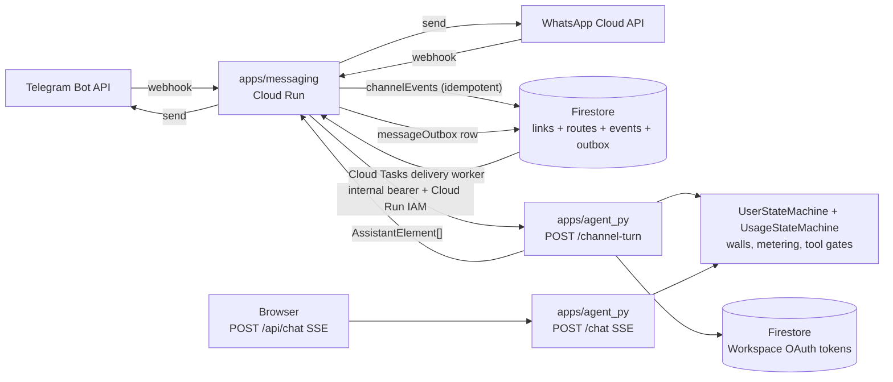

# ADR 0002: Telegram and WhatsApp messaging support

- **Status:** Proposed
- **Date:** 2026-05-15
- **Deciders:** Lifecoach maintainers
- **Related areas:** `apps/agent_py`, new `apps/messaging`, `apps/web`, `packages/shared-types`, Firestore, Terraform infrastructure
- **Supersedes:** PRs #124, #125, #126, #127, #132, #133. Synthesizes review feedback from those PRs and from four parallel code-review passes on the two ADR drafts.

> **Numbering note:** This is ADR 0002. ADR 0001 (background and scheduled agent work) is being decided in PR #131; either merge order works but the README must end up listing both.

## Context

Lifecoach today is a web app: the agent serves the browser over SSE. Several factors push us toward also supporting messaging-app surfaces:

1. **Reach.** Telegram and WhatsApp are the daily-driver UIs for the target audience; a web-only product caps adoption.
2. **Latency of access.** A messaging chat opens faster than a tab on `tranquil.coach`, especially on mobile.
3. **Server-initiated touchpoints.** ADR 0001's background workflows can deliver daily digests through whichever surface the user actually checks.
4. **Concurrency matters.** A messaging-linked user can send three messages in two seconds; the existing per-turn metering and the agent's session model must hold up.
5. **Provider transports differ.** Telegram bots and WhatsApp Cloud API have different auth, idempotency, length limits, and capability surfaces (buttons, attachments, templates).
6. **Privacy.** OAuth Workspace tokens, raw email bodies, and chat history must not leak into provider logs or accidentally widen tool access in a context the user didn't expect.

The decision below captures one architecture across both providers without duplicating the coaching agent.

## Decision

Build a **separate Cloud Run service** `apps/messaging/` that adapts each provider's webhook into a single internal call to the agent, persists durable outbound delivery in a Firestore outbox, and never holds business logic. The agent (`apps/agent_py`) gains one new internal route — `POST /channel-turn` — that runs a non-streaming turn against the same per-user policy machinery the SSE `/chat` route uses today. All canonical contracts live in `packages/shared-types/` (Zod) with mirrored Pydantic models in `apps/agent_py`.

Hard rules:

- **No business logic in `apps/messaging`.** It validates provider webhooks, normalises to a canonical envelope, dispatches to the agent, and routes responses back to the provider via the outbox. That is its entire job.
- **Linking is required before any agent invocation.** A messaging connection without a linked Firebase UID gets a stock "please link first" reply, not an LLM call.
- **`/channel-turn` runs the same `UserStateMachine` + `UsageStateMachine` policy + per-turn metering as `/chat`.** Walls applied before the agent runs — no LLM spend on a walled user.
- **Workspace tool availability is derived server-side**, from the agent's own token-store read, never from anything `apps/messaging` puts in the request body.
- **`apps/messaging/` is greenfield** — this directory does not exist today; this ADR creates it alongside `apps/web` and `apps/agent_py`.



## Component responsibilities

| Component | Owns | Must not |
| --- | --- | --- |
| `apps/messaging` | Webhook signature verification (Telegram `X-Telegram-Bot-Api-Secret-Token`, WhatsApp `x-hub-signature-256`), envelope normalisation, idempotency lookup, per-uid serialisation, outbox writes, delivery worker, provider-specific send logic. | Hold OAuth tokens, call Gmail/Calendar/Vertex/Firestore-other-than-its-own collections, decide policy, render coaching content. |
| `apps/agent_py` (`/channel-turn`) | Authenticated turn execution: load user, build `UserStateMachine`, apply `UsageStateMachine` walls, increment metering, run the ADK turn, return `AssistantElement[]` + usage policy + any structured commands. | Stream over SSE on this route. Trust any field in the request body that implies elevated capability (Workspace, Pro tier, etc.). |
| `apps/web` (Settings → Messaging) | Initiate linking flows (web-first or messenger-first), show linked accounts, allow disconnect. | Talk to provider APIs directly. |
| `packages/shared-types/src/channel.ts` | Canonical Zod schemas for `ChannelMessage`, `ChannelTurnRequest`, `ChannelTurnResponse`, `ChannelCapabilities`, `AssistantElement[]` reused from chat. | — |
| `apps/agent_py/src/lifecoach_agent/contracts/channel.py` | Pydantic mirrors of the Zod schemas. Schema drift is a CI failure. | — |

## Canonical channel contracts

All types live in `packages/shared-types/src/channel.ts` (Zod schemas, barrel-exported) with Pydantic mirrors in `apps/agent_py/src/lifecoach_agent/contracts/channel.py`.

```ts
type Channel = "telegram" | "whatsapp";

interface ChannelMessage {
  channel: Channel;
  providerTenantId: string;          // Telegram bot id (from getMe); WhatsApp phone_number_id
  externalConversationId: string;    // Telegram chat id; WhatsApp wa_id
  externalConversationIdHash: string;// sha256(externalConversationId), used in keys/logs
  providerEventId: string;           // Telegram update_id; WhatsApp messages[].id / statuses[].id
  direction: "inbound" | "status";
  receivedAt: string;                // ISO8601, server clock
  body: ChannelBody;                 // discriminated union below
}

type ChannelBody =
  | { kind: "text"; text: string }
  | { kind: "button"; payload: string; label?: string }
  | { kind: "command"; command: string; args?: string }
  | { kind: "attachment_unsupported"; mimeHint?: string };

interface ChannelCapabilities {
  maxTextLength: number;             // Telegram 4096, WhatsApp 4096
  buttons: boolean;                  // inline keyboard / interactive buttons
  attachments: boolean;              // future: images / voice
  templates: boolean;                // WhatsApp template gating outside customer-care window
}

interface ChannelTurnRequest {
  uid: string;                       // Firebase UID resolved from a linked channelLink
  channel: Channel;
  routeId: string;                   // see conversationRoutes below
  message: ChannelMessage;
  capabilities: ChannelCapabilities;
  // No workspaceScopesGranted, no tier overrides — derived server-side only.
}

interface ChannelTurnResponse {
  elements: AssistantElement[];      // reused from chat
  usage: { policy: string; walled: boolean; wallReason?: string; wallCta?: string };
  // When walled === true, elements is empty; apps/messaging renders wallReason+wallCta.
}
```

## Internal `/channel-turn` contract

| Aspect | Behaviour |
| --- | --- |
| Path | `POST /channel-turn` on the existing `apps/agent_py` Cloud Run service. |
| Auth | Both: (a) `x-agent-internal-bearer` header — same shared secret pattern the web proxy uses today, so `server.py`'s existing middleware needs no change; AND (b) the caller's Cloud Run service identity (`sa-messaging@…`) must have `roles/run.invoker` on the agent service. Belt-and-braces because losing either alone is high-impact. |
| Body | `ChannelTurnRequest` (above). |
| Response | `ChannelTurnResponse`. Always 200 on a successful turn or wall. 4xx only on bad request shape; 5xx only on infrastructure failure. |
| Streaming | Non-SSE, single JSON response. The handler internally calls the same turn-runner the SSE `/chat` route uses (extract from `server.py`'s `/chat` handler — currently SSE-only — into a shared helper as part of rollout step 2). |
| Pre-turn order | (1) verify auth, (2) load Firebase user by uid, (3) build `UserStateMachine`, (4) read `usage_policy`, (5) if walled → return `walled: true` without invoking the LLM, (6) `increment_turn_count`, (7) read Workspace tokens for tool gating, (8) run the ADK turn, (9) persist session as usual. |
| Workspace tool access | Same derivation as `/chat`: agent reads `workspace_tokens_store` for the resolved uid. Linking on messaging does **not** grant additional consent — if the user had Workspace OAuth before linking, tools are available; if not, they are not. |

## Firestore data model

Six new collections under the existing dev/prod project. All composite indexes required (none of these are served by single-field auto-indexes).

```text
channelLinks/{linkId}
  uid: string                       # Firebase UID (required — link rows without a uid are inadmissible)
  channel: Channel
  providerTenantId: string
  externalConversationId: string
  externalConversationIdHash: string
  status: "active" | "revoked"
  linkedAt: timestamp
  revokedAt?: timestamp
  capabilities: ChannelCapabilities  # snapshot at link time, refreshed on first inbound
  index: (uid, channel, status) and (channel, providerTenantId, externalConversationIdHash, status)

channelLinkLookups/{channel}:{providerTenantId}:{externalConversationIdHash}
  linkId: string                    # hot-path lookup doc — avoids scanning channelLinks for every inbound
  status: "active" | "revoked"

channelLinkCodes/{codeHash}
  channel: Channel
  uid: string                       # owner (web-first flow only)
  providerTenantId?: string         # bound at consume time
  expiresAt: timestamp              # ≤ 15 min from createdAt
  consumedAt?: timestamp            # consumption is transactional
  # Plaintext code is NEVER stored. codeHash = sha256(plaintext).

conversationRoutes/{routeId}
  routeId: string                   # = sha256(uid + ":" + channel + ":" + linkId)
  uid: string
  channel: Channel
  linkId: string
  preferredOutboundChannel?: Channel  # for multi-channel users (future)
  lastInboundAt: timestamp
  index: (uid, channel) and (uid, lastInboundAt desc)

channelEvents/{eventId}
  eventId: string                   # idempotency key — see Idempotency keys below
  uid?: string                      # absent for pre-link events
  channel: Channel
  direction: "inbound" | "status"
  routeId?: string
  providerEventId: string
  status: "received" | "linked" | "routed" | "dispatched" | "ignored" | "failed"
  errorCode?: string
  errorMessage?: string             # sanitized — see Security
  receivedAt: timestamp
  TTL: 30 days

messageOutbox/{outboxId}
  outboxId: string
  uid: string
  channel: Channel
  routeId: string
  body: provider-rendered payload   # already split / template-selected
  status: "pending" | "sending" | "sent" | "retrying" | "failed" | "cancelled"
  attemptCount: number
  nextAttemptAt?: timestamp
  providerDeliveryId?: string       # set atomically with status: "sent"
  createdAt: timestamp
  updatedAt: timestamp
  index: (status, nextAttemptAt) for the sweeper
```

## Idempotency keys

```text
eventId = sha256(
  channel + ":" +
  providerTenantId + ":" +
  direction + ":" +
  externalConversationIdHash + ":" +
  providerEventId
)
```

The `direction` component is required: WhatsApp sends both `messages[].id` (inbound) and `statuses[].id` (delivery callbacks) and the values can collide for the same logical message. Without `direction` in the key, a delivery confirmation would silently drop the original inbound event.

For Telegram, `providerTenantId` is the bot id from `getMe` and `providerEventId` is the `update_id` (globally unique per bot). For WhatsApp Cloud API, `providerTenantId` is `phone_number_id` and `providerEventId` is `messages[].id` (`wamid.xxx`).

The outbox is keyed separately by `outboxId` (UUIDv4 at creation); retried sends use the same `outboxId` so the delivery worker can be exactly-once at the provider boundary.

## Routing model

**Inbound (every webhook):**

1. Verify the provider signature (Telegram `X-Telegram-Bot-Api-Secret-Token`; WhatsApp `x-hub-signature-256` HMAC over the body). Reject on mismatch.
2. Compute `eventId`. Insert `channelEvents/{eventId}` with `status: "received"` using Firestore create-if-absent. Duplicate → 200 OK, exit.
3. Look up `channelLinkLookups/{channel}:{providerTenantId}:{externalConversationIdHash}`.
   - **Hit (linked, active):** load the `channelLink`, resolve `uid`, compute `routeId`.
   - **Miss:** check if this is a linking command (Telegram `/start <code>`, WhatsApp text matching the link-code format). If yes → consume `channelLinkCodes` transactionally, create `channelLink` + lookup, reply with a "linked" message via the outbox, mark event `linked`, exit.
   - **Miss and not a linking command:** mark event `ignored`, reply with stock "please link first" via the outbox.
4. Acquire a per-`(uid, routeId)` serialisation lease (Firestore transaction on `conversationRoutes/{routeId}.inflightUntil`). If a turn is already in flight, queue or reject — never run two concurrent turns for the same route. This is what prevents metering-race exploits on free tier.
5. Call `POST /channel-turn`.
6. On response: write `messageOutbox` row(s) atomically with marking the event `dispatched`. The delivery worker (Cloud Tasks-triggered) picks them up.
7. On agent error: mark event `failed` with sanitized `errorCode`. Reply via outbox with a stock "something went wrong, try again" message.

**Outbox delivery worker (runs out-of-band):**

1. Claims a `messageOutbox` row with `status: "pending"` via transactional lease.
2. Renders to provider-specific shape using `ChannelCapabilities` (split long text at sentence boundaries; degrade buttons to text+inline links if `capabilities.buttons === false`; use WhatsApp templates if outside the 24h customer-care window).
3. Sends to provider. On `2xx`, write `providerDeliveryId` and flip to `sent` in one transaction.
4. On retryable failure: backoff, increment `attemptCount`, schedule `nextAttemptAt`.
5. On `attemptCount >= max`: flip to `failed`, surface in admin logs.

**Outbox sweeper** (separate Cloud Scheduler job, every 5 min): scans `messageOutbox` where `status == "pending"` and `createdAt < now - 60s`, and re-enqueues them via Cloud Tasks. This closes the gap where the original enqueue can fail after the row is written — without the sweeper, those rows sit forever.

## Linking flows

**Web-first (recommended primary flow):**

1. User on `apps/web` → Settings → Messaging → "Link Telegram" (or WhatsApp).
2. Web calls `apps/messaging` to mint a `channelLinkCodes` row: random 32-byte token (256 bits entropy), base64url-encoded (43 chars — under Telegram's 64-byte `/start` parameter limit). Only `sha256(token)` is stored.
3. UI shows the Telegram deep-link `https://t.me/<bot>?start=<token>` (or WhatsApp `https://wa.me/<phone>?text=<token>`).
4. User clicks; provider routes them to the bot with the token.
5. Bot's inbound handler matches the token format, computes hash, opens a Firestore transaction: read `channelLinkCodes/{codeHash}`, verify not consumed, verify not expired, mark consumed, create `channelLink` + lookup with the bot's `providerTenantId` and the chat's `externalConversationId`.
6. Bot replies with "linked! send me a message to start." — first agent turn happens on the user's next message.

**Messenger-first (deferred / fallback):**

User finds the bot and messages without a code. Bot replies with a one-time `t.me/...?start=…` link back to `apps/web` with the link code embedded. User completes Firebase Auth on web; web consumes the code and creates the `channelLink`. Until that happens, **the agent is never invoked** — the bot just sends the linking instruction.

Code lifetime: 15 minutes. Single-use, transactional consume. Nonce stored only as its sha256.

## Session policy

Default: one ADK session per `(uid, routeId, day in user's IANA timezone)`. Session id = `{uid}:{channel}:{routeId}:{YYYY-MM-DD}`. This balances continuity within a day's conversation against avoiding unbounded session growth. Revisit if user testing shows the day boundary is wrong for the messaging audience.

## Rendering and capability degradation

| Output element | Telegram | WhatsApp |
| --- | --- | --- |
| Plain text | Send as `sendMessage` text (max 4096 chars; split at sentence boundary if longer). | Same; if outside 24h customer-care window, must use an approved template — the agent's reply is dropped and an "out-of-window" notice is queued instead. |
| `ask_single_choice_question` | Inline keyboard with one button per option. | Interactive `list_reply` or `button_reply` (max 3 buttons; degrade extras to a numbered text list). |
| `ask_multiple_choice_question` | Inline keyboard, persistent. | Interactive list, persistent. |
| `connect_workspace` / `auth_user` | Deep link back to `apps/web/settings`. | Same. These UI directives never resolve in-channel — the user must complete in the browser. |
| `upgrade_to_pro` | Deep link back to `apps/web/billing`. | Same. |
| Attachments (future) | `sendPhoto` / `sendVoice`. | Media message endpoints. |

## Provider-specific notes

**Telegram:**

- Webhook secret token (`X-Telegram-Bot-Api-Secret-Token`) is set on `setWebhook` and verified verbatim per request.
- `update_id` is globally unique per bot; safe as the `providerEventId` source.
- `message_id` is only unique per chat — not safe alone for cross-chat dedupe (use `update_id`).
- `/start <token>` is the canonical deep-link entry; payload limited to 64 bytes.
- No customer-care window concept.

**WhatsApp Cloud API:**

- Webhook signature is `x-hub-signature-256: sha256=<HMAC>` over the raw body using the app secret. Reject on mismatch.
- 24-hour customer-care window: outside it, free-form replies are rejected; only pre-approved templates work. Outbox renderer must check the last inbound timestamp.
- `messages[].id` is `wamid.xxx`, globally unique per `phone_number_id`.
- `statuses[].id` reuses the inbound `wamid` — handled by including `direction` in the idempotency key (see above).
- Templates are pre-registered with Meta; product needs at least an "out-of-window prompt" template before launching WhatsApp.

## Security, privacy, safety

- OAuth tokens and Workspace API responses never traverse `apps/messaging` and never reach provider APIs.
- Webhook signatures are verified for every inbound request; unsigned/mismatched requests get 401, no Firestore writes.
- The internal bearer secret is fetched from Secret Manager at startup — never hardcoded, never in Terraform-managed env vars.
- `apps/messaging`'s service account has only the IAM it needs: invoker on `apps/agent_py`, read/write on the six Firestore collections it owns, Secret Manager read for the bearer + provider secrets. Nothing else.
- Linking nonces: ≥256 bits entropy, 15-min TTL, hashed at rest, transactionally consumed.
- Per-uid inbound serialisation prevents metering races on the free-tier hard cap.
- Sanitised `errorMessage`/`errorCode`: same rule as ADR 0001 — stable error code only, raw provider error bodies never persisted; logs apply the `re.sub(r"ya29\.\S+", "[redacted]", …)` redaction from `apps/agent_py/src/lifecoach_agent/server.py`.
- Raw message text is stored in `channelEvents` only with TTL 30 days; never written to chat history or session prompts beyond what's required for the current turn.
- Disconnect (Settings or `/disconnect` command) flips `channelLink.status` → `revoked` and the lookup doc atomically; in-flight outbox rows for that link are cancelled.

## Failure handling

| Failure | Behaviour |
| --- | --- |
| Provider signature mismatch | 401, no writes, alert if rate exceeds baseline. |
| Duplicate webhook (same `eventId`) | 200 OK, exit. Counter incremented for observability. |
| Linked-lookup miss + not a linking command | Reply "please link first" via outbox; event `ignored`. |
| Linking-code expired or already consumed | Reply "code expired, generate a new one"; event `ignored`. |
| Agent `/channel-turn` returns walled | Outbox a wall reply with `wallReason` + `wallCta`; event `dispatched`. |
| Agent `/channel-turn` returns 5xx | Mark event `failed`. Send stock "something went wrong, try again". No automatic retry — the user can simply re-send. |
| Outbox send retryable failure | Backoff + retry up to N times via the worker. |
| Outbox send terminal failure | Mark `failed`, surface in admin logs + observability dashboard. |
| Outbox enqueue lost (process crashed between row write and Cloud Tasks enqueue) | Sweeper picks it up within 5 min. |
| Idempotency-key collision risk | Bound by including `direction` in the key. Specific WhatsApp delivery-status case verified in tests. |

## Observability

Structured-log fields on every line from `apps/messaging` and `/channel-turn`: `eventId`, `outboxId`, `uid_hash`, `channel`, `direction`, `routeId`, `status`, `latency_ms`, `error_code`.

Log-based metrics (Terraform-defined, Cloud Monitoring):

- `channel_inbound_received_total{channel, direction}`
- `channel_event_failed_total{channel, error_code}`
- `channel_outbox_age_seconds` — gauge of oldest `pending` row
- `channel_turn_walled_total{channel, wall_reason}`
- `channel_provider_send_failed_total{channel, error_code}`

Alerts (start values):

- `channel_outbox_age_seconds > 120` for 5 min → page.
- `rate(channel_event_failed_total) / rate(channel_inbound_received_total) > 0.05` over 1h → page.
- `rate(channel_provider_send_failed_total) > N/min` → page.

## Alternatives considered

| Option | Decision | Reason |
| --- | --- | --- |
| Telegram/WhatsApp adapters inside `apps/agent_py` | Rejected | Mixes transport with coaching; per-provider rate-limit headaches; harder to test in isolation. |
| Third-party omnichannel inbox (Twilio Conversations, MessageBird) | Deferred | Removes some implementation work but adds vendor lock-in, monthly cost floor, and a second auth model to debug. Revisit after first-version traffic data. |
| Consume `/chat` SSE server-side from `apps/messaging` | Rejected | SSE wire format is browser-oriented; the messaging path needs structured `AssistantElement[]` once, not a stream. A dedicated non-streaming endpoint is the right shape. |
| Single Cloud Run service hosting both `apps/agent_py` and `apps/messaging` | Rejected | Couples deploy cadence, IAM, and scaling characteristics. Provider webhook bursts are a different load shape from interactive chat. |
| Per-user webhooks (one Telegram bot per user) | Rejected | Operational nightmare; defeats the bot-id-as-`providerTenantId` model; cost scales with users. |
| Pull-based polling instead of webhooks | Rejected | Higher latency, more API quota, and Telegram explicitly recommends webhooks for production. |

## Rollout plan

1. Define Zod schemas in `packages/shared-types/src/channel.ts`; mirror as Pydantic in `apps/agent_py/src/lifecoach_agent/contracts/channel.py`; CI check that the two stay in sync.
2. Extract the non-streaming core of `/chat` from `apps/agent_py/src/lifecoach_agent/server.py` into a `run_agent_turn(uid, session_id, message, channel_context) -> AssistantElement[]` helper. Both SSE `/chat` and the new `/channel-turn` consume it.
3. Add `@app.post("/channel-turn")` in `server.py` behind the existing internal-bearer middleware. Add explicit invoker IAM binding for the future `sa-messaging@…` service account.
4. Create `apps/messaging/` (FastAPI on Cloud Run): two webhook routes (`/webhook/telegram`, `/webhook/whatsapp`), signature verification, envelope normalisation, Firestore writes, internal call to `/channel-turn`, outbox write.
5. Terraform — five independent PRs:
   - (a) Enable `cloudtasks.googleapis.com` and `cloudscheduler.googleapis.com` (if not already done for ADR 0001) in `infra/modules/project-apis/`.
   - (b) New `apps/messaging` Cloud Run service definition under `infra/envs/dev/main.tf` using the existing `infra/modules/cloud-run-service/` pattern.
   - (c) New `infra/modules/messaging-tasks-queue/` for outbox delivery.
   - (d) Composite Firestore indexes for the six new collections.
   - (e) Secret Manager entries for Telegram bot tokens, WhatsApp app secret, internal bearer (or reuse existing).
6. Build the outbox delivery worker as a Cloud Tasks target inside `apps/messaging`. Implement the sweeper as a Cloud Scheduler tick.
7. Add `apps/web/src/app/settings/messaging/page.tsx` (Settings → Messaging) for the web-first link flow + listing + disconnect.
8. Roll out Telegram first to an internal allowlist (Firestore doc `messagingConfig/global.allowlistUids`, not env var). Measure metering races, outbox latency, and provider error rates before widening.
9. Add WhatsApp after Telegram is stable — requires Meta App approval + template registration before public launch.
10. Add richer inputs (images, voice, location) and outputs (carousel/attachment cards) only after the text-only path is solid and observability dashboards are reviewed in dev.

## Open questions

These should be resolved before widening past the allowlist:

- **Capability snapshot freshness.** `channelLinks.capabilities` is snapshotted at link time; if Telegram changes button limits or WhatsApp adds a feature, when do we refresh? Suggest: every Nth inbound, or on demand from `apps/web`.
- **Multi-channel users.** A user links both Telegram AND WhatsApp — does `conversationRoutes.preferredOutboundChannel` apply? Currently undefined; suggest "reply on whichever the user last messaged from".
- **Background-digest delivery.** ADR 0001 (background agent work) defines digests but doesn't say how they reach messaging users. Likely candidates: extend `messageOutbox` to accept agent-originated rows, or define a separate background-notification path. Resolve before ADR 0001 reaches public rollout.
- **Anonymous Lifecoach-via-messaging.** Out of scope for this ADR (Non-goal). Revisit only if user research shows messaging-only signup is a meaningful funnel.
- **Per-channel quota policy.** Should free-tier daily turn caps differ per channel (e.g., messaging users get the same 100 turns as web)? Probably yes — same cap, but tracked separately so abuse on one channel can't lock the other.

## Status

- **Proposed** (this PR). Merging this ADR commits to the design; implementation lands across the follow-up PRs in the Rollout plan.
