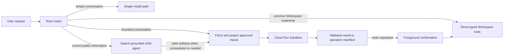

# ADR 0003: Bounded research and sandboxed code execution

- **Status:** Proposed
- **Date:** 2026-08-14
- **Deciders:** Lifecoach maintainers
- **Related:** #53, #185, #210, #211
- **Related areas:** `apps/agent_py`, Workspace tools, web research, Cloud Run, OAuth, observability

## Context

The coach needs three capabilities that have different latency and security profiles:

1. fast conversational replies and common Google Workspace operations;
2. current web research with inspectable citations; and
3. occasional arbitrary computation over bounded user data.

Treating all three as one general-purpose agent path would make ordinary turns slower and would give generated code more authority than it needs. Production traces attached to #185 show why the distinction matters: the model's first response normally arrives in roughly four seconds, while repeated Workspace sub-agent calls can extend a turn to 79-81 seconds. A separate profile-store stall blocked preparation for 53 seconds. Adding code generation and a remote job to every tool path would worsen the dominant problem.

Issue #53 previously considered a generic `run_code(language, source)` tool for decoding and triaging Gmail responses. It rejected that option because sandbox startup and code-generation latency were disproportionate to a deterministic decoding task. That remains the right decision. Common operations should be direct tools or tested application code, not generated programs.

The repository also has relevant implementation history:

- commit `2f1d804` invoked the Google Workspace `gws` CLI while binding OAuth credentials in the server process;
- commit `99fdabc` replaced that subprocess boundary with `google-api-python-client` in the Python agent; and
- `apps/agent_py/_PORTING.md` records that the `gws` CLI is no longer part of the current runtime.

Since #53, Google has introduced [Cloud Run Sandboxes](https://docs.cloud.google.com/run/docs/code-execution) in preview. Sandboxes execute inside an existing Cloud Run resource, are described as ready almost instantly, and default to no inherited environment variables, secrets, metadata-server access, or outbound network. They are ephemeral and read-only by default. This changes the feasibility of interactive code execution, but it does not justify putting OAuth tokens or unrestricted egress inside generated code.

Web research is a separate concern. Issue #210 specifies a search-only child agent using ADK's Google Search grounding. Search grounding must preserve the provider's grounding metadata and citations; a generic sandbox with internet access cannot provide the same provenance guarantee.

## Decision drivers

- **Latency:** simple chat and common Workspace actions must avoid unnecessary model hops.
- **Least authority:** generated code must not receive OAuth credentials, host secrets, metadata credentials, or unrestricted network access.
- **Provenance:** web claims shown to the user must retain grounding metadata and citations.
- **Product control:** Workspace writes continue to require explicit foreground confirmation.
- **Operational containment:** execution must have hard resource, time, output, and usage limits with a kill switch.
- **Progressive delivery:** Cloud Run Sandboxes are Pre-GA, so production use requires a measured feasibility and threat-model gate.

## Decision

Adopt three explicit capability lanes. The root coach chooses the narrowest lane that can complete the user's request.



### Lane 1: direct fast path

Ordinary chat uses the root model without delegation. Common Workspace reads and writes use narrow, deterministic application tools over the existing Python Google API client.

The system must not invoke a Workspace sub-agent or a sandbox for an operation that one typed API call can perform. Multi-step triage may remain delegated, but the delegating tool receives one consolidated request and has an end-to-end deadline. Repeated speculative calls for the same intent are an error to measure and evaluate.

Generated code is not used for base64 decoding, field projection, date conversion, sorting, filtering, or other stable transformations that belong in tested code.

### Lane 2: grounded web research

Current public-web questions use the dedicated search-grounded child agent from #210. It has Google Search as its only external information tool and returns:

- a concise answer;
- source URLs and titles;
- the grounding metadata needed by the UI; and
- bounded excerpts or structured facts when a later computation needs them.

The research agent does not receive Workspace credentials or sandbox authority. The sandbox does not perform general web browsing. When a task combines web research and computation, the root agent first obtains grounded artifacts, then supplies only those artifacts to the execution lane. This preserves citations and keeps sandbox egress disabled.

### Lane 3: bounded sandbox execution

Add an explicit `run_analysis` capability for tasks that genuinely benefit from code, such as joining bounded datasets, calculating scenarios, transforming an uploaded file, or validating a complex proposed schedule.

The initial implementation uses Cloud Run Sandboxes within a dedicated execution service or a tightly isolated execution component. It does not execute generated code in the agent process and does not launch a new Cloud Run Job for an interactive turn.

Each invocation has:

- an allowlisted runtime, initially Python;
- a structured request containing code, read-only input artifact references, expected output schema, and budgets;
- an ephemeral writable workspace and read-only input mount;
- outbound network disabled;
- no inherited environment variables, secrets, or metadata-server access;
- a short wall-clock timeout, process-count limit, CPU/memory limit, and input/output byte caps;
- cancellation when the client disconnects or the parent invocation ends;
- stdout/stderr capture with secret and personal-data-safe logging; and
- a validated structured result, never an unbounded shell transcript injected into the root session.

The sandbox is selected only after the root agent has enough information to state the computation. It is not advertised as a general shell and is not automatically retried with progressively broader permissions.

## Google Workspace access from code

### MVP: pre-fetched, read-only data

The parent process uses existing authenticated Workspace tools to fetch allowlisted, projected, size-capped data. It writes that data into a read-only sandbox input artifact. Generated code can analyze the artifact but cannot call Google APIs directly.

If the result proposes writes, it emits a typed operation manifest. The parent validates the manifest, shows the exact actions to the user, and performs approved writes through existing Workspace tools. Generated code never performs Workspace writes.

This MVP aligns with speed because it reuses direct API calls, avoids another network-capable agent loop, and makes sandbox setup the only additional execution overhead.

### Later option: capability-scoped broker

Issue #211 includes a spike for a local `gws`-style command backed by an allowlisted broker outside the sandbox. The desired developer and model experience is:

```text
gws gmail messages list --query "newer_than:7d" --fields id,subject,date
```

That command must not contain or acquire an OAuth token. It would communicate with a local broker through a narrowly mounted channel, and the broker would enforce:

- the Firebase UID and invocation ID fixed by the parent;
- a single-use, short-TTL capability grant;
- an operation and field allowlist;
- page, row, body-byte, and call-count limits;
- read-only access unless a future ADR explicitly changes the rule; and
- structured audit events without message bodies or tokens.

Cloud Run documents bind mounts but does not currently establish that a bind-mounted Unix socket provides the required isolation and reliability. The spike must prove the channel and its threat model. If it cannot, the architecture remains pre-fetched-data-only. Enabling broad sandbox egress to reach an HTTP broker is not an acceptable substitute.

## Latency policy

The lanes have different service-level objectives and must be measured separately:

| Request class | Intended path | Initial objective |
| --- | --- | --- |
| Simple chat, no tools | root model only | p95 complete under 8 seconds |
| Single Workspace operation | root + direct typed tool | p95 complete under 12 seconds |
| Grounded web research | root + search child | first status promptly; p95 complete under 20 seconds |
| Sandboxed analysis | root + bounded inputs + sandbox | explicit progress; hard interactive deadline of 30 seconds |

These are product objectives, not claims about current production performance. Issue #185 owns the baseline and remediation. Telemetry must separate preparation, root-model TTFB/TTFT, each child-agent invocation, external API calls, sandbox setup, sandbox execution, and final narration.

To avoid turning the slow lane into the default:

- the root prompt includes concrete positive and negative routing examples;
- evals fail when simple calculations or single Workspace operations invoke `run_analysis`;
- common successful generated programs are candidates for promotion into deterministic tools or recipes; and
- sandbox use has a per-user quota and feature flag.

## Security requirements

The following are release gates:

1. Sandbox code cannot read the parent environment, metadata server, OAuth tokens, service-account credentials, or unmounted host paths.
2. Outbound network remains disabled. Any future network access requires a new decision record with destination-level controls.
3. Inputs are immutable, projected, size-capped, and labelled by source. Workspace and web content are untrusted data, not instructions.
4. The executor rejects unsupported interpreters, shell chaining outside the sandbox launcher, excessive processes, oversized artifacts, and malformed output.
5. Workspace writes occur only in the parent after explicit user confirmation.
6. Logs contain invocation metadata, timings, limits, exit class, and byte counts; they do not contain generated source, raw Workspace content, OAuth material, or full stdout by default.
7. Every invocation records the initiating user, model, request class, input artifact hashes, policy version, limits, and disposition.
8. A global kill switch and per-user rate limit can disable execution without redeploying the coach.
9. Security evals cover prompt injection in email/web content, secret discovery, metadata access, network exfiltration, path traversal, fork bombs, disk/output exhaustion, timeout, malformed manifests, and citation laundering.

## Alternatives considered

### Run generated code in the agent container

Rejected. Process-level timeouts do not provide a sufficient credential, filesystem, metadata, or resource boundary for untrusted code.

### Give the sandbox a Workspace access token

Rejected. Environment variables, files, and argv are visible to generated code, and a bearer token would let that code bypass operation-level policy. Short token lifetime does not prevent immediate exfiltration or destructive use.

### Enable sandbox egress and let code call Google APIs or the web

Rejected. Cloud Run's documented `--allow-egress` control is broad. It would combine prompt-injected data, user credentials, and an exfiltration path. It also loses Google Search grounding provenance.

### Use Cloud Run Jobs for every execution

Rejected for interactive use. Jobs are suitable for long-running or background work described by ADR 0001, but provisioning and polling a separate execution adds avoidable latency. A request that exceeds the interactive budget may be offered as a background job later.

### Use code execution for all Workspace transformations

Rejected, consistent with #53. Stable transformations are faster, cheaper, safer, and more testable as application code.

### Put Google Search and code execution in one agent

Rejected. It broadens authority, complicates ADK built-in-tool constraints, and makes citation provenance harder to preserve. Composition belongs in the root orchestrator through bounded artifacts.

## Rollout

### Phase 0: latency foundations

Complete the high-priority work in #185: deadlines and stale-cache fallback for context sources, consolidated Workspace delegation, direct tools for common operations, prompt/history reduction, and per-hop telemetry. Code execution must not be used to mask those bottlenecks.

### Phase 1: feasibility and threat-model spike

- Enable Cloud Run Sandboxes in a non-production service.
- Measure setup and execution p50/p95 for cold and warm Cloud Run instances.
- Verify default isolation claims in automated tests.
- Test cancellation and resource limits.
- Test read-only input and ephemeral output mounts.
- Determine whether a local broker channel can be safely mounted without egress.
- Record preview availability, Terraform/provider support, regional constraints, and cost.

### Phase 2: read-only analysis MVP

- Ship `run_analysis` behind an allowlist and kill switch.
- Support pre-fetched data only; no live Workspace calls and no network.
- Return typed results and proposed-operation manifests.
- Add UI progress, cancellation, audit records, quotas, and security/performance evals.

### Phase 3: evaluated expansion

Consider a read-only capability broker only if Phase 1 proves the isolation boundary and Phase 2 demonstrates a real product need. Consider background execution through ADR 0001 for work that cannot fit the interactive deadline. Workspace writes and unrestricted network remain out of scope.

## Consequences

### Positive

- Fast requests avoid the cost of research and code generation.
- Web answers retain first-class grounding and citations.
- Arbitrary computation becomes possible without placing generated code in the trusted agent process.
- Workspace credentials and writes remain under existing server-side policy and confirmation controls.
- The architecture can evolve from pre-fetched artifacts to a constrained broker without changing the root routing model.

### Negative

- Three lanes require routing evals, separate telemetry, and more operational components.
- The safest MVP cannot issue ad hoc live Workspace queries from inside generated code.
- Cloud Run Sandboxes are Pre-GA and may change or be unavailable in required regions/tooling.
- A sandbox does not remove prompt-injection risk; projected inputs, output validation, and authority separation remain necessary.
- Sandboxed analysis will still be slower than deterministic code and must remain exceptional.

## Open questions

- Does the Cloud Run Terraform provider expose the sandbox launcher in the project's pinned version, or is a YAML/gcloud deployment step temporarily required?
- Can a bind-mounted local socket be proven safe and stable with sandbox egress disabled?
- Which exact CPU, memory, process, byte, and wall-clock limits fit the first use cases?
- Should executions run in a dedicated Cloud Run service identity from day one, or can the preview begin in a tightly isolated non-production component?
- Which user-visible tasks justify generated code instead of a new deterministic recipe?
